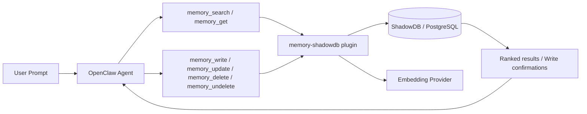
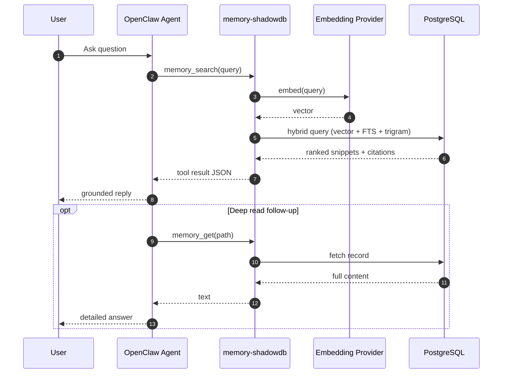
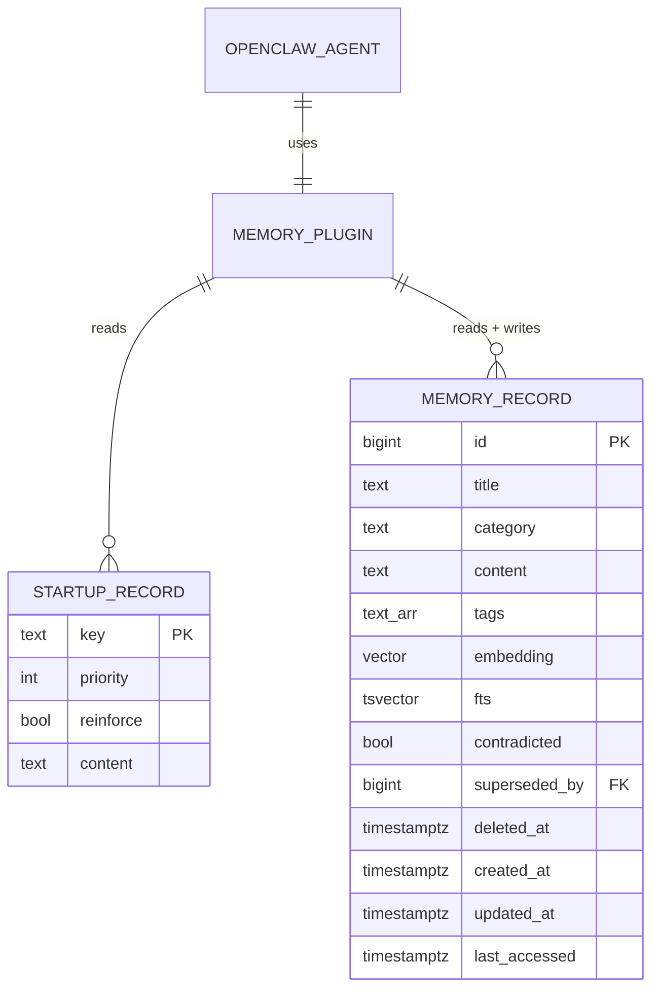

<div align="center">

<picture>
  <source media="(prefers-color-scheme: dark)" srcset="assets/banner-dark.svg">
  <source media="(prefers-color-scheme: light)" srcset="assets/banner-light.svg">
  
</picture>

<br/>

<h2 align="center">Replace static markdown bloat with a memory plugin for OpenClaw and on-demand retrieval.</h2>
<h3 align="center">Your DB choice. Your embedding provider choice. Your path to effectively unbounded memory.</h3>
<h3 align="center">Easy to install. Zero-risk rollout with automatic backup. Fully reversible.</h3>

[](https://raw.githubusercontent.com/openclaw/shadowdb/main/setup.sh)
[](#-current-status)
[](#-what-shadowdb-is)

</div>

---

# ✨ What ShadowDB Is

## ShadowDB is a database-backed memory system for OpenClaw.

### It runs through the **memory plugin slot for OpenClaw** (`memory-shadowdb`) so your agent uses native tools:

- `memory_search`
- `memory_get`
- `memory_write` (config-gated)
- `memory_update` (config-gated)
- `memory_delete` (config-gated, soft-delete only)
- `memory_undelete` (config-gated)

---

# 🚀 Quick Start

```bash
curl -fsSL https://raw.githubusercontent.com/openclaw/shadowdb/main/setup.sh | bash
```

## That setup script:

1. checks prerequisites,
2. backs up your current workspace/config,
3. creates schema,
4. imports memory,
5. verifies retrieval.

---

# 📈 Current Status

## ✅ Production-ready now

- Fast, grounded retrieval from SQL via the memory plugin for OpenClaw (`memory_search` / `memory_get`)
- **Write operations** — `memory_write`, `memory_update`, `memory_delete` tools with config-gated access, auto-embedding, and soft-delete safety
- Deterministic startup hydration from DB via `before_agent_start` hook
- **Model-aware startup injection** — `maxCharsByModel` config maps model name patterns to per-model char budgets so small-context models (ministral-8b, qwen3) get compact P0/P1 essentials while large-context models (Opus, Sonnet) get the full priority stack
- Startup mapping path for legacy identity files (`SOUL.md`, `IDENTITY.md`) through import scripts
- Flexible embedding providers with strict dimension mismatch enforcement

## 🔧 Remaining hardening work (non-blocking)

- Golden parity harness (automated before/after behavior checks)
- Schema migration/versioning scripts

---

# 💡 Why This Exists

## Static markdown injected every turn wastes context and attention.

### ShadowDB moves memory into a real retrieval system so the model gets:
- less repetitive prompt noise,
- better recall,
- better precision,
- and easier scaling.

---

# ⚖️ The Constraint Paradox

## Markdown files were limited. Those limits were features.

A 200-line `MEMORY.md` couldn't have 2,000 duplicate entries. You couldn't write a fact without seeing the other facts right next to it. Staleness was visible because the entire file fit on a screen. When the file got unwieldy, the friction forced curation — you trimmed, consolidated, rewrote. The constraints *were* the quality control.

ShadowDB removes those constraints. That's the point — semantic search over thousands of records beats grep through a flat file. But removing constraints has consequences that aren't obvious until you're deep in it:

| Markdown files (constrained) | Database (unconstrained) |
|------------------------------|--------------------------|
| Can't duplicate — you'd see it | Duplicates are trivial and invisible |
| Staleness is visible — small file, you notice | Staleness is invisible — nobody scrolls 10K rows |
| Size forces curation — unwieldy = trim | `INSERT` is free — table grows silently |
| Everything is context — you read the whole file | Records are isolated — no ambient awareness |
| No orphans — if it's in the file, it's active | Orphaned/contradicted/stale data accumulates |

The trap is building a more powerful system, then spending all your engineering budget on guardrails for the power you added. Retention policies, dedup passes, contradiction detection, knowledge graph management, semantic similarity checks on write — each one solves a real problem, but each one only exists *because the simpler system couldn't have that problem*.

**If the guardrails become more complex than the feature, you've lost the trade.**

### Where we draw the line

ShadowDB's write tools are designed to feel like editing a document, not managing a database. The agent writes facts. Sometimes it replaces old facts. Sometimes it removes facts. That's it. We resist the pull toward building a knowledge lifecycle management system inside a memory plugin.

Concretely:

1. **Write tools stay simple.** `memory_write`, `memory_update`, `memory_delete`, `memory_undelete`. No knowledge graphs, no automatic contradiction detection, no semantic dedup on the write path. Complexity in the write path means complexity in every agent interaction.

2. **Retention is the only automated cleanup.** Soft-deleted records expire after a configurable window. That's the one piece of automation we allow, because it's set-and-forget with no runtime decisions. Everything else is a conscious human or agent action.

3. **Data quality is a curation problem, not an infrastructure problem.** If the DB accumulates cruft, the answer is periodic cleanup (manual or scripted), not more features in the write tools. A dedup pass is a maintenance task you run, not a capability you build into the system.

4. **`superseded_by` and `contradicted` exist in the schema.** They're the right model for knowledge lifecycle when you need them. But the write tools don't force you into using them. They're available for explicit use — not automated, not required. If you want to mark a record as superseded when writing its replacement, you can. If you don't, the old record just stays in search results alongside the new one, and that's usually fine.

5. **Accept some mess.** A database with 10K records and 5% cruft that serves fast, grounded retrieval is better than a pristine 200-line file that wastes context on every turn and can't scale. Perfect data quality is not the goal. Good-enough retrieval is.

### The import lesson

The current database has ~30% duplicate records from multiple import passes that didn't deduplicate. This is exactly the class of problem that couldn't happen with markdown files — you'd never paste the same content into `MEMORY.md` three times. It happened because `INSERT INTO` doesn't check if the content already exists, and import scripts ran multiple times.

This is a data hygiene problem, not a schema problem. The fix is a one-time dedup pass, not a uniqueness constraint on content (which would break legitimate records that share prefixes). Going forward, the write tools include the data but don't prevent the operator from running the same import twice. That's a process problem, and process problems get process fixes.

### Staleness as signal, not action

The instinct when you find stale data is to build tools to remove it. But deletion is an action. Staleness is a signal. They shouldn't be conflated.

A record from 30 days ago isn't necessarily wrong. Someone's phone number from last month is still valid. A project status from last month probably isn't. The system shouldn't decide — the LLM should, because it has the context of *what's being asked*.

The practical options, roughly ordered from simplest to most complex:

**1. Recency-aware search ranking (cheapest, most organic)**

The current RRF search ranking uses vector similarity, FTS relevance, and trigram matching — but has zero recency signal. A fact from day one competes equally with a fact from today. Adding a recency decay factor to the RRF score would organically push old records down without removing them. Old records still appear when they're the best match — they just don't crowd out newer ones when both match equally.

This is the most natural fix because it works like human memory: recent things are more salient, but old important things still surface when directly relevant.

**2. Surface age in search results (let the LLM decide)**

The search snippet format currently shows `[category] | type: record_type` but no date. If the snippet included `(5 days ago)` or `(created 2026-02-10)`, the LLM can judge relevance in context. A research report from two weeks ago answering "what did we find about X?" is perfectly relevant. The same report answering "what's the current status of X?" is suspect. The LLM knows the difference — but only if it can see the age.

**3. Explicit stale marker (`stale_at TIMESTAMPTZ`)**

A column the agent or a maintenance process can set to flag records as "this might be outdated." Not deleted, not wrong — just flagged. Search could include stale records with lower ranking, or the LLM could see the stale flag and decide.

This is more complex than options 1-2 and mostly useful if you want the agent to actively curate: "I know this is outdated, flag it." Whether that's worth the added surface area vs. just letting recency ranking handle it is an open question.

**4. Age-gated cleanup (roadmap, not now)**

A periodic task that reviews records older than N days, flags obviously stale ones, and surfaces borderline ones for human review. This is a maintenance task, not a feature — closer to "spring cleaning" than "garbage collection." Worth exploring when the DB is large enough that organic ranking alone doesn't cut it, but not worth building until that's actually the case.

**Access tracking: metadata, not ranking**

`access_count` and `last_accessed` columns exist in the schema. They're incremented when a record is fetched via `memory_get` (the deliberate follow-up read, not the search listing). This is passive bookkeeping — it tells you which records are actually being used, which have never been accessed, and when something was last relevant.

Critically, access frequency is **not** fed into the search ranking. The intuition that "frequently accessed = more valuable" breaks down because it creates a feedback loop: a record that ranks high for structural reasons (strong keyword overlap, embedding proximity) gets accessed, which would boost its rank, which gets it accessed again. The record doesn't have to be *useful* — it just has to keep appearing. Access-as-ranking-signal amplifies existing biases instead of correcting them.

Access data is useful for:
- Operational insight (which records actually get used?)
- Cleanup candidates (records with `access_count = 0` after months)
- Retention policy (`stalePurgeDays` uses `last_accessed` to identify truly abandoned records)

It's not useful for: ranking, boosting, or any form of "popular records surface higher."

**What we're NOT building:**

- Automatic contradiction detection on write ("you're writing X but Y already exists")
- Semantic dedup on the write path ("this is 95% similar to record Z")
- Knowledge graph versioning ("record A supersedes B which supersedes C")

These are solutions to problems we don't have yet, and each one adds write-path complexity that compounds. If we need them later, we'll know — because retrieval quality will visibly degrade and the simple options won't fix it.

---

# 🧭 Architecture at a Glance

<details>
<summary><b>Diagram: high-level flow</b></summary>



</details>

<details>
<summary><b>Diagram: query lifecycle</b></summary>



</details>

<details>
<summary><b>Diagram: core data model</b></summary>



</details>

---

# ❓ FAQ

<details>
<summary><b>Wait — what happens when markdown files are empty? Can I delete them?</b></summary>

Short version:
- Empty expected bootstrap files are usually okay.
- Deleting expected files is usually worse (many frameworks emit missing-file markers).

OpenClaw behavior:
- Missing file can inject `[MISSING] Expected at: ...`
- Empty file is typically skipped

Practical recommendation:
- Keep expected files present
- Keep them minimal/empty when not needed
- Let DB retrieval handle memory

</details>

<details>
<summary><b>How will it find <code>SOUL.md</code> / <code>IDENTITY.md</code> if they are not on disk?</b></summary>

By design, runtime memory is read from the DB via plugin tools.

Flow:
1. setup/import ingests bootstrap content into DB records,
2. runtime uses `memory_search` / `memory_get`,
3. plugin reads SQL records (not markdown files on disk).

Important nuance:
- Retrieval works.
- Startup identity/rules front-load now works from DB via plugin hook.
- You can tune hydration behavior with startup mode (`always`, `first-run`, `digest`).

</details>

<details>
<summary><b>Do I need to hand-edit JSON config?</b></summary>

No for most users.

Treat this as a plugin abstraction: install + verify, done.

If you need exact config wiring, use doctor/status tooling or inspect generated config after setup.

</details>

---

# 🧠 Embedding Providers

`memory-shadowdb` supports:

- `ollama`
- `openai`
- `openai-compatible`
- `voyage`
- `gemini`
- `command` (external embedding command)

Dimension checks are enforced so mismatches fail loudly instead of silently degrading.

---

# 🗂️ Included Schemas

- `schema.sql` (PostgreSQL + pgvector + FTS + trigram indexes)
- `schema-sqlite.sql` (SQLite + FTS5 + sync triggers)
- `schema-mysql.sql` (MySQL/MariaDB + FULLTEXT)

---

# 🛡️ Drop-in Contract (Implemented)

## ShadowDB now supports practical drop-in identity + memory behavior using:

1. legacy file ingest mapping (`SOUL.md`/`IDENTITY.md` → startup records),
2. structural startup hydration before runs,
3. native memory tool retrieval from DB,
4. rollback to stock bootstrap behavior when needed.

What remains is **verification depth**, not architectural capability.

---

# 🛠️ Suggested Migration Pattern (Today)

1. Install plugin path and verify `memory_search` returns `provider: "shadowdb"`.
2. Keep minimal bootstrap stubs for identity safety.
3. Move factual memory load to DB.
4. Choose startup hydration mode (`always` for strict parity, `digest` for lower overhead).
5. Optionally configure `maxCharsByModel` for model-aware injection budgets.

### Startup Config Reference

```jsonc
// in openclaw.json → plugins.entries.memory-shadowdb.config
"startup": {
  "enabled": true,
  "mode": "digest",           // "always" | "first-run" | "digest"
  "maxChars": 6000,           // default budget (fallback)
  "cacheTtlMs": 600000,       // digest re-check interval (10min)
  "maxCharsByModel": {        // model substring → char budget
    "opus": 6000,             // large context → full stack
    "sonnet": 5000,
    "mistral-large": 4000,
    "llama-3.3": 3000,
    "ministral-8b": 1500,     // small context → P0 essentials only
    "qwen3": 2000
  }
}
```

Rows are fetched `ORDER BY priority ASC` and concatenated until the budget is hit. Use priority tiers (P0=critical identity, P1=operational rules, P2=behavioral, P3=reference) to control what smaller models see.

---

# ✏️ Write Operations

## Overview

ShadowDB supports write operations through four tools: `memory_write`, `memory_update`, `memory_delete`, and `memory_undelete`. All writes are **config-gated** — disabled by default, requiring explicit opt-in via plugin config. This is a deliberate safety choice: reads are always safe, writes require intent.

### Design Principle: Tools Never Destroy Data

**`memory_delete` is always a soft-delete. There is no hard-delete parameter.**

The agent can mark records as deleted. Only time can permanently remove them. This is an intentional architectural decision:

- An agent misjudging relevance is recoverable. A permanent delete is not.
- Soft-deleted records remain in the database with a `deleted_at` timestamp.
- All search, get, and startup operations skip soft-deleted records automatically.
- Permanent removal happens only through the **retention policy** — a config-driven background process that purges records that have been soft-deleted for longer than the configured retention window.

This means: every `memory_delete` call is reversible within the retention window. If the agent (or a bad prompt) deletes something it shouldn't have, you can recover it. After the retention window expires, the record is gone forever — but by then, the decision has aged past the "oops" window.

## Tools

### `memory_write` — Create a new memory record

Insert a new record into the memories table with automatic embedding generation.

| Parameter    | Type       | Required | Description                                           |
|-------------|-----------|----------|-------------------------------------------------------|
| `content`   | `string`  | ✅       | Record content (the knowledge to persist)             |
| `category`  | `string`  | ❌       | Organizational category (default: `"general"`)         |
| `title`     | `string`  | ❌       | Human-readable title for the record                   |
| `tags`      | `string[]`| ❌       | Searchable tag array                                  |

**Behavior:**
- Inserts into `memories` table with `record_type = 'fact'`
- If `writes.autoEmbed` is enabled (default: `true`), generates embedding vector automatically
- Returns the new record ID and virtual path (`shadowdb/{category}/{id}`)
- Content is validated: must be non-empty, max 100,000 characters

### `memory_update` — Update an existing record

Modify a record's content, title, category, or tags. Re-embeds automatically on content change.

| Parameter    | Type       | Required | Description                                           |
|-------------|-----------|----------|-------------------------------------------------------|
| `id`        | `number`  | ✅       | Record ID to update                                   |
| `content`   | `string`  | ❌       | New content (triggers re-embedding if changed)        |
| `title`     | `string`  | ❌       | New title                                             |
| `category`  | `string`  | ❌       | New category                                          |
| `tags`      | `string[]`| ❌       | New tag array (replaces existing)                     |

**Behavior:**
- Only updates fields that are explicitly provided (partial update)
- If content changes and `writes.autoEmbed` is enabled, regenerates embedding
- Sets `updated_at = NOW()` automatically (via database trigger)
- Returns confirmation with the updated record path
- Fails with clear error if record ID does not exist
- Cannot update a soft-deleted record (must undelete first)

### `memory_delete` — Soft-delete a record

Remove a record from active search results. **Always a soft-delete — never permanent.**

| Parameter    | Type       | Required | Description                                           |
|-------------|-----------|----------|-------------------------------------------------------|
| `id`        | `number`  | ✅       | Record ID to delete                                   |

**Behavior:**
- Sets `deleted_at = NOW()` — record remains in the database but is excluded from all search, get, and startup operations
- The record is recoverable within the retention window (default: 30 days)
- After the retention window, the background purge permanently removes the row
- Returns confirmation with the record ID and the retention expiry date
- Calling `memory_delete` on an already-deleted record is a no-op (idempotent)

### `memory_undelete` — Restore a soft-deleted record

Undo a soft-delete before the retention purge removes it permanently.

| Parameter    | Type       | Required | Description                                           |
|-------------|-----------|----------|-------------------------------------------------------|
| `id`        | `number`  | ✅       | Record ID to restore                                  |

**Behavior:**
- Sets `deleted_at = NULL` — record becomes active and searchable again
- Fails with clear error if the record doesn't exist (already purged or never existed)
- Returns confirmation with the restored record path

## Config Reference

```jsonc
// in openclaw.json → plugins.entries.memory-shadowdb.config
"writes": {
  "enabled": true,           // Gate: must be true for any write tool to function
  "autoEmbed": true,         // Auto-generate embedding on write/update (default: true)
  "retention": {
    "purgeAfterDays": 30,    // Hard-purge soft-deleted records after N days (0 = never purge)
    "stalePurgeDays": 0      // Hard-purge records not accessed in N days (0 = disabled, opt-in)
  }
}
```

### Config Behavior Matrix

| `writes.enabled` | Tool call          | Result                                |
|-------------------|--------------------|---------------------------------------|
| `false` (default) | `memory_write`     | Error: "Write operations are disabled" |
| `true`            | `memory_write`     | Insert + auto-embed                   |
| `true`            | `memory_update`    | Update + re-embed if content changed  |
| `true`            | `memory_delete`    | Soft-delete (`deleted_at = NOW()`)    |
| `true`            | `memory_undelete`  | Restore (`deleted_at = NULL`)         |

No hard-delete parameter exists. No config flag enables hard-delete via tools. Permanent removal is exclusively a retention policy operation.

### Embedding on Write

When `writes.autoEmbed` is `true` (default), write and update operations automatically generate an embedding vector using the configured embedding provider. This means new records are immediately searchable via vector similarity — no separate backfill step required.

If `autoEmbed` is `false`, records are inserted with `embedding = NULL`. They'll still be found by FTS and trigram search, but not by vector similarity. Use the batch embedding backfill CLI (roadmap) to embed them later.

If embedding fails (e.g., provider is down), the write **still succeeds** — the record is inserted without an embedding, and a warning is logged. This fail-open design prioritizes data persistence over search quality.

## Data Retention & Bloat Management

### The Problem

Soft-delete-only means the table grows monotonically. Every deleted record stays in the database, consuming storage and slowing index operations. At scale (100K+ records), this becomes a real cost — primarily from the embedding vectors (~3KB per 768-dim float32 vector), not the text content.

### The Solution: Retention Policy

ShadowDB runs a background retention sweep on plugin service start (and optionally on a configurable interval). The sweep permanently removes records that meet purge criteria:

**1. Soft-delete retention (`purgeAfterDays`, default: 30)**

Records with `deleted_at` older than N days are hard-purged. This is the primary bloat control mechanism. The 30-day default gives a generous recovery window while ensuring deleted records don't accumulate forever.

```sql
-- Executed by retention sweep, not by any tool
DELETE FROM memories WHERE deleted_at < NOW() - INTERVAL '30 days';
```

**2. Stale access purge (`stalePurgeDays`, default: 0 = disabled)**

Records where `last_accessed` is older than N days can be auto-purged. **This is disabled by default** because it's aggressive — a record that's correct and important but rarely queried would be silently removed. Enable only if you understand the risk.

```sql
-- Only runs when stalePurgeDays > 0
DELETE FROM memories
WHERE last_accessed < NOW() - INTERVAL '365 days'
  AND deleted_at IS NULL
  AND contradicted IS NOT TRUE;
```

**3. Sweep logging**

Every retention sweep logs what it purged:
```
memory-shadowdb: retention sweep — purged 47 soft-deleted (>30d), 0 stale (disabled)
```

### Bloat Budget

| Records | Text (~1KB avg) | Embeddings (768×4B) | Total     | Notes                    |
|---------|-----------------|---------------------|-----------|--------------------------|
| 10K     | ~10 MB          | ~30 MB              | ~40 MB    | Current scale. No concern.|
| 100K    | ~100 MB         | ~300 MB             | ~400 MB   | Retention policy important.|
| 1M      | ~1 GB           | ~3 GB               | ~4 GB     | Need vacuuming + partitioning.|

For most single-agent deployments, the 30-day retention purge keeps the table well within the 10K-100K range indefinitely.

## Security Model

1. **Config-gated access**: Writes are disabled by default. The `writes.enabled` flag must be explicitly set in plugin config — there is no way to enable writes via tool parameters, environment variables, or runtime state.

2. **No tool-accessible hard-delete**: The `memory_delete` tool can only soft-delete. There is no parameter, flag, or config that enables permanent deletion through a tool call. Only the retention policy (background process, config-driven) can permanently remove data. This eliminates an entire class of prompt injection risk.

3. **Input validation**: Content is validated for type, length (max 100,000 chars), and non-emptiness. Category and title are sanitized strings. Tags must be an array of strings.

4. **SQL parameterization**: All write queries use parameterized SQL (`$1`, `$2`, ...). No user input is ever interpolated into SQL strings — same security model as read operations.

5. **Embedding isolation**: Auto-embedding uses the same `EmbeddingClient` as search — API keys come from config/env only, never from tool parameters.

6. **Retention logging**: Every purge operation is logged with counts. No silent data loss.

---

# ✅ Validation Checklist

- [ ] `memory_search` returns `provider: "shadowdb"`
- [ ] core memories retrieve correctly
- [ ] identity behavior remains stable across restarts/compactions
- [ ] rollback path tested
- [ ] `memory_write` inserts and auto-embeds when `writes.enabled = true`
- [ ] `memory_update` re-embeds on content change
- [ ] `memory_delete` sets `deleted_at`, record excluded from search
- [ ] `memory_undelete` restores soft-deleted record
- [ ] Retention purge removes records deleted > `purgeAfterDays` ago
- [ ] Write tools return clear errors when `writes.enabled = false`
- [ ] Search/get/startup all filter `WHERE deleted_at IS NULL`

---

# 🧯 Troubleshooting

## `memory_search` not returning ShadowDB

- run:

```bash
openclaw doctor --non-interactive
```

- verify plugin is loaded and memory slot is wired
- restart gateway after config changes

## Embedding errors

- check provider keys / endpoint
- check embedding dimensions vs DB vector dimensions

## Postgres issues

- confirm connection string/config
- confirm extensions (`vector`, `pg_trgm`) where needed

---

# 🧪 Testing

Plugin tests:

```bash
cd extensions/memory-shadowdb
npm test
```

Current tests cover:
- provider alias normalization,
- provider config resolution,
- startup hydration config defaults/normalization,
- dimension mismatch enforcement.

---

---

# 📋 Roadmap / TODOs

## Write Operations
- [x] **`memory_write` tool** — Structured insert with auto-embedding, category/title/content/tags
  - Config: `writes.enabled` (default false), `writes.autoEmbed` (default true)
  - Validates input (non-empty, max 100K chars), returns new record ID and virtual path
  - Embedding failure is non-fatal (record persists without vector)

- [x] **`memory_update` tool** — Update existing record fields + auto re-embed on content change
  - Partial update: only modifies fields explicitly provided
  - Automatic embedding regeneration when content changes
  - Fails clearly if record ID does not exist

- [x] **`memory_delete` tool** — Soft-delete only (sets `deleted_at = NOW()`)
  - No hard-delete parameter — tools never permanently destroy data
  - Excluded from all search/get/startup by `WHERE deleted_at IS NULL`
  - Recoverable via `memory_undelete` within retention window

- [x] **`memory_undelete` tool** — Restore soft-deleted records
  - Sets `deleted_at = NULL`, record becomes searchable again
  - Fails if record already purged or never existed

- [x] **Retention policy** — Background purge of expired soft-deleted records
  - `writes.retention.purgeAfterDays` (default: 30) — permanent removal after N days
  - `writes.retention.stalePurgeDays` (default: 0 = disabled) — purge untouched records
  - Runs on service start + configurable interval
  - Logged with counts — no silent data loss

## Maintenance & Operations
- [ ] **Batch embedding backfill** — CLI command to embed all NULL-embedding rows
  - Progress reporting and resume on failure
  - Rate limiting to avoid overwhelming embedding provider
  - Dry-run mode for cost estimation

- [ ] **Schema migration versioning** — Track schema version, auto-migrate on startup
  - Detect schema drift and apply migrations automatically
  - Rollback support for failed migrations
  - Version table to track applied migrations

## Testing & Validation
- [ ] **Golden parity test harness** — Automated before/after behavior comparison
  - Compare memory-core vs memory-shadowdb responses
  - Regression detection for retrieval quality
  - Performance benchmarking (latency, recall, precision)

## Multi-Tenancy & Scoping
- [ ] **Multi-agent scoped startup records** — Per-agent startup row filtering
  - `startup.agent_filter` column for agent-specific rules
  - Shared vs agent-specific identity isolation
  - Enables multiple agents with different personas on same DB

## Audit & Compliance
- [ ] **Write audit log** — Track who wrote what and when (session, timestamp, diff)
  - Immutable append-only audit table
  - Track session ID, timestamp, user context, content diff
  - Enables compliance tracking and abuse detection

---

# 🤝 Contributing

If you contribute, please keep docs explicit and state current runtime truth (not aspirational claims).

Priority contribution areas:
- startup hydration test coverage + policy tuning,
- migration/parity harness,
- schema versioning/migrations,
- multi-agent scoped startup records.

---

# 📄 License

MIT
