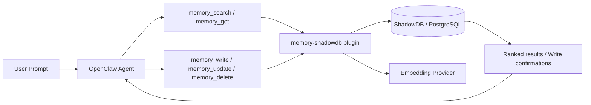
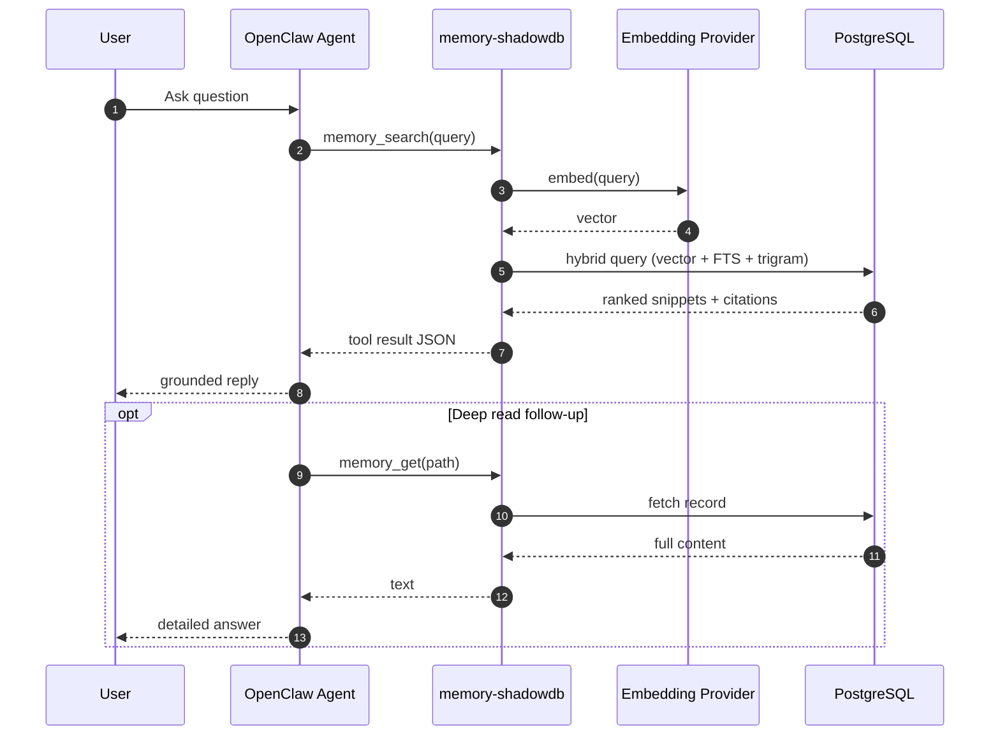
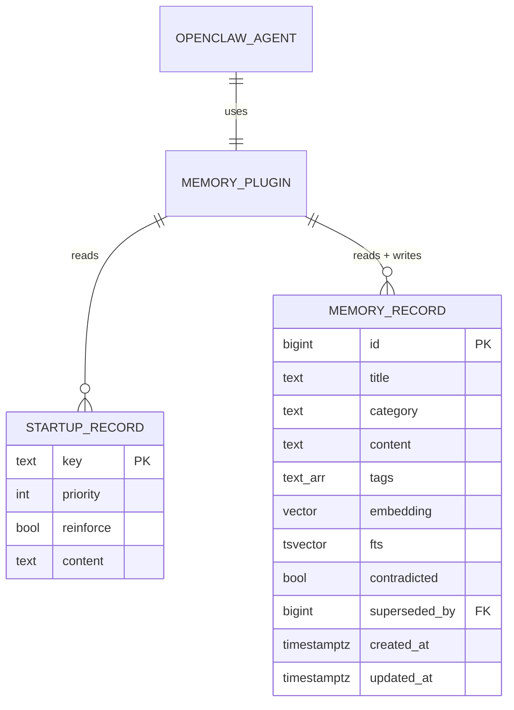

<div align="center">

<picture>
  <source media="(prefers-color-scheme: dark)" srcset="assets/banner-dark.svg">
  <source media="(prefers-color-scheme: light)" srcset="assets/banner-light.svg">
  
</picture>

<br/>

<h2 align="center">Replace static markdown bloat with a memory plugin for OpenClaw and on-demand retrieval.</h2>
<h3 align="center">Your DB choice. Your embedding provider choice. Your path to effectively unbounded memory.</h3>
<h3 align="center">Easy to install. Zero-risk rollout with automatic backup. Fully reversible.</h3>

[](https://raw.githubusercontent.com/openclaw/shadowdb/main/setup.sh)
[](#-current-status)
[](#-what-shadowdb-is)

</div>

---

# ✨ What ShadowDB Is

## ShadowDB is a database-backed memory system for OpenClaw.

### It runs through the **memory plugin slot for OpenClaw** (`memory-shadowdb`) so your agent uses native tools:

- `memory_search`
- `memory_get`
- `memory_write` (config-gated)
- `memory_update` (config-gated)
- `memory_delete` (config-gated)

---

# 🚀 Quick Start

```bash
curl -fsSL https://raw.githubusercontent.com/openclaw/shadowdb/main/setup.sh | bash
```

## That setup script:

1. checks prerequisites,
2. backs up your current workspace/config,
3. creates schema,
4. imports memory,
5. verifies retrieval.

---

# 📈 Current Status

## ✅ Production-ready now

- Fast, grounded retrieval from SQL via the memory plugin for OpenClaw (`memory_search` / `memory_get`)
- **Write operations** — `memory_write`, `memory_update`, `memory_delete` tools with config-gated access, auto-embedding, and soft-delete safety
- Deterministic startup hydration from DB via `before_agent_start` hook
- **Model-aware startup injection** — `maxCharsByModel` config maps model name patterns to per-model char budgets so small-context models (ministral-8b, qwen3) get compact P0/P1 essentials while large-context models (Opus, Sonnet) get the full priority stack
- Startup mapping path for legacy identity files (`SOUL.md`, `IDENTITY.md`) through import scripts
- Flexible embedding providers with strict dimension mismatch enforcement

## 🔧 Remaining hardening work (non-blocking)

- Golden parity harness (automated before/after behavior checks)
- Schema migration/versioning scripts

---

# 💡 Why This Exists

## Static markdown injected every turn wastes context and attention.

### ShadowDB moves memory into a real retrieval system so the model gets:
- less repetitive prompt noise,
- better recall,
- better precision,
- and easier scaling.

---

# 🧭 Architecture at a Glance

<details>
<summary><b>Diagram: high-level flow</b></summary>



</details>

<details>
<summary><b>Diagram: query lifecycle</b></summary>



</details>

<details>
<summary><b>Diagram: core data model</b></summary>



</details>

---

# ❓ FAQ

<details>
<summary><b>Wait — what happens when markdown files are empty? Can I delete them?</b></summary>

Short version:
- Empty expected bootstrap files are usually okay.
- Deleting expected files is usually worse (many frameworks emit missing-file markers).

OpenClaw behavior:
- Missing file can inject `[MISSING] Expected at: ...`
- Empty file is typically skipped

Practical recommendation:
- Keep expected files present
- Keep them minimal/empty when not needed
- Let DB retrieval handle memory

</details>

<details>
<summary><b>How will it find <code>SOUL.md</code> / <code>IDENTITY.md</code> if they are not on disk?</b></summary>

By design, runtime memory is read from the DB via plugin tools.

Flow:
1. setup/import ingests bootstrap content into DB records,
2. runtime uses `memory_search` / `memory_get`,
3. plugin reads SQL records (not markdown files on disk).

Important nuance:
- Retrieval works.
- Startup identity/rules front-load now works from DB via plugin hook.
- You can tune hydration behavior with startup mode (`always`, `first-run`, `digest`).

</details>

<details>
<summary><b>Do I need to hand-edit JSON config?</b></summary>

No for most users.

Treat this as a plugin abstraction: install + verify, done.

If you need exact config wiring, use doctor/status tooling or inspect generated config after setup.

</details>

---

# 🧠 Embedding Providers

`memory-shadowdb` supports:

- `ollama`
- `openai`
- `openai-compatible`
- `voyage`
- `gemini`
- `command` (external embedding command)

Dimension checks are enforced so mismatches fail loudly instead of silently degrading.

---

# 🗂️ Included Schemas

- `schema.sql` (PostgreSQL + pgvector + FTS + trigram indexes)
- `schema-sqlite.sql` (SQLite + FTS5 + sync triggers)
- `schema-mysql.sql` (MySQL/MariaDB + FULLTEXT)

---

# 🛡️ Drop-in Contract (Implemented)

## ShadowDB now supports practical drop-in identity + memory behavior using:

1. legacy file ingest mapping (`SOUL.md`/`IDENTITY.md` → startup records),
2. structural startup hydration before runs,
3. native memory tool retrieval from DB,
4. rollback to stock bootstrap behavior when needed.

What remains is **verification depth**, not architectural capability.

---

# 🛠️ Suggested Migration Pattern (Today)

1. Install plugin path and verify `memory_search` returns `provider: "shadowdb"`.
2. Keep minimal bootstrap stubs for identity safety.
3. Move factual memory load to DB.
4. Choose startup hydration mode (`always` for strict parity, `digest` for lower overhead).
5. Optionally configure `maxCharsByModel` for model-aware injection budgets.

### Startup Config Reference

```jsonc
// in openclaw.json → plugins.entries.memory-shadowdb.config
"startup": {
  "enabled": true,
  "mode": "digest",           // "always" | "first-run" | "digest"
  "maxChars": 6000,           // default budget (fallback)
  "cacheTtlMs": 600000,       // digest re-check interval (10min)
  "maxCharsByModel": {        // model substring → char budget
    "opus": 6000,             // large context → full stack
    "sonnet": 5000,
    "mistral-large": 4000,
    "llama-3.3": 3000,
    "ministral-8b": 1500,     // small context → P0 essentials only
    "qwen3": 2000
  }
}
```

Rows are fetched `ORDER BY priority ASC` and concatenated until the budget is hit. Use priority tiers (P0=critical identity, P1=operational rules, P2=behavioral, P3=reference) to control what smaller models see.

---

# ✏️ Write Operations

## Overview

ShadowDB supports write operations through three tools: `memory_write`, `memory_update`, and `memory_delete`. All writes are **config-gated** — disabled by default, requiring explicit opt-in via plugin config. This is a deliberate safety choice: reads are always safe, writes require intent.

## Tools

### `memory_write` — Create a new memory record

Insert a new record into the memories table with automatic embedding generation.

| Parameter    | Type       | Required | Description                                           |
|-------------|-----------|----------|-------------------------------------------------------|
| `content`   | `string`  | ✅       | Record content (the knowledge to persist)             |
| `category`  | `string`  | ❌       | Organizational category (default: `"general"`)         |
| `title`     | `string`  | ❌       | Human-readable title for the record                   |
| `tags`      | `string[]`| ❌       | Searchable tag array                                  |

**Behavior:**
- Inserts into `memories` table with `record_type = 'fact'`
- If `writes.autoEmbed` is enabled (default: `true`), generates embedding vector automatically
- Returns the new record ID and virtual path (`shadowdb/{category}/{id}`)
- Content is validated: must be non-empty, max 100,000 characters

### `memory_update` — Update an existing record

Modify a record's content, title, category, or tags. Re-embeds automatically on content change.

| Parameter    | Type       | Required | Description                                           |
|-------------|-----------|----------|-------------------------------------------------------|
| `id`        | `number`  | ✅       | Record ID to update                                   |
| `content`   | `string`  | ❌       | New content (triggers re-embedding if changed)        |
| `title`     | `string`  | ❌       | New title                                             |
| `category`  | `string`  | ❌       | New category                                          |
| `tags`      | `string[]`| ❌       | New tag array (replaces existing)                     |

**Behavior:**
- Only updates fields that are explicitly provided (partial update)
- If content changes and `writes.autoEmbed` is enabled, regenerates embedding
- Sets `updated_at = NOW()` automatically (via database trigger)
- Returns confirmation with the updated record path
- Fails with clear error if record ID does not exist

### `memory_delete` — Soft-delete or hard-delete a record

Remove a record from active search results.

| Parameter    | Type       | Required | Description                                           |
|-------------|-----------|----------|-------------------------------------------------------|
| `id`        | `number`  | ✅       | Record ID to delete                                   |
| `hard`      | `boolean` | ❌       | Hard-delete (permanent). Default: `false` (soft-delete)|

**Behavior:**
- **Soft-delete (default):** Sets `contradicted = TRUE` — record remains in DB but is excluded from search results by the `WHERE contradicted IS NOT TRUE` filter
- **Hard-delete:** Permanently removes the row. Requires `writes.allowDelete = true` in config — if not set, hard-delete requests are rejected
- Returns confirmation with the deleted record ID and method used

## Config Reference

```jsonc
// in openclaw.json → plugins.entries.memory-shadowdb.config
"writes": {
  "enabled": true,           // Gate: must be true for any write tool to function
  "autoEmbed": true,         // Auto-generate embedding on write/update (default: true)
  "allowDelete": false       // Allow hard-delete (permanent). Default: false (soft-delete only)
}
```

### Config Behavior Matrix

| `writes.enabled` | Tool call         | Result                                |
|-------------------|-------------------|---------------------------------------|
| `false` (default) | `memory_write`    | Error: "Write operations are disabled" |
| `true`            | `memory_write`    | Insert + auto-embed                   |
| `true`            | `memory_update`   | Update + re-embed if content changed  |
| `true`            | `memory_delete`   | Soft-delete (set contradicted=true)   |
| `true` + `allowDelete: true` | `memory_delete(hard=true)` | Hard-delete (permanent) |
| `true` + `allowDelete: false` | `memory_delete(hard=true)` | Error: "Hard delete is not enabled" |

### Embedding on Write

When `writes.autoEmbed` is `true` (default), write and update operations automatically generate an embedding vector using the configured embedding provider. This means new records are immediately searchable via vector similarity — no separate backfill step required.

If `autoEmbed` is `false`, records are inserted with `embedding = NULL`. They'll still be found by FTS and trigram search, but not by vector similarity. Use the batch embedding backfill CLI (roadmap) to embed them later.

If embedding fails (e.g., provider is down), the write **still succeeds** — the record is inserted without an embedding, and a warning is logged. This fail-open design prioritizes data persistence over search quality.

## Security Model

1. **Config-gated access**: Writes are disabled by default. The `writes.enabled` flag must be explicitly set in plugin config — there is no way to enable writes via tool parameters, environment variables, or runtime state.

2. **Soft-delete by default**: `memory_delete` marks records as contradicted rather than removing them. Hard-delete requires a separate config flag (`writes.allowDelete`), creating a two-layer safety gate.

3. **Input validation**: Content is validated for type, length (max 100,000 chars), and non-emptiness. Category and title are sanitized strings. Tags must be an array of strings.

4. **SQL parameterization**: All write queries use parameterized SQL (`$1`, `$2`, ...). No user input is ever interpolated into SQL strings — same security model as read operations.

5. **Embedding isolation**: Auto-embedding uses the same `EmbeddingClient` as search — API keys come from config/env only, never from tool parameters.

---

# ✅ Validation Checklist

- [ ] `memory_search` returns `provider: "shadowdb"`
- [ ] core memories retrieve correctly
- [ ] identity behavior remains stable across restarts/compactions
- [ ] rollback path tested
- [ ] `memory_write` inserts and auto-embeds when `writes.enabled = true`
- [ ] `memory_update` re-embeds on content change
- [ ] `memory_delete` soft-deletes by default, hard-delete rejected without `allowDelete`
- [ ] Write tools return clear errors when `writes.enabled = false`

---

# 🧯 Troubleshooting

## `memory_search` not returning ShadowDB

- run:

```bash
openclaw doctor --non-interactive
```

- verify plugin is loaded and memory slot is wired
- restart gateway after config changes

## Embedding errors

- check provider keys / endpoint
- check embedding dimensions vs DB vector dimensions

## Postgres issues

- confirm connection string/config
- confirm extensions (`vector`, `pg_trgm`) where needed

---

# 🧪 Testing

Plugin tests:

```bash
cd extensions/memory-shadowdb
npm test
```

Current tests cover:
- provider alias normalization,
- provider config resolution,
- startup hydration config defaults/normalization,
- dimension mismatch enforcement.

---

---

# 📋 Roadmap / TODOs

## Write Operations
- [x] **`memory_write` tool** — Structured insert with auto-embedding, category/title/content/tags
  - Config: `writes.enabled` (default false), `writes.autoEmbed` (default true), `writes.allowDelete` (default false)
  - Validates input (non-empty, max 100K chars), returns new record ID and virtual path
  - Embedding failure is non-fatal (record persists without vector)

- [x] **`memory_update` tool** — Update existing record fields + auto re-embed on content change
  - Partial update: only modifies fields explicitly provided
  - Automatic embedding regeneration when content changes
  - Fails clearly if record ID does not exist

- [x] **`memory_delete` tool** — Soft-delete by default, hard-delete config-gated
  - Soft-delete: sets `contradicted = TRUE` (excluded from search by existing WHERE clause)
  - Hard-delete: requires `writes.allowDelete = true` in config (two-layer safety gate)
  - Returns confirmation with method used (soft/hard)

## Maintenance & Operations
- [ ] **Batch embedding backfill** — CLI command to embed all NULL-embedding rows
  - Progress reporting and resume on failure
  - Rate limiting to avoid overwhelming embedding provider
  - Dry-run mode for cost estimation

- [ ] **Schema migration versioning** — Track schema version, auto-migrate on startup
  - Detect schema drift and apply migrations automatically
  - Rollback support for failed migrations
  - Version table to track applied migrations

## Testing & Validation
- [ ] **Golden parity test harness** — Automated before/after behavior comparison
  - Compare memory-core vs memory-shadowdb responses
  - Regression detection for retrieval quality
  - Performance benchmarking (latency, recall, precision)

## Multi-Tenancy & Scoping
- [ ] **Multi-agent scoped startup records** — Per-agent startup row filtering
  - `startup.agent_filter` column for agent-specific rules
  - Shared vs agent-specific identity isolation
  - Enables multiple agents with different personas on same DB

## Audit & Compliance
- [ ] **Write audit log** — Track who wrote what and when (session, timestamp, diff)
  - Immutable append-only audit table
  - Track session ID, timestamp, user context, content diff
  - Enables compliance tracking and abuse detection

---

# 🤝 Contributing

If you contribute, please keep docs explicit and state current runtime truth (not aspirational claims).

Priority contribution areas:
- startup hydration test coverage + policy tuning,
- migration/parity harness,
- schema versioning/migrations,
- multi-agent scoped startup records.

---

# 📄 License

MIT
