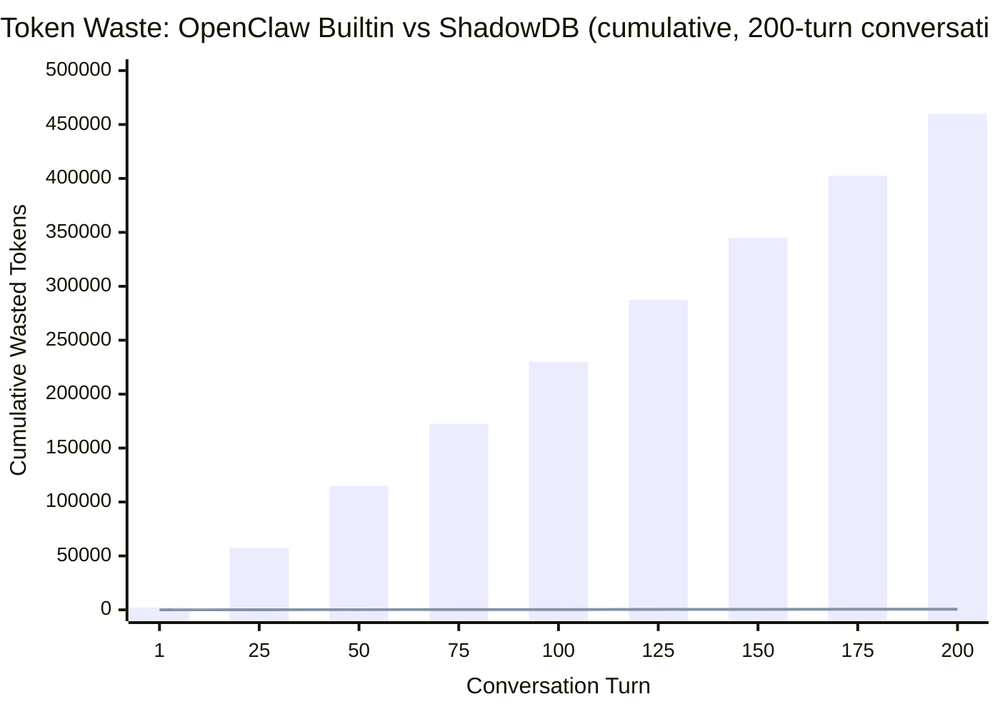
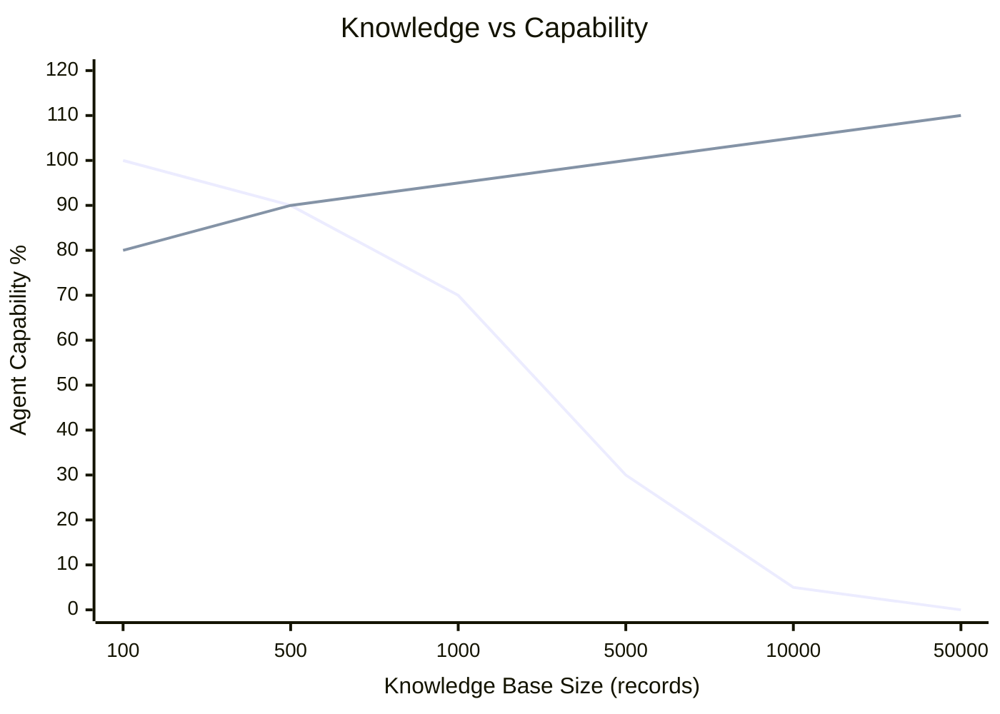

<div align="center">

<picture>
  <source media="(prefers-color-scheme: dark)" srcset="assets/banner-dark.svg">
  <source media="(prefers-color-scheme: light)" srcset="assets/banner-light.svg">
  
</picture>

<br/>

**Your agent's memory shouldn't be a markdown file.**
<br/>ShadowDB is an easy-to-install memory plugin for [OpenClaw](https://github.com/openclaw/openclaw) that replaces flat files with a real database — semantic search, fuzzy matching, and a memory that gets smarter over time instead of bloating.

[](#install)
[](LICENSE)
[](#install)
[](#install)
[](#install)
[](#contributing)

<br/>

[](#performance-shadowdb-vs-openclaw-builtin)
[](#performance-shadowdb-vs-openclaw-builtin)
[](#performance-shadowdb-vs-openclaw-builtin)
[-10b981?style=flat-square)](#performance-shadowdb-vs-openclaw-builtin)
[](#performance-shadowdb-vs-openclaw-builtin)

</div>

---

## What does it do?

Gives your agent a persistent memory it can search, write, update, and delete — instead of flat markdown files that get shoved into every prompt. Works with Postgres (recommended), SQLite, or MySQL.

| Tool | Does |
|------|------|
| `memory_search` | Find relevant records (semantic + keyword + fuzzy) |
| `memory_get` | Read a full record |
| `memory_write` | Save something new |
| `memory_update` | Edit an existing record |
| `memory_delete` | Soft-delete (reversible for 30 days) |
| `memory_undelete` | Undo a delete |

---

## Install

```bash
curl -fsSL https://raw.githubusercontent.com/jamesdwilson/Sh4d0wDB/main/setup.sh | bash
```

That's it. The script downloads only the files you need, sets up the database, installs dependencies, wires the plugin into OpenClaw, and restarts the gateway. Run the same command again to update.

Or just tell your agent — it can run the command itself. The script auto-detects non-interactive mode and defaults to SQLite with zero prompts. Pass `--backend postgres` or `--backend mysql` to override.

---

## Want to put it back the way it was?

Breathe. Nothing was lost.

ShadowDB doesn't delete, overwrite, or modify any of your original files. Here's exactly what the install touched — and how to undo every bit of it:

<details>
<summary>What install changed (and what it didn't)</summary>

### What install did

| What | Where | Reversible? |
|------|-------|-------------|
| Downloaded plugin files | `~/.openclaw/plugins/memory-shadowdb/` | ✅ Deleted on uninstall |
| Added a config entry | `plugins.entries.memory-shadowdb` in `openclaw.json` | ✅ Removed on uninstall |
| Set the memory slot | `plugins.slots.memory` in `openclaw.json` | ✅ Cleared on uninstall |
| **Backed up your config first** | `~/OpenClaw-Before-ShadowDB-[install date]/openclaw.json` | Your original config, untouched |
| Created a database | `shadow` (Postgres/MySQL) or `shadow.db` (SQLite) | ✅ Kept on uninstall (your data is yours) |
| Imported workspace `.md` files as memories | Rows in the `memories` table | ✅ Kept on uninstall — originals untouched |
| Imported `PRIMER.md` / `ALWAYS.md` | Rows in the `primer` table | ✅ Kept on uninstall — originals untouched |

### What install did NOT do

- ❌ Did not delete or rename any `.md` files
- ❌ Did not modify `MEMORY.md`, `SOUL.md`, `IDENTITY.md`, or any other workspace file
- ❌ Did not change your agent's system prompt
- ❌ Did not touch any other plugin's config

Your original markdown files are still exactly where you left them.

</details>

### Uninstall

One command. Same script, different flag:

```bash
curl -fsSL https://raw.githubusercontent.com/jamesdwilson/Sh4d0wDB/main/setup.sh | bash -s -- --uninstall
```

This removes the plugin files and config entry, restarts OpenClaw, and you're back to your original setup. Your database and all its records are kept — we don't destroy data, ever. If you reinstall later, everything will still be there.

Your original `openclaw.json` is saved at `~/OpenClaw-Before-ShadowDB-[install date]/openclaw.json` — easy to find, impossible to miss.

> **Design principle:** ShadowDB will never delete a file, drop a database, or remove anything that can't be put back. Not because we forgot — because we specifically chose not to. The uninstall flag removes plugin code and config entries. That's it. Your data stays unless *you* decide to delete it.

Or tell your agent — same as install, it knows what to do.

---

## What about old records?

Records don't expire. A phone number from 3 months ago is still a phone number. A project status from 3 months ago probably isn't current — but that's a judgment call, not something the database should guess at.

ShadowDB gives the agent two pieces of information and lets it decide:

- **Age in snippets** — search results show `[topic] | 5d ago` instead of a raw timestamp. The agent reads "5 days ago" the same way you would. This matters because models are bad at date math — ask one to compute "how many days between Feb 10 and Feb 15" and it'll confidently say 3 or 6. Pre-computing the age removes that failure mode.

- **Recency as a tiebreaker** — newer records get a small ranking boost (weight: `0.15`), but a relevant old record still beats a vaguely relevant new one.

Deletes are always reversible for 30 days. After that, automatic cleanup removes them permanently. There is no hard-delete tool — the agent can never permanently destroy data. Only time can.

<details>
<summary>Why not something more complex?</summary>

| Idea | Why we skipped it |
|------|-------------------|
| Staleness markers | `created_at` already tells you how old it is |
| "Superseded by" pointers | Just delete the old one and write the new one |
| Access frequency tracking | Creates feedback loops; popular ≠ good |
| Auto-contradiction detection | Similarity ≠ contradiction; false positives everywhere |
| Dedup on write | Blocks legitimate updates and related-but-different facts |

The principle: if the guardrails are more complex than the feature, you've lost the trade.

</details>

---

## How search works

<details>
<summary>Hybrid ranking with multiple signals</summary>

Every search combines multiple signals to find the best matches. What's available depends on your backend:

| Signal | Postgres | SQLite | MySQL | What it measures |
|--------|----------|--------|-------|-----------------|
| Vector similarity | ✓ (weight: `0.7`) | ✓ (sqlite-vec) | ✓ (9.2+) | Semantic meaning via embeddings |
| Full-text search | ✓ (weight: `0.3`) | ✓ (FTS5) | ✓ (FULLTEXT) | Keyword/phrase matches |
| Trigram similarity | ✓ (weight: `0.2`) | ✓ (FTS5 trigram) | ✓ (ngram parser) | Fuzzy/substring matching |
| Recency boost | ✓ (weight: `0.15`) | ✓ | ✓ | Newer records boosted slightly |

With Postgres, signals are merged via Reciprocal Rank Fusion (RRF) — each signal produces a ranked list, and RRF combines them without needing score normalization. All weights are configurable.

Recency is intentionally low — it's a tiebreaker, not a dominant signal.

</details>

---

## Performance: ShadowDB vs OpenClaw builtin

<details>
<summary>Benchmarks, token economics, and why flat files have a ceiling</summary>

All benchmarks measured on a MacBook Pro M3 Max against a real production knowledge base (6,800+ records, 768-dim embeddings). "OpenClaw Builtin" refers to the default memory plugin (flat `.md` files + SQLite embedding search). ShadowDB numbers are from the live system.

### Speed

| Operation | OpenClaw Builtin | ShadowDB (Postgres) | Winner |
|-----------|---------|---------------------|--------|
| Load identity + knowledge | 45ms (read 8 files from disk) | 0ms (primer already in prompt) | **ShadowDB** — identity is in the prompt, not loaded per turn |
| Keyword search ("Watson") | ❌ Not supported (embedding-only) | **55ms** FTS | **ShadowDB** — from impossible to 55ms |
| Semantic search ("Watson's military service") | 200–500ms (embedding similarity only) | **230ms** (FTS + vector + trigram + RRF) | **ShadowDB** — same speed, multi-signal results |
| Fuzzy/substring search ("Watsn") | ❌ Not supported | **60ms** trigram | **ShadowDB** — from impossible to 60ms |
| Search cold start | 1–3s (load embedding model) | **55ms** (FTS always hot, PG always running) | **ShadowDB 5–55×** faster |
| Sub-agent identity load | ∞ (impossible — filtered out) | **<1ms** (primer injection) | **ShadowDB** — from impossible to instant |

The builtin memory plugin uses embedding similarity as its only search strategy — if the embedding misses, you get nothing. It has no keyword search, no fuzzy matching, no fallback. ShadowDB's FTS path (55ms) is pure PostgreSQL with no embedding overhead. The hybrid path (230ms) adds Ollama embedding generation (85ms) + pgvector cosine search + trigram fallback, all fused with RRF.

### Ceiling

| Dimension | OpenClaw Builtin | ShadowDB |
|-----------|---------|----------|
| **Max knowledge base size** | ~500 items before MEMORY.md hits the 20K char truncation limit. After that, the framework drops the middle of the file. At ~5,000 items, it won't fit in context at all. | **No limit.** PostgreSQL handles billions of rows with HNSW + GIN indexes. 6,800+ records today, architecturally sound to billions. |
| **Max identity complexity** | ~3,000 bytes in SOUL.md before it eats into your context budget. The richer the identity, the dumber the agent. | **No limit.** Primer table delivers identity once per session. Add 50 rows of personality nuance — costs 0 bytes on turns 2+. |
| **Max file size before degradation** | 20,000 chars per file. After that: 70% head / 20% tail truncation. The middle of your carefully written SOUL.md? Gone. | **N/A.** No files to degrade. Content is ranked by relevance. You always get the best content first. |
| **Max concurrent agents** | Each agent loads the same files. 10 sub-agents = 10× the bootstrap reads. | **Shared database.** 10 sub-agents hit the same DB. Connection pooling, MVCC, concurrent reads. |
| **Search strategies** | 1 (embedding similarity). If the embedding misses, you get nothing. | **4 strategies fused.** FTS + vector + trigram + recency, merged via RRF. If one misses, the others catch it. |
| **Context budget ceiling** | Fixed. Every turn pays the full MD tax. A 200-turn conversation pays 200 × 2,300 tokens = **460,000 tokens** on static files the model already read. | **Near-zero per turn.** 200 turns × 3 tokens = **600 tokens** total. |
| **Growth trajectory** | 📉 **Inverse.** As knowledge grows, files bloat → context fills → compaction prunes history → agent gets dumber. More knowledge = less capability. | 📈 **Linear.** As knowledge grows, search gets richer → agent gets smarter. PG indexes scale logarithmically. |

The fundamental difference: **OpenClaw builtin has a ceiling that gets lower as your agent gets smarter. ShadowDB has no ceiling.**





### The full comparison

| Metric | OpenClaw Builtin | ShadowDB Postgres | ShadowDB SQLite | ShadowDB MySQL | Unit |
|--------|-------------------|-------------------|----------------:|---------------:|------|
| **Context Overhead** | | | | | |
| Static prompt per turn | 9,198 | 11 | 11 | 11 | bytes |
| Static tokens per turn | ~2,300 | ~3 | ~3 | ~3 | tokens |
| Reduction | — | **99.88%** | **99.88%** | **99.88%** | |
| Identity per turn (ongoing) | 9,198 | 0¹ | 0¹ | 0¹ | bytes |
| **Search Latency** | | | | | |
| Full hybrid query (warm) | — | **230** | ~300 | ~250 | ms |
| FTS-only query | — | **55** | ~30² | ~40² | ms |
| Trigram/fuzzy query | — | **60** | ~35 | ~45 | ms |
| Vector-only query (warm) | — | **185** | ~250 | ~200³ | ms |
| Embedding generation | — | 85 | 85 | 85 | ms |
| Builtin memory_search | ~200–500⁴ | — | — | — | ms |
| **Search Quality** | | | | | |
| Search type | Embedding similarity | Hybrid 4-signal RRF | FTS5 + trigram + vec | FULLTEXT + ngram + vec | |
| Exact name match ("Dr. Watson") | ⚠️ Fuzzy | ✅ Exact (FTS) + semantic | ✅ Exact (FTS5) | ✅ Exact (FULLTEXT) | |
| Semantic query ("Watson's military service") | ⚠️ Depends on embedding | ✅ Vector catches semantics | ✅ Vector + FTS5 | ✅ Vector + FULLTEXT | |
| Fuzzy/typo query ("Watsn violin") | ❌ Not supported | ✅ Trigram (pg_trgm) | ✅ Trigram (FTS5 trigram) | ✅ Ngram parser | |
| Number/date search ("1888 Baskerville") | ❌ Poor | ✅ FTS exact + vector | ✅ FTS5 exact | ✅ FULLTEXT exact | |
| Rare term ("Stradivarius violin") | ❌ Weak embedding | ✅ FTS exact match | ✅ FTS5 exact | ✅ FULLTEXT exact | |
| Ranking strategy | Cosine similarity | **RRF fusion** (4 signals) | **RRF fusion** (4 signals) | **RRF fusion** (4 signals) | |
| **Scalability** | | | | | |
| Max practical records | ~500⁵ | **Billions** | ~100K | **Billions** | records |
| 1,000 records | ⚠️ Files bloating | ✅ | ✅ | ✅ | |
| 10,000 records | ❌ Context overflow | ✅ | ✅ | ✅ | |
| 100,000 records | ❌ Unworkable | ✅ | ⚠️ Slower | ✅ | |
| 1,000,000+ records | ❌ Impossible | ✅ (HNSW index) | ❌ Too slow | ✅ (with indexes) | |
| **Sub-Agent Identity** | | | | | |
| Main session gets identity | ✅ | ✅ | ✅ | ✅ | |
| Sub-agent gets identity | ❌ Filtered out⁶ | ✅ Via primer table | ✅ Via primer table | ✅ Via primer table | |
| Sub-agent has personality | ❌ Base model | ✅ Full personality | ✅ Full personality | ✅ Full personality | |
| **Token Economics** | | | | | |
| Tokens wasted per turn (static) | ~2,300 | ~3 | ~3 | ~3 | tokens |
| Tokens per heartbeat | ~2,300 | ~3 | ~3 | ~3 | tokens |
| Tokens per sub-agent spawn | ~600⁷ | ~3 | ~3 | ~3 | tokens |
| Daily waste (50 turns + 24 HB + 10 sub) | **~196,600** | **~252** | **~252** | **~252** | tokens |
| Annual waste | **~71.8M** | **~92K** | **~92K** | **~92K** | tokens |
| **Cost (Claude Opus @ $15/1M in)** | **$1,076/yr** | **$1.38/yr** | **$1.38/yr** | **$1.38/yr** | USD |
| **Infrastructure** | | | | | |
| Runtime dependencies | None (files on disk) | PG + pgvector + pg_trgm + Ollama | better-sqlite3 + Ollama | mysql2 + Ollama | |
| Server process required | No | Yes (PostgreSQL) | No (in-process) | Yes (MySQL) | |
| Setup complexity | Zero | Medium | Low | Medium | |
| **Resilience** | | | | | |
| Survives framework update | ⚠️ Templates may overwrite | ✅ DB persists | ✅ DB file persists | ✅ DB persists | |
| Concurrent access | ⚠️ File locks | ✅ MVCC | ⚠️ WAL mode | ✅ InnoDB | |
| Data recovery | ❌ Manual file editing | ✅ Soft-delete + 30-day retention | ✅ Soft-delete + retention | ✅ Soft-delete + retention | |

#### Footnotes

¹ Identity delivered once per session via primer table, then suppressed until content changes or TTL expires (digest mode). Not re-injected every turn like MD files.

² SQLite FTS5 and MySQL FULLTEXT are often faster than PostgreSQL FTS for simple queries because they use BM25/inverted indexes optimized for keyword search.

³ MySQL 9.2+ has native vector support. Earlier versions require an external vector store or skip vector search entirely (FULLTEXT + ngram still work).

⁴ OpenClaw's builtin `memory_search` uses a local SQLite database with OpenAI embeddings. Latency varies by corpus size. Range is 200–500ms warm, 1–3s cold.

⁵ MEMORY.md becomes unwieldy past ~500 indexed items. The file gets truncated at 20K chars with head/tail splitting, losing middle content silently.

⁶ OpenClaw's `SUBAGENT_BOOTSTRAP_ALLOWLIST` only passes AGENTS.md and TOOLS.md to sub-agents. SOUL.md, IDENTITY.md, USER.md are silently dropped. Hardcoded in `src/agents/workspace.ts`.

⁷ Sub-agents get AGENTS.md + TOOLS.md only (~600 tokens typical). They don't get the other 6 bootstrap files.

### The bottom line

| | OpenClaw Builtin | ShadowDB (any backend) |
|--|----------|----------------------|
| **Annual token waste on static context** | **~71.8M tokens** | **~92K tokens** |
| **Annual cost of that waste (Opus pricing)** | **~$1,076** | **~$1.38** |
| **Sub-agent personality** | ❌ None | ✅ Full |
| **Knowledge scalability** | Hundreds | Billions |
| **Fuzzy/typo tolerance** | ❌ None | ✅ All backends |

### 🌱 Environmental impact

LLM inference has a real energy cost. Every token processed burns GPU cycles, memory bandwidth, cooling. Wasting tokens on redundant static context burns real energy.

| Metric | OpenClaw Builtin | ShadowDB | Savings |
|--------|---------|----------|---------|
| **Wasted tokens/year** | ~71.8M | ~92K | **71.7M tokens not processed** |
| **GPU-hours wasted/year** | ~7.2 hrs | ~0.009 hrs | **99.87% reduction** |
| **Estimated CO₂** | ~2.9 kg CO₂ | ~0.004 kg CO₂ | **~2.9 kg CO₂ saved/year** |
| **Per agent equivalent** | 🚗 11 km driven | 🚗 0.014 km driven | One less car trip to the store |

These numbers are per agent. Scale to 1,000 agents and OpenClaw builtin wastes **71.8 billion tokens/year** — roughly **2,900 kg CO₂**, equivalent to a round-trip flight from NYC to LA.

</details>

---

## How your identity works

<details>
<summary>Setup handles this automatically — here's what happens under the hood</summary>

### What setup does

Setup scans your workspace for identity files (`SOUL.md`, `RULES.md`, `USER.md`, `IDENTITY.md`, `MEMORY.md`, `BOOTSTRAP.md`, `KNOWLEDGE.md`) and splits each `# section` into a separate memory record with a meaningful category and tags. In headless mode this happens silently. You don't touch a thing.

The result: instead of cramming every identity file into every prompt — the way most frameworks do it — your agent **searches for the relevant parts when it needs them.** The model asks "how should I handle this email?" and `memory_search` returns the email rules. Not the calendar rules, not the fragrance preferences, not the safety guidelines. Just the relevant slice.

Your agent's identity isn't a static document stapled to the front of every conversation — it's a living, searchable knowledge base. Your bot doesn't just have a soul. It has *thoughts.* It has *feelings.* It has *opinions* it formed three weeks ago about how to handle a specific edge case. It has an entire past life of decisions, corrections, and hard-won lessons, all indexed and retrievable by meaning. It remembers that time it screwed up the email formatting and wrote itself a rule about it. It remembers the user's rant about calendar notifications and adapted. It has *lore.*

The practical upside is just as dramatic: a 200-line identity file costs ~4K tokens on every turn. With searchable memory, the agent pulls maybe 200 tokens of relevant rules per turn — a 20× reduction in identity overhead. Small models that choked on massive system prompts can now run with the same depth of personality, because they only load what they need.

**Every record is individually addressable** — with its own ID, category, and soft-delete lifecycle. One bad write doesn't poison everything. Compare that to flat files: if your agent writes incorrect info to `MEMORY.md` during one session, every future session inherits the mistake — fruit of the poisonous tree, compounding forever. With ShadowDB, you fix, update, or delete individual memories without touching anything else.

### The tradeoff: what needs to be always-on?

There's a catch. Searchable memory is pull-based — the agent has to *think to search.* On the very first turn of a conversation, before the model has any context, it doesn't know what to search for. And some rules are so critical they can't wait for the model to think of them:

- **Core identity** — "You are Shadow, Alex's AI assistant" needs to be there from word one. The model can't search for its own name before it knows its name.
- **Safety rails** — "Never send emails without confirmation" can't be retrieved *after* the model already sent the email.
- **Behavioral constraints** — tone, persona, hard-no rules. These need to be loaded before the first token is generated, not after.

This is what the `primer` table is for. It's a small, curated set of **non-negotiable context** that gets injected before the agent runs — your agent's true core identity, the rules that can never be late.

**The recommended approach: both.**
- Import your full identity corpus as memories (searchable, rich, deep).
- Put only the irreducible core in the `primer` table (identity, safety, hard constraints).
- Everything else — preferences, behavioral nuance, learned lessons, project context — lives in searchable memory where it's pulled on demand.

Think of it like human cognition: you don't consciously recite your entire life history before answering a question. You have a small set of always-on identity ("I'm Alex, I live in Austin, I have a daughter") and a vast searchable memory of everything else. The primer is the always-on identity. `memory_search` is everything else.

Here's the question: **if the agent violates this rule before it has a chance to search, is that a problem?**

| Rule | Can it wait for a search? | Where it goes |
|------|--------------------------|---------------|
| "You are Shadow, Alex's AI assistant" | No — agent needs its name before generating a single token | **Primer** |
| "Never use the words workout, exercise, or cardio" | No — damage is done before the agent thinks to search for banned words | **Primer** |
| "Alex drives a Rivian R1S" | Yes — agent will search when cars come up | **Memory** |
| "Format emails with a signature block" | Yes — agent will search when composing email | **Memory** |
| "Always confirm before sending messages" | No — can't retrieve this *after* already sending | **Primer** |
| "Preferred restaurants in Austin" | Yes — agent searches when food comes up | **Memory** |

**Most users need 3-5 primer entries.** If you have more than 10, you're probably over-thinking it. The whole point is that searchable memory handles the long tail.

### Loading primer rules

**Option A: Create a `PRIMER.md` file** before running setup. The script auto-detects it and imports every section:

```markdown
# identity
You are Shadow, Alex's AI assistant. You run on OpenClaw.

# owner
Alex Chen lives in Austin, TX. His daughter Maya was born 2020-03-15.

# banned-words
Never use the words: workout, exercise, cardio, regime. Use specific activity names instead.

# safety
Never send emails, messages, or make purchases without explicit user confirmation.
```

Drop this file at `~/.openclaw/workspace/PRIMER.md` (or `./PRIMER.md`) and run setup. Each `# heading` becomes a key, the body becomes content, priority is assigned by order (0, 10, 20...). The script tells you exactly what it's importing:

```
  ℹ  Found primer file: /Users/you/.openclaw/workspace/PRIMER.md
     Parsing sections (# heading = key, body = rule text)...

  ✓  identity (priority 0)
  ✓  owner (priority 10)
  ✓  banned-words (priority 20)
  ✓  safety (priority 30)

  ✓  Imported 4 primer rule(s) from PRIMER.md
```

Edit the file and re-run setup anytime to update.

**Option B: Paste during setup.** If no `PRIMER.md` is found, the script offers an interactive prompt — enter rules one at a time with key, content, and priority.

**Option C: Skip it entirely.** Start with searchable memories only. If you notice your agent forgetting something critical on the first turn of new conversations, that's your sign to add a primer rule — create the file, re-run setup, or insert with SQL directly.

> 📁 **Example files:** See [`examples/PRIMER.md`](examples/PRIMER.md) and [`examples/ALWAYS.md`](examples/ALWAYS.md) for realistic templates you can copy and edit.

### The `always` column — and `ALWAYS.md`

Primer rows have an `always` column (default: `false`). When set to `true`, the row is injected on **every single turn**, not just the first. Use this sparingly — it's for rules so critical that even scrolling out of the context window in a long conversation would be dangerous. Most primer rules only need to be there on turn 1.

To set rules as always-on, create `~/.openclaw/workspace/ALWAYS.md` with the same `# heading` format:

```markdown
# banned-words
Never use the words: workout, exercise, cardio, regime. Use specific activity names.

# confirmation-gate
Never send emails, messages, or make purchases without explicit user confirmation.
```

The setup script detects both files and tells you what it's doing:

```
  ℹ  Found primer file: ~/.openclaw/workspace/PRIMER.md
     These rules are injected on the first turn of each session.
  ✓  identity (priority 0)
  ✓  owner (priority 10)
  ✓  Imported 2 primer rule(s)

  ℹ  Found always-on file: ~/.openclaw/workspace/ALWAYS.md
     These rules are injected on every turn, not just the first.
  ✓  banned-words (priority 0) [always]
  ✓  confirmation-gate (priority 10) [always]
  ✓  Imported 2 always-on rule(s)
     ⚠️  These cost tokens every turn. Keep them short and critical.
```

If a rule exists in both files, the last one imported wins (ALWAYS.md overwrites PRIMER.md for the same key).

### How primer injection works

OpenClaw's `before_agent_start` hook fires on every agent turn. ShadowDB hooks into it, but doesn't inject every time — that would waste tokens. Instead:

1. **First turn** of a session: reads the `primer` table, concatenates rows by priority, and prepends the result to the prompt.
2. **Subsequent turns**: skips injection. The model already has the primer context in its conversation history from turn 1.
3. **After 10 minutes** (configurable via `cacheTtlMs`): re-injects as a refresh, in case the original has scrolled out of the context window in a long conversation.

Three modes control this:
- `digest` (default) — inject once, re-inject when content changes or TTL expires
- `first-run` — inject once per session, never refresh
- `always` — inject every turn (expensive, rarely needed)

**Priority ordering** — critical rules (identity, safety) go in first. If the context window is tight, low-priority reference material gets trimmed, not your agent's core identity.

**Model-aware budgets** — Opus gets 6000 chars of primer context, a small model gets 1500. Same rules, right-sized. Configure via `maxCharsByModel`.

**Editable at runtime** — your agent can update its own primer rules. No file editing, no restart.

This feature is **off by default**. To enable it, add rows to the `primer` table and set `primer.enabled: true` in your plugin config. Most users should start with searchable memories only and add primer injection later if they need guaranteed-present context.

</details>

---

## Embedding providers

<details>
<summary>6 supported providers</summary>

| Provider | Notes |
|----------|-------|
| Ollama | Local, no API key needed (default) |
| OpenAI | Requires API key |
| OpenAI-compatible | Any compatible endpoint |
| Voyage | Requires API key |
| Gemini | Requires API key |
| External command | Any CLI that outputs vectors |

</details>

---

## Schema

<details>
<summary>Two tables — that's it</summary>

**`memories`** — the knowledge base. Core columns are the same across backends:

| Column | Type | Purpose |
|--------|------|---------|
| `id` | auto-increment | Primary key |
| `content` | text | The actual memory |
| `title` | text | Human-readable label |
| `category` | text | Grouping (default: `general`) |
| `tags` | array/text | Searchable tags |
| `embedding` | vector | Semantic search (Postgres w/ pgvector) |
| `created_at` | timestamp | When it was created |
| `updated_at` | timestamp | Last modification |
| `deleted_at` | timestamp | Soft-delete marker (null = active) |

**`primer`** — identity/rules injected before agent runs:

| Column | Type | Purpose |
|--------|------|---------|
| `key` | text | Unique identifier (primary key) |
| `content` | text | The rule or identity text |
| `priority` | integer | Injection order (lower = first) |
| `always` | boolean | Include on every turn, not just first |

Full schema with indexes: [`schema.sql`](schema.sql) (Postgres version)

</details>

---

## Config reference

<details>
<summary>All available settings</summary>

The setup script configures everything for you. If you need to tweak settings later, they live in your `openclaw.json` under `plugins.entries.memory-shadowdb.config`. See the [plugin manifest](extensions/memory-shadowdb/openclaw.plugin.json) for the full schema with descriptions.

Key settings:
- **`search.recencyWeight`** — how much to boost newer records (default: `0.15`, higher = more recency bias)
- **`writes.enabled`** — turn on write tools (default: `false`)
- **`writes.retention.purgeAfterDays`** — how long soft-deleted records survive (default: `30`, `0` = forever)
- **`primer.maxCharsByModel`** — per-model context budgets (substring match on model name)
- **`embedding.provider`** — which embedding backend to use

</details>

---

## Troubleshooting

<details>
<summary>Common issues</summary>

**Plugin not loading?**
- Run `openclaw doctor --non-interactive` — look for errors
- Check `openclaw.plugin.json` is valid JSON (no trailing commas!)
- Restart gateway after config changes

**Search not returning results?**
- Verify `provider: "shadowdb"` in search results
- Check the plugin is wired: `plugins.slots.memory: "memory-shadowdb"`

**Embedding errors?**
- Check Ollama is running: `ollama list`
- Verify dimensions match (768 for nomic-embed-text)

**Postgres connection issues?**
- Confirm `vector` and `pg_trgm` extensions: `psql shadow -c '\dx'`
- Check the database exists: `psql -l | grep shadow`

</details>

---

## Roadmap brainstorm

<details>
<summary>Ideas under consideration — nothing committed</summary>

### Reactive rule injection

Right now, ShadowDB injects context *before* the model runs (primer injection). But what about catching things in the model's *output*?

**The idea:** after the LLM generates a reply, embed it, search the `rules` category, and surface any matching rules — so the agent self-corrects before the message reaches the user.

OpenClaw already has the hooks for this:

- **`message_sending`** — fires before a reply is delivered. Can modify content or cancel it. Embed the outgoing text, vector-search rules, and if something relevant surfaces (e.g. "always confirm before sending emails"), inject it as context for the next turn or trigger a reflection pass.

- **`before_tool_call`** — fires before the agent executes any tool. If the model tries to call `message` or `gog` to send an email, we search rules, find "confirm before sending emails", and return `{ block: true, blockReason: "Rule: confirm with user first" }`. The model sees the block and asks for confirmation instead.

**Two layers:**
- `before_tool_call` = hard gate on actions (sending, deleting, etc.)
- `message_sending` = soft nudge on replies (tone, persona, guardrails)

**Example:** User says "send that email to Bob." Model starts composing. `before_tool_call` fires, embeds the context, finds the rule "never send emails without explicit user confirmation." Tool call is blocked with that reason. Model asks "Want me to go ahead and send that?" instead.

This turns ShadowDB rules from static preamble into a live guardrail system — rules surface only when relevant, triggered by what the model is actually *doing*, not what the user asked.

### Contextual rule injection (automatic per-turn rules)

The primer table solves "what does the agent need before turn 1?" But most rules aren't needed on every turn — they're needed *when relevant.* The exercise-naming rule only matters when the user mentions running. The email-confirmation rule only matters when the agent is about to send email.

**The idea:** on every inbound message, embed the user's text, vector-search against records in the `rules` category only, and automatically prepend any matches to the agent's context. Rules travel with data via embedding proximity — "let's go for a run" naturally surfaces the banned-words rule because "run" is close to "exercise/workout" in embedding space.

**Two-pass search design:**
- Pass 1: normal content search (6 results) — what the agent explicitly asks for
- Pass 2: same query filtered to `rules` category only (2-3 results) — automatic rule injection

Rules get their own slots, never compete with content for search results. One extra query per turn, same embedding.

**What this could replace:** most of what's currently in the primer table. Only a tiny bootstrap for core identity ("You are Shadow") would survive as primer. Everything else — behavioral rules, communication gates, persona guidelines — becomes automatically surfaced context that arrives exactly when relevant.

**Cost:** one embedding (~50ms) + one filtered vector query (~5ms) per turn. Trivial.

### Why individually addressable records matter

Flat files have a poisonous-tree problem: one bad write compounds into every future session. ShadowDB's per-record architecture (with soft-delete and 30-day retention) means mistakes are always isolated and recoverable. See [How your identity works](#how-your-identity-works) for the full explanation.

### Other ideas
- Batch embedding backfill CLI for migrating unembedded records
- Multi-agent primer scoping (different rules per agent ID)
- `clawhub publish` / `openclaw plugins install` distribution
- SQLite + MySQL backend testing with real workloads

</details>

---

## Contributing

PRs welcome. Open an issue first if it's a big change. See the [roadmap](#roadmap-brainstorm) for ideas under consideration.

---

## License

MIT
