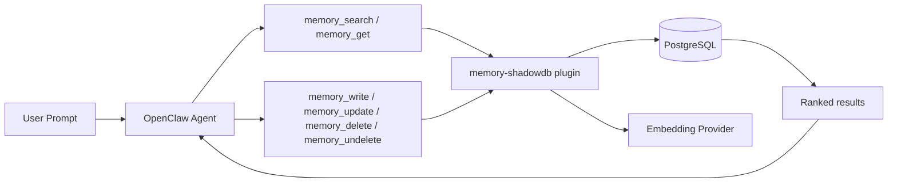
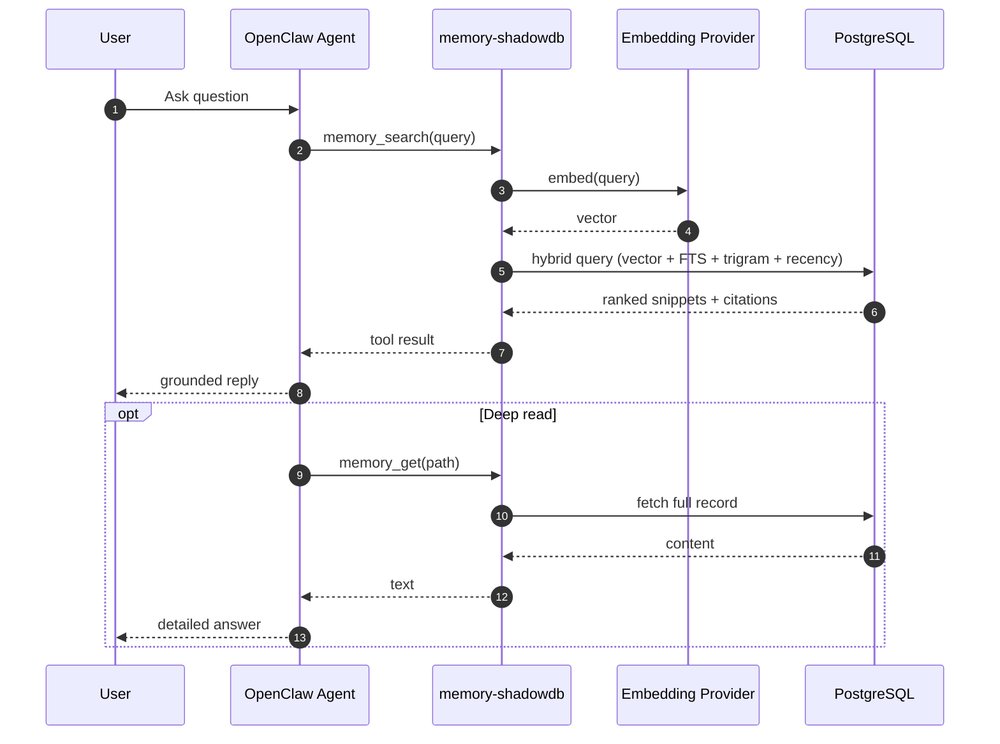
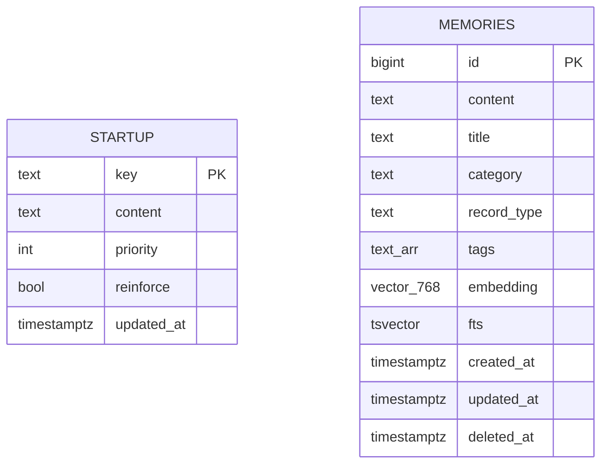

<div align="center">

<picture>
  <source media="(prefers-color-scheme: dark)" srcset="assets/banner-dark.svg">
  <source media="(prefers-color-scheme: light)" srcset="assets/banner-light.svg">
  
</picture>

<br/>

<h2 align="center">A memory plugin for OpenClaw that replaces static markdown with real retrieval.</h2>
<h3 align="center">Your DB. Your embedding provider. Effectively unbounded memory.</h3>

[](https://raw.githubusercontent.com/openclaw/shadowdb/main/setup.sh)
[](#-current-status)
[](#-what-is-this)

</div>

---

# What is this?

ShadowDB is a database-backed memory system for OpenClaw. Instead of stuffing everything into markdown files that get injected every turn, your agent stores and retrieves knowledge on demand — like how you'd actually want memory to work.

**Tools it gives your agent:**

| Tool | What it does |
|------|-------------|
| `memory_search` | Semantic + full-text + fuzzy search across all records |
| `memory_get` | Pull the full content of a specific record |
| `memory_write` | Create a new record (config-gated) |
| `memory_update` | Edit an existing record (config-gated) |
| `memory_delete` | Soft-delete a record (config-gated, always reversible) |
| `memory_undelete` | Undo a soft-delete (config-gated) |

---

# Quick Start

```bash
curl -fsSL https://raw.githubusercontent.com/openclaw/shadowdb/main/setup.sh | bash
```

That script handles prerequisites, backs up your config, creates the schema, imports your existing memory, and verifies everything works.

---

# Status

**Production-ready.** Shipping today:

- Hybrid search (vector similarity + full-text + trigram fuzzy matching + recency ranking)
- Write operations with auto-embedding and soft-delete safety
- Startup identity injection from DB (replaces `SOUL.md` / `IDENTITY.md`)
- Model-aware context budgets (small models get essentials, large models get everything)
- 6 embedding providers (Ollama, OpenAI, Voyage, Gemini, and more)

**Still on the list:**

- Batch embedding backfill CLI
- Schema migration versioning
- Multi-agent startup scoping

---

# How it works

Your agent asks a question. The plugin embeds the query, runs it against Postgres (vector + FTS + trigram + recency — four signals merged via RRF ranking), and returns ranked snippets with citations. If the agent wants more detail, it pulls the full record with `memory_get`.

For writes, the agent creates or updates records and they're immediately searchable. Deletes are always soft — the record stays in the DB for 30 days (configurable) before automatic cleanup removes it permanently.

<details>
<summary><b>Architecture diagrams</b></summary>

**High-level flow:**



**Query lifecycle:**



</details>

---

# Schema

Two tables. That's it.

**`startup`** — identity and rules injected before each agent run:

| Column | Type | Description |
|--------|------|-------------|
| `key` | `TEXT PK` | Unique identifier (e.g., `soul`, `core-rules`) |
| `content` | `TEXT` | The content to inject |
| `priority` | `INTEGER` | Lower = injected first (P0 = critical, P3 = reference) |
| `reinforce` | `BOOLEAN` | Include on reinforcement turns |
| `updated_at` | `TIMESTAMPTZ` | Auto-maintained |

**`memories`** — the knowledge base:

| Column | Type | Description |
|--------|------|-------------|
| `id` | `BIGSERIAL PK` | Auto-incrementing ID |
| `content` | `TEXT` | The knowledge (required) |
| `title` | `TEXT` | Human-readable label |
| `category` | `TEXT` | Organizational group (default: `general`) |
| `record_type` | `TEXT` | Fact, decision, research, etc. (default: `fact`) |
| `tags` | `TEXT[]` | Searchable tag array |
| `embedding` | `VECTOR(768)` | Semantic search index |
| `fts` | `TSVECTOR` | Full-text search index (auto-generated) |
| `created_at` | `TIMESTAMPTZ` | When created (used for recency ranking + age display) |
| `updated_at` | `TIMESTAMPTZ` | Auto-maintained on changes |
| `deleted_at` | `TIMESTAMPTZ` | Soft-delete timestamp (NULL = active) |



---

# Search ranking

Search combines four signals using Reciprocal Rank Fusion (RRF):

| Signal | Weight | What it measures |
|--------|--------|-----------------|
| Vector similarity | `0.7` (default) | Semantic meaning via embeddings |
| Full-text search | `0.3` (default) | Keyword/phrase matching |
| Trigram similarity | `0.2` (fixed) | Fuzzy/typo-tolerant matching |
| Recency | `0.15` (default) | Newer records get a slight boost |

Recency is a tiebreaker, not a dominant signal. A highly relevant old record still beats a vaguely relevant new one. All weights are configurable.

Search results include the record's age (`3d ago`, `2w ago`) so the agent can judge whether freshness matters for the specific question being asked.

---

# Write operations

All writes require `writes.enabled: true` in config. Disabled by default.

### `memory_write` — create a record

| Parameter | Type | Required | Description |
|-----------|------|----------|-------------|
| `content` | `string` | ✅ | The knowledge to store |
| `category` | `string` | | Category (default: `general`) |
| `title` | `string` | | Human label |
| `tags` | `string[]` | | Searchable tags |

Auto-embeds by default so records are immediately searchable.

### `memory_update` — edit a record

| Parameter | Type | Required | Description |
|-----------|------|----------|-------------|
| `id` | `number` | ✅ | Record ID |
| `content` | `string` | | New content (re-embeds if changed) |
| `title` | `string` | | New title |
| `category` | `string` | | New category |
| `tags` | `string[]` | | New tags (replaces existing) |

Only updates fields you provide. Everything else stays the same.

### `memory_delete` — soft-delete a record

| Parameter | Type | Required | Description |
|-----------|------|----------|-------------|
| `id` | `number` | ✅ | Record ID |

Sets `deleted_at = NOW()`. The record disappears from search but stays in the DB. Recoverable for 30 days (configurable). After that, automatic cleanup removes it permanently.

**There is no hard-delete.** The agent can never permanently destroy data through tools. Only time can.

### `memory_undelete` — undo a delete

| Parameter | Type | Required | Description |
|-----------|------|----------|-------------|
| `id` | `number` | ✅ | Record ID |

Clears `deleted_at`, record becomes searchable again.

---

# What about old records?

Records don't expire or disappear just because they're old. A phone number from 3 months ago is still valid. A project status from 3 months ago probably isn't. ShadowDB doesn't try to guess — it gives the agent the information to decide.

**How it handles age:**

1. **Recency ranking** — newer records get a slight boost in search results, but old records still show up when they're the best match.
2. **Age in snippets** — search results show how old each record is (`3d ago`, `2w ago`). The agent sees this and decides if it matters.
3. **Soft-delete + retention** — deleted records stick around for 30 days, then get permanently cleaned up.

That's the whole model. Two columns drive it: `created_at` (how old) and `deleted_at` (is it active). Everything else is the agent's judgment call.

<details>
<summary><b>Design thinking: why we kept it this simple</b></summary>

We considered and rejected a bunch of more complex approaches:

| Idea | Why we skipped it |
|------|-------------------|
| **"Wrong" flag separate from delete** | If something's wrong, just delete it and write the correct version. A separate flag doesn't change search behavior. |
| **"Superseded by" pointers** | Tracking which record replaced which sounds useful, but deleting the old one and writing the new one does the same thing without the bookkeeping. |
| **Staleness markers** | `created_at` already tells you how old something is. A separate "stale" flag only helps for records that are stale regardless of age, which is rare. |
| **Access frequency tracking** | Tracking how often records are accessed creates feedback loops — popular records get more popular regardless of quality. And collecting data with no consumer is pointless. |
| **Auto-contradiction detection** | Checking "does this conflict with existing records?" on every write sounds smart, but similarity ≠ contradiction. False positives would be high. |
| **Dedup on write** | Blocking writes that look similar to existing records punishes legitimate use cases (updates, related-but-different facts). |

The principle: if the guardrails become more complex than the feature, you've lost the trade. A database with some mess that serves fast retrieval is better than a pristine system that costs all your engineering budget on quality control.

</details>

---

# Startup injection

ShadowDB can inject identity and rules from the `startup` table before each agent run — replacing `SOUL.md`, `IDENTITY.md`, and other bootstrap files.

Records are prioritized (P0 = critical identity, P3 = reference material) and concatenated until a character budget is hit. Smaller models get less context.

### Config

```jsonc
"startup": {
  "enabled": true,
  "mode": "digest",        // "always" | "first-run" | "digest"
  "maxChars": 6000,
  "maxCharsByModel": {     // model substring → budget
    "opus": 6000,
    "sonnet": 5000,
    "ministral-8b": 1500,
    "qwen3": 2000
  }
}
```

---

# Embedding providers

| Provider | Config key | Notes |
|----------|-----------|-------|
| Ollama | `ollama` | Local, no API key needed |
| OpenAI | `openai` | Requires `OPENAI_API_KEY` |
| OpenAI-compatible | `openai-compatible` | Any compatible endpoint |
| Voyage | `voyage` | Requires `VOYAGE_API_KEY` |
| Gemini | `gemini` | Requires `GEMINI_API_KEY` |
| External command | `command` | Run any CLI that outputs vectors |

Dimension mismatches between the embedding provider and the DB column are caught on startup — no silent degradation.

---

# Config reference

```jsonc
// openclaw.json → plugins.entries.memory-shadowdb.config
{
  "table": "memories",
  "connectionString": "postgresql://...",

  "embedding": {
    "provider": "ollama",
    "model": "nomic-embed-text",
    "dimensions": 768
  },

  "search": {
    "vectorWeight": 0.7,
    "textWeight": 0.3,
    "recencyWeight": 0.15
  },

  "writes": {
    "enabled": true,
    "autoEmbed": true,
    "retention": {
      "purgeAfterDays": 30
    }
  },

  "startup": {
    "enabled": true,
    "mode": "digest",
    "maxChars": 6000,
    "maxCharsByModel": {
      "opus": 6000,
      "sonnet": 5000
    }
  }
}
```

---

# Migration guide

1. Install the plugin and verify `memory_search` returns `provider: "shadowdb"`.
2. Keep minimal bootstrap file stubs (empty is fine — don't delete them).
3. Import existing memory into the DB.
4. Configure startup injection mode.
5. Optionally set up model-aware budgets.

---

# Troubleshooting

**`memory_search` not returning ShadowDB results?**
- Run `openclaw doctor --non-interactive`
- Check the plugin is loaded and wired to the memory slot
- Restart gateway after config changes

**Embedding errors?**
- Check provider API keys / endpoint
- Verify embedding dimensions match the DB column (768 for most models)

**Postgres connection issues?**
- Confirm connection string in config
- Confirm `vector` and `pg_trgm` extensions are installed

---

# Testing

```bash
cd extensions/memory-shadowdb
npm test
```

Covers: provider normalization, config resolution, startup hydration, dimension enforcement.

---

# Roadmap

- [ ] Batch embedding backfill CLI (progress, rate limiting, dry-run)
- [ ] Schema migration versioning (auto-detect + auto-apply)
- [ ] Multi-agent startup scoping (per-agent identity isolation)
- [ ] Write audit log (who wrote what, when, with diffs)
- [ ] Golden parity test harness (before/after behavior comparison)

---

# Contributing

Keep docs honest — document what exists, not what's planned. Priority areas: test coverage, migration tooling, multi-agent support.

---

# License

MIT
