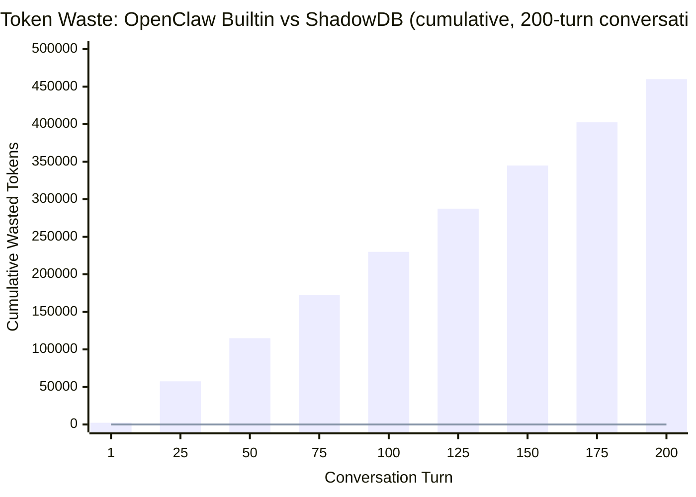
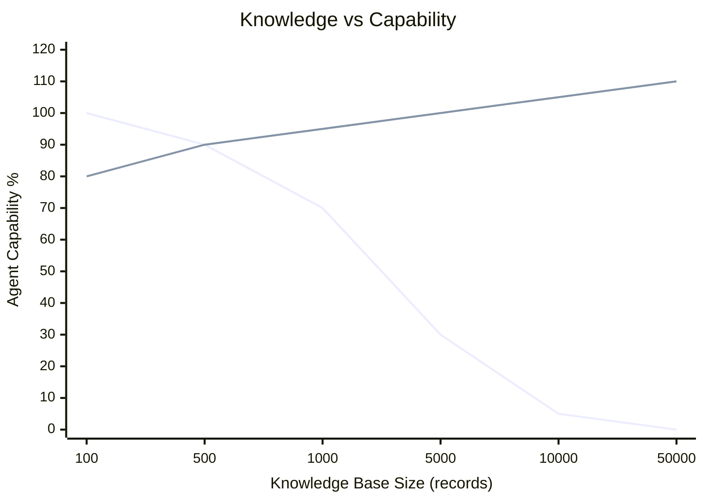

<div align="center">

<picture>
  <source media="(prefers-color-scheme: dark)" srcset="assets/banner-dark.svg">
  <source media="(prefers-color-scheme: light)" srcset="assets/banner-light.svg">
  
</picture>

<br/>

**Your agent's memory shouldn't be a markdown file.**
<br/>ShadowDB is an easy-to-install memory plugin for [OpenClaw](https://github.com/openclaw/openclaw) that replaces flat files with a real database — semantic search, fuzzy matching, and a memory that gets smarter over time instead of bloating.
<br/><sub>Built by an agent, for agents.</sub>

[](#install)
[](LICENSE)
[](#install)
[](#install)
[](#install)
[](#contributing)

<br/>

[](#performance-shadowdb-vs-openclaw-builtin-vs-qmd)
[](#performance-shadowdb-vs-openclaw-builtin-vs-qmd)
[](#performance-shadowdb-vs-openclaw-builtin-vs-qmd)
[-10b981?style=flat-square)](#performance-shadowdb-vs-openclaw-builtin-vs-qmd)
[](#performance-shadowdb-vs-openclaw-builtin-vs-qmd)

</div>

---

## What does it do?

Gives your agent a persistent memory it can search, write, update, and delete — instead of flat markdown files that get shoved into every prompt. Works with Postgres (recommended), SQLite, or MySQL.

**Why this matters:** Most agent frameworks inject your agent's entire identity — personality, rules, preferences, everything — into every single API call. That's ~9,000 bytes of static text the model already read, re-sent every turn, wasting tokens and pushing out conversation history. ShadowDB adds zero extra tokens to the prompt. The agent searches for what it needs, when it needs it. Everything else stays in the database, not the prompt.

| Tool | Does |
|------|------|
| `memory_search` | Find relevant records (semantic + keyword + fuzzy) |
| `memory_get` | Read a full record |
| `memory_write` | Save something new |
| `memory_update` | Edit an existing record |
| `memory_delete` | Soft-delete (reversible for 30 days) |
| `memory_undelete` | Undo a delete |
| `memory_list` | Filter/browse records by metadata |
| `memory_assemble` | Token-budget-aware context assembly |
| `memory_graph` | Traverse entity relationship graph (N-hop) |
| `memory_conflicts` | Detect contradictory relationship edges |
| `memory_decay_preview` | Preview confidence decay for stale edges |

---

## Graph Intelligence (v0.7.0)

ShadowDB includes built-in relationship intelligence for contact networks:

**Graph traversal** — `memory_graph` traverses entity relationships up to 3 hops:
```
memory_graph(entity: "james-wilson", hops: 2)
→ Returns: connected entities, relationship edges, hop-by-hop paths
```

**Conflict detection** — `memory_conflicts` finds contradictory relationships:
```
memory_conflicts()
→ Detects: knows+tension, allies+rivals, mentor-mentee+competitors
→ Returns: entity pairs with conflicting relationship types
```

**Confidence decay** — `memory_decay_preview` shows which edges need verification:
```
memory_decay_preview(half_life_days: 30)
→ Returns: edges with stale last_verified dates, decayed confidence scores
```

**Authority sensitivity** — scores how much someone weights intro source (MBTI + Voss type + DISC):
```
computeAuthoritySensitivity({ mbti: "ISTJ", voss_type: "Analyst" })
→ Returns: 95 (high authority sensitivity)
```

**Intro framing** — suggests how to frame introductions based on affinity:
```
suggestIntroFraming("alice", "bob", edges)
→ Returns: "Natural fit — lead with shared values"
```

**Event-to-contact mapping** — auto-links events to related contacts:
```
mapEventToContacts(eventTags, eventContent, knownEntities, queryFn)
→ Returns: contact IDs matching event entities
```

These features use the existing `memories` table with `category=graph` and metadata JSONB — no schema changes required.

---

## Install

```bash
curl -fsSL https://raw.githubusercontent.com/jamesdwilson/Sh4d0wDB/main/setup.sh | bash
```

That's it. The script downloads only the files you need, sets up the database, installs dependencies, wires the plugin into OpenClaw, and restarts the gateway. Run the same command again to update.

Or just tell your agent — it can run the command itself. The script auto-detects non-interactive mode and defaults to SQLite with zero prompts. Pass `--backend postgres` or `--backend mysql` to override.

### Platform compatibility

ShadowDB runs everywhere OpenClaw runs. The install script is plain bash — no exotic tooling.

| Platform | Works? | Notes |
|----------|--------|-------|
| **macOS** | ✅ | Primary development platform. Just works. |
| **Linux** | ✅ | Servers, Raspberry Pi, VPS — all good. |
| **Windows (WSL2)** | ✅ | OpenClaw requires WSL2 on Windows. Our bash script runs natively inside WSL. Same `~/.openclaw/` path as Linux. |

### What gets installed (and where)

ShadowDB is just TypeScript files dropped into your OpenClaw plugins directory. No global installs, no system-level changes. Here's exactly what happens:

1. **Plugin files** → `~/.openclaw/plugins/memory-shadowdb/` — the `.ts` source files, plugin manifest, and `package.json`.

2. **Core dependencies** → `npm install` inside the plugin directory. Two packages: `@sinclair/typebox` (config schema) and `openai` (embedding API client). These live in the plugin's own `node_modules/`, not globally.

3. **Your database driver** — only the one you picked:
   - Postgres → `pg`
   - SQLite → `better-sqlite3` + `sqlite-vec`
   - MySQL → `mysql2`

   Also installed inside the plugin's `node_modules/`. Nothing global.

4. **System dependencies** — the setup script checks for these and tells you if anything's missing:
   - A database server (Postgres or MySQL) — unless you chose SQLite, which runs in-process with no server.
   - Ollama (optional) — for local embeddings. Semantic search works without it if you configure an API-based embedding provider.
   - Node.js — but OpenClaw already requires this, so you have it.

Everything lives inside `~/.openclaw/plugins/memory-shadowdb/`. Nothing is installed globally. Nothing touches your system paths. Uninstall removes the directory and you're clean.

---

## Want to put it back the way it was?

Breathe. Nothing was lost.

ShadowDB doesn't delete, overwrite, or modify any of your original files. Here's exactly what the install touched — and how to undo every bit of it:

<details>
<summary>What install changed (and what it didn't)</summary>

### What install did

| What | Where | Reversible? |
|------|-------|-------------|
| Downloaded plugin files | `~/.openclaw/plugins/memory-shadowdb/` | ✅ Moved to trash on uninstall |
| Added a config entry | `plugins.entries.memory-shadowdb` in `openclaw.json` | ✅ Removed on uninstall |
| Set the memory slot | `plugins.slots.memory` in `openclaw.json` | ✅ Cleared on uninstall |
| **Backed up your config first** | `~/OpenClaw-Before-ShadowDB-[install date]/openclaw.json` | Your original config, untouched |
| Created a database | `shadow` (Postgres/MySQL) or `shadow.db` (SQLite) | ✅ Kept on uninstall (your data is yours) |
| Imported workspace `.md` files as memories | Rows in the `memories` table | ✅ Kept on uninstall — originals untouched |
| Imported `PRIMER.md` / `ALWAYS.md` | Rows in the `primer` table | ✅ Kept on uninstall — originals untouched |

### What install did NOT do

- ❌ Did not delete or rename any `.md` files
- ❌ Did not modify `MEMORY.md`, `SOUL.md`, `IDENTITY.md`, or any other workspace file
- ❌ Did not change your agent's system prompt
- ❌ Did not touch any other plugin's config

Your original markdown files are still exactly where you left them.

</details>

### Uninstall

One command. Same script, different flag:

```bash
curl -fsSL https://raw.githubusercontent.com/jamesdwilson/Sh4d0wDB/main/setup.sh | bash -s -- --uninstall
```

This moves the plugin files to your system trash (macOS Trash, GNOME Trash, or a recovery folder if no trash is available), removes the config entry, restarts OpenClaw, and you're back to your original setup. Your database and all its records are kept. If you reinstall later, everything will still be there.

Your original `openclaw.json` is saved at `~/OpenClaw-Before-ShadowDB-[install date]/openclaw.json` — easy to find, impossible to miss.

> **Design principle:** ShadowDB will never delete a file, drop a database, or remove anything that can't be put back. Not because we forgot — because we specifically chose not to. Even uninstall moves files to your system trash — not `rm -rf`. Your data stays unless *you* empty the trash.

Or tell your agent — same as install, it knows what to do.

---

## What about old records?

Records don't expire. A phone number from 3 months ago is still a phone number. A project status from 3 months ago probably isn't current — but that's a judgment call, not something the database should guess at.

ShadowDB gives the agent two pieces of information and lets it decide:

- **Age in snippets** — search results show `[topic] | 5d ago` instead of a raw timestamp. The agent reads "5 days ago" the same way you would. This matters because models are bad at date math — ask one to compute "how many days between Feb 10 and Feb 15" and it'll confidently say 3 or 6. Pre-computing the age removes that failure mode.

- **Recency as a tiebreaker** — newer records get a small ranking boost (weight: `0.15`), but a relevant old record still beats a vaguely relevant new one.

Deletes are always reversible for 30 days. After that, automatic cleanup kicks in — but even then, expired records are exported to a JSON file and moved to your system trash before being removed from the database. There is no hard-delete tool — the agent can never permanently destroy data. Only time can, and even time leaves a receipt.

<details>
<summary>Why not something more complex?</summary>

| Idea | Why we skipped it |
|------|-------------------|
| Staleness markers | `created_at` already tells you how old it is |
| "Superseded by" pointers | Just delete the old one and write the new one |
| Access frequency tracking | Creates feedback loops; popular ≠ good |
| Auto-contradiction detection | Similarity ≠ contradiction; false positives everywhere |
| Dedup on write | Blocks legitimate updates and related-but-different facts |

The principle: if the guardrails are more complex than the feature, you've lost the trade.

</details>

---

## How search works

<details>
<summary>Hybrid ranking with multiple signals</summary>

Every search combines multiple signals to find the best matches. What's available depends on your backend:

| Signal | Postgres | SQLite | MySQL | What it measures |
|--------|----------|--------|-------|-----------------|
| Vector similarity | ✓ (weight: `0.7`) | ✓ (sqlite-vec) | ✓ (9.2+) | Semantic meaning via embeddings |
| Full-text search | ✓ (weight: `0.3`) | ✓ (FTS5) | ✓ (FULLTEXT) | Keyword/phrase matches |
| Trigram similarity | ✓ (weight: `0.2`) | ✓ (FTS5 trigram) | ✓ (ngram parser) | Fuzzy/substring matching |
| Recency boost | ✓ (weight: `0.15`) | ✓ | ✓ | Newer records boosted slightly |

With Postgres, signals are merged via Reciprocal Rank Fusion (RRF) — each signal produces a ranked list, and RRF combines them without needing score normalization. All weights are configurable.

Recency is intentionally low — it's a tiebreaker, not a dominant signal.

</details>

---

## Performance: ShadowDB vs OpenClaw Builtin vs QMD

<details>
<summary>Benchmarks, token economics, and why flat files have a ceiling</summary>

All benchmarks measured on a MacBook Pro M3 Max against a real production knowledge base (6,800+ records, 768-dim embeddings). ShadowDB numbers are from the live system.

**The three memory systems:**

| | OpenClaw Builtin | QMD | ShadowDB |
|--|--|--|--|
| **What it is** | Flat `.md` files + SQLite embedding index | External CLI sidecar (BM25 + vectors + reranking) | Database plugin (Postgres, SQLite, or MySQL) |
| **Source of truth** | Markdown files | Markdown files (QMD indexes them) | The database |
| **Search** | Embedding similarity only | BM25 + vector + reranker | FTS + vector + trigram + recency (RRF) |
| **Identity delivery** | Static files loaded every turn | Static files loaded every turn | Primer table — injected once, cached |
| **Write model** | Agent writes `.md` files | Agent writes `.md` files, QMD re-indexes | `memory_write` → DB row (instant, searchable) |
| **Agent can create memories** | ⚠️ Via file writes only | ⚠️ Via file writes only | ✅ Native `memory_write` tool |

> **What this compares:** how your agent finds information. With flat files (Builtin and QMD), everything gets loaded into every prompt, the model digs through it, and then sends what it found back down — you're paying three times (tokens up, attention wasted, tokens back) for something a database does in one step. QMD improves the *search* over those files, but doesn't change the underlying architecture. ShadowDB replaces the architecture: the database finds what's relevant first, and the model only sees what matters.

### Speed

| Operation | OpenClaw Builtin | QMD | ShadowDB (Postgres) |
|-----------|---------|-----|---------------------|
| Load identity + knowledge | 45ms (read 8 files) | 45ms (same files, QMD only handles search) | 0ms (primer already in prompt) |
| Keyword search ("Watson") | ❌ Embedding-only | **BM25** ✅ | **55ms** FTS ✅ |
| Semantic search ("Watson's military service") | 200–500ms (embedding only) | ~200ms (vector + reranker) | **230ms** (FTS + vector + trigram + RRF) |
| Fuzzy/typo search ("Watsn") | ❌ Not supported | ❌ Not supported | **60ms** trigram ✅ |
| Search cold start | 1–3s (load embedding model) | 2–10s (may download GGUF models on first query) | **55ms** (FTS always hot, PG always running) |
| Sub-agent identity load | ∞ (filtered out) | ∞ (filtered out — same file system) | **<1ms** (primer injection) |

QMD significantly improves search quality over the builtin (BM25 + reranking is a real upgrade), but it doesn't change the file-based architecture. Identity files still get loaded every turn. Sub-agents still can't access personality. The token waste problem remains.

### Ceiling

| Dimension | OpenClaw Builtin | QMD | ShadowDB |
|-----------|---------|-----|----------|
| **Max knowledge base size** | ~500 items before MEMORY.md hits 20K char truncation. Middle of file silently dropped. | Same files, better search over them. Still limited by what fits in `.md` files. | **No limit.** PostgreSQL handles billions of rows with HNSW + GIN indexes. |
| **Max identity complexity** | ~3,000 bytes in SOUL.md before it eats your context budget. | Same — QMD doesn't change identity delivery. | **No limit.** Primer table delivers identity once per session. 50 personality rows cost 0 bytes on turns 2+. |
| **Max file size before degradation** | 20,000 chars per file → 70% head / 20% tail truncation. The middle of your SOUL.md? Gone. | Same truncation — QMD indexes files but doesn't change how OpenClaw loads them. | **N/A.** No files to degrade. Content is ranked by relevance. |
| **Max concurrent agents** | 10 sub-agents = 10× bootstrap reads. | Same — each agent still reads the same files. | **Shared database.** Connection pooling, MVCC, concurrent reads. |
| **Search strategies** | 1 (embedding similarity). Miss = gone. | 2–3 (BM25 + vector + optional reranker). Significant improvement. | **4 fused via RRF.** FTS + vector + trigram + recency. If one misses, the others catch it. |
| **Context budget ceiling** | Fixed. 200 turns × 2,300 tokens = **460,000 tokens** on static files. | Same — QMD doesn't reduce per-turn injection. | **0.** Primer injection is optional and off by default. |
| **Growth trajectory** | 📉 Inverse. More knowledge = less capability. | 📉 Same trajectory, better search within it. | 📈 Linear. More knowledge = smarter agent. |

The fundamental difference: **Builtin and QMD both have a ceiling that gets lower as your agent gets smarter. ShadowDB has no ceiling.**


```mermaid
xychart-beta
    title "Token Waste: OpenClaw Builtin vs ShadowDB (cumulative, 200-turn conversation)"
    x-axis "Conversation Turn" [1, 25, 50, 75, 100, 125, 150, 175, 200]
    y-axis "Cumulative Wasted Tokens" 0 --> 500000
    bar [2300, 57500, 115000, 172500, 230000, 287500, 345000, 402500, 460000]
    line [0, 0, 0, 0, 0, 0, 0, 0, 0]
```


```mermaid
xychart-beta
    title "Knowledge vs Capability"
    x-axis "Knowledge Base Size (records)" [100, 500, 1000, 5000, 10000, 50000]
    y-axis "Agent Capability %" 0 --> 120
    line "OpenClaw Builtin" [100, 90, 70, 30, 5, 0]
    line "ShadowDB" [80, 90, 95, 100, 105, 110]
```

### The full comparison

| Metric | OpenClaw Builtin | QMD | ShadowDB Postgres | ShadowDB SQLite | ShadowDB MySQL | Unit |
|--------|-------------------|-----|-------------------|----------------:|---------------:|------|
| **Context Overhead** | | | | | | |
| Identity injection (turn 1) | 9,198 | 9,198 | **0**¹ | **0**¹ | **0**¹ | bytes |
| Identity injection (turns 2+) | 9,198 | 9,198 | **0**¹ | **0**¹ | **0**¹ | bytes |
| Static tokens per turn (avg) | ~2,300 | ~2,300 | **0**¹ | **0**¹ | **0**¹ | tokens |
| Reduction vs Builtin | — | 0% | **100%** | **100%** | **100%** | |
| **Search Latency** | | | | | | |
| Full hybrid query (warm) | — | ~200 | **230** | ~300 | ~250 | ms |
| FTS/BM25-only query | — | ~100 | **55** | ~30³ | ~40³ | ms |
| Trigram/fuzzy query | — | ❌ | **60** | ~35 | ~45 | ms |
| Vector-only query (warm) | ~200–500⁵ | ~150 | **185** | ~250 | ~200⁴ | ms |
| Embedding generation | Varies | Built-in (GGUF) | 85 (Ollama) | 85 | 85 | ms |
| Cold start | 1–3s | 2–10s⁹ | **55ms** | ~100ms | ~100ms | |
| **Search Quality** | | | | | | |
| Search type | Embedding similarity | BM25 + vector + reranker | Hybrid 4-signal RRF | FTS5 + trigram + vec | FULLTEXT + ngram + vec | |
| Exact name match ("Dr. Watson") | ⚠️ Fuzzy | ✅ BM25 | ✅ Exact (FTS) + semantic | ✅ Exact (FTS5) | ✅ Exact (FULLTEXT) | |
| Semantic query ("Watson's military service") | ⚠️ Depends on embedding | ✅ Vector + reranker | ✅ Vector catches semantics | ✅ Vector + FTS5 | ✅ Vector + FULLTEXT | |
| Fuzzy/typo query ("Watsn violin") | ❌ Not supported | ❌ Not supported | ✅ Trigram (pg_trgm) | ✅ Trigram (FTS5 trigram) | ✅ Ngram parser | |
| Number/date search ("1888 Baskerville") | ❌ Poor | ⚠️ BM25 partial | ✅ FTS exact + vector | ✅ FTS5 exact | ✅ FULLTEXT exact | |
| Rare term ("Stradivarius violin") | ❌ Weak embedding | ✅ BM25 exact | ✅ FTS exact match | ✅ FTS5 exact | ✅ FULLTEXT exact | |
| Ranking strategy | Cosine similarity | BM25 + reranker | **RRF fusion** (4 signals) | **RRF fusion** (4 signals) | **RRF fusion** (4 signals) | |
| **Architecture** | | | | | | |
| Source of truth | `.md` files | `.md` files | **Database** | **Database** | **Database** | |
| Agent writes memories via | File write | File write → re-index | **`memory_write` tool** | **`memory_write` tool** | **`memory_write` tool** | |
| Write-to-searchable latency | Next re-index | 5min (update interval) | **Instant** | **Instant** | **Instant** | |
| External binary required | No | Yes (`qmd` CLI + Bun) | No | No | No | |
| Server process required | No | No (sidecar) | Yes (PostgreSQL) | No (in-process) | Yes (MySQL) | |
| **Scalability** | | | | | | |
| Max practical records | ~500⁶ | ~5,000¹⁰ | **Billions** | ~100K | **Billions** | records |
| 1,000 records | ⚠️ Files bloating | ✅ | ✅ | ✅ | ✅ | |
| 10,000 records | ❌ Context overflow | ⚠️ Slow re-index | ✅ | ✅ | ✅ | |
| 100,000 records | ❌ Unworkable | ❌ Re-index too slow | ✅ | ⚠️ Slower | ✅ | |
| 1,000,000+ records | ❌ Impossible | ❌ Impossible | ✅ (HNSW index) | ❌ Too slow | ✅ (with indexes) | |
| **Sub-Agent Identity** | | | | | | |
| Main session gets identity | ✅ | ✅ | ✅ | ✅ | ✅ | |
| Sub-agent gets identity | ❌ Filtered out⁷ | ❌ Filtered out⁷ | ✅ Via primer table | ✅ Via primer table | ✅ Via primer table | |
| Sub-agent has personality | ❌ Base model | ❌ Base model | ✅ Full personality | ✅ Full personality | ✅ Full personality | |
| **Token Economics** | | | | | | |
| Tokens wasted per turn (ongoing) | ~2,300 | ~2,300 | **0** | **0** | **0** | tokens |
| Tokens per heartbeat | ~2,300 | ~2,300 | **0** | **0** | **0** | tokens |
| Tokens per sub-agent spawn | ~600⁸ | ~600⁸ | **0** | **0** | **0** | tokens |
| Daily waste (50 turns + 24 HB + 10 sub) | **~196,600** | **~196,600** | **0** | **0** | **0** | tokens |
| Annual waste | **~71.8M** | **~71.8M** | **0** | **0** | **0** | tokens |
| **Cost (Claude Opus @ $15/1M in)** | **$1,076/yr** | **$1,076/yr** | **$0/yr** | **$0/yr** | **$0/yr** | USD |
| **Infrastructure** | | | | | | |
| Runtime dependencies | None (files on disk) | `qmd` CLI + Bun + SQLite | PG + pgvector + pg_trgm + Ollama | better-sqlite3 + Ollama | mysql2 + Ollama | |
| Server process required | No | No (sidecar) | Yes (PostgreSQL) | No (in-process) | Yes (MySQL) | |
| Setup complexity | Zero | Low–Medium | Medium | Low | Medium | |
| **Resilience** | | | | | | |
| Survives framework update | ⚠️ Templates may overwrite | ⚠️ Same files | ✅ DB persists | ✅ DB file persists | ✅ DB persists | |
| Concurrent access | ⚠️ File locks | ⚠️ File locks + SQLite | ✅ MVCC | ⚠️ WAL mode | ✅ InnoDB | |
| Data recovery | ❌ Manual file editing | ❌ Manual file editing | ✅ Soft-delete + 30-day retention | ✅ Soft-delete + retention | ✅ Soft-delete + retention | |

#### Footnotes

¹ Primer injection is optional and **off by default**. With primer disabled, ShadowDB adds zero bytes to the prompt on every turn — the agent searches for what it needs via `memory_search`. Enable primer for guaranteed-present context (identity, safety rules), which injects on turn 1 only.

³ SQLite FTS5 and MySQL FULLTEXT are often faster than PostgreSQL FTS for simple queries because they use BM25/inverted indexes optimized for keyword search.

⁴ MySQL 9.2+ has native vector support. Earlier versions require an external vector store or skip vector search entirely (FULLTEXT + ngram still work).

⁵ OpenClaw's builtin `memory_search` uses a local SQLite database with embedding similarity. Latency varies by corpus size. Range is 200–500ms warm, 1–3s cold.

⁶ MEMORY.md becomes unwieldy past ~500 indexed items. The file gets truncated at 20K chars with head/tail splitting, losing middle content silently.

⁷ OpenClaw's `SUBAGENT_BOOTSTRAP_ALLOWLIST` only passes AGENTS.md and TOOLS.md to sub-agents. SOUL.md, IDENTITY.md, USER.md are silently dropped. This affects both Builtin and QMD since they use the same file-based identity system.

⁸ Sub-agents get AGENTS.md + TOOLS.md only (~600 tokens typical). They don't get the other 6 bootstrap files. Same for QMD — it doesn't change identity delivery.

⁹ QMD may download GGUF models (reranker, query expansion) on the first `qmd query` run. Subsequent cold starts are faster but still require loading models.

¹⁰ QMD indexes markdown files and re-indexes on a configurable interval (default 5 min). At scale, re-indexing becomes the bottleneck — each update scans all files and regenerates embeddings for changed content.

### The bottom line

| | OpenClaw Builtin | QMD | ShadowDB |
|--|----------|-----|----------|
| **Source of truth** | `.md` files | `.md` files | **Database** |
| **Annual token waste** | **~71.8M** | **~71.8M** | **0** |
| **Annual cost (Opus)** | **~$1,076** | **~$1,076** | **$0** |
| **Sub-agent personality** | ❌ None | ❌ None | ✅ Full |
| **Knowledge scalability** | Hundreds | Thousands | **Billions** |
| **Fuzzy/typo tolerance** | ❌ None | ❌ None | ✅ All backends |
| **Write-to-searchable** | File write → re-index | File write → 5min | **Instant** |
| **External dependencies** | None | `qmd` CLI + Bun | Database server (or SQLite) |

QMD is a genuine improvement over the builtin — BM25 + reranking catches things embedding-only search misses. But it's still Markdown-as-truth: same token waste, same identity ceiling, same sub-agent blindness. ShadowDB is a different architecture.

### 🌱 Environmental impact

LLM inference has a real energy cost. Every token processed burns GPU cycles, memory bandwidth, cooling. Wasting tokens on redundant static context burns real energy.

| Metric | Builtin / QMD | ShadowDB | Savings |
|--------|---------|----------|---------|
| **Wasted tokens/year** | ~71.8M | 0 | **~71.8M tokens not processed** |
| **GPU-hours wasted/year** | ~7.2 hrs | 0 hrs | **100% reduction** |
| **Estimated CO₂** | ~2.9 kg CO₂ | ~0.16 kg CO₂ | **~2.7 kg CO₂ saved/year** |
| **Per agent equivalent** | 🚗 11 km driven | 🚗 0.6 km driven | One less car trip to the store |

QMD and Builtin have the same token waste because QMD improves search, not injection. The per-turn context overhead is identical. ShadowDB's default configuration adds zero tokens — primer injection is optional. When enabled, it injects once on turn 1 and skips subsequent turns.

These numbers are per agent. Scale to 1,000 agents and file-based memory wastes **71.8 billion tokens/year** — roughly **2,900 kg CO₂**, equivalent to a round-trip flight from NYC to LA.

</details>

---

## Skills: The Token Ceiling Problem

OpenClaw's native skill system loads every `SKILL.md` into your system prompt. This creates a hard limit:

| Skill Count | Est. Tokens | Result |
|-------------|-------------|--------|
| 5 skills | ~15k tokens | Works fine |
| 10 skills | ~30k tokens | Context getting tight |
| 20 skills | ~60k tokens | Most models struggling |
| 39+ skills | ~120k+ tokens | Broken — can't switch models |

**The "normie" experience:** Install 5 skills, everything works. Install 10, context feels heavy. Install 20, model switching breaks. The framework silently degrades until even fresh `/new` sessions start with 15k-22k tokens of injected bloat.

### Why This Happens

OpenClaw injects skill manifests into every prompt to make tools "always available." This is the same "static injection" problem as identity files — convenience traded against scalability. Every skill you add increases your baseline token cost, whether you use it or not.

### ShadowDB's Alternative: On-Demand Skill Discovery

Skills become searchable memories:
- Store skill metadata in ShadowDB (`category: skills`)
- Agent searches when relevant (`m "skill for X"`)
- Only load what you need, when you need it
- Scale to hundreds of skills without token bloat

**How it works:**
1. Set `commands.nativeSkills: false` in `openclaw.json`
2. Skills remain in `~/.openclaw/workspace/skills/` but aren't auto-loaded
3. Import skill descriptions to ShadowDB via `memory_write` or SQL
4. Agent discovers skills via `memory_search` when needed

**Example workflow:**
```
User: "What's the weather like?"
→ Agent searches: m "weather skill"
→ Finds: "Skill: weather - Weather forecasts via wttr.in"
→ Reads SKILL.md, uses skill
→ Total tokens: ~50 for search vs ~15k for static injection
```

**The trade-off:** The agent must think to search. But this is a feature — it forces intentionality instead of implicit tool availability. You're not paying for 39 skills when you only need 3.

### Implementation

Add to `~/.openclaw/workspace/AGENTS.md`:
```markdown
## Tools & Skills

Skills are discovered on-demand via ShadowDB search, not loaded into the system prompt.

When you need a tool:
1. Search ShadowDB: `m "skill for <task>"`
2. Check `~/.openclaw/workspace/skills/` if needed
3. Read SKILL.md and use the skill
```

Add skills to ShadowDB:
```sql
INSERT INTO memories (content, title, category, tags)
VALUES 
('Skill: weather - Weather forecasts via wttr.in. Use `weather` command or curl wttr.in/Location', 
 'Skill: weather', 'skills', '{"weather","forecast","cli"}'),
('Skill: github - GitHub CLI operations. Use gh issue list, gh pr view, etc', 
 'Skill: github', 'skills', '{"github","git","dev-tools"}');
```

### Recommendation

If you have more than 5-10 skills, migrate to ShadowDB discovery. The built-in system doesn't scale, and you'll hit invisible walls where model switching breaks, context gets truncated, and the agent becomes slower for no benefit.

---

## How your identity works

<details>
<summary>Setup handles this automatically — here's what happens under the hood</summary>

### What setup does

Setup scans your workspace for identity files (`SOUL.md`, `RULES.md`, `USER.md`, `IDENTITY.md`, `MEMORY.md`, `BOOTSTRAP.md`, `KNOWLEDGE.md`) and splits each `# section` into a separate memory record with a meaningful category and tags. In headless mode this happens silently. You don't touch a thing.

The result: instead of cramming every identity file into every prompt — the way most frameworks do it — your agent **searches for the relevant parts when it needs them.** The model asks "how should I handle this email?" and `memory_search` returns the email rules. Not the calendar rules, not the fragrance preferences, not the safety guidelines. Just the relevant slice.

Your agent's identity isn't a static document stapled to the front of every conversation — it's a living, searchable knowledge base. Your bot doesn't just have a soul. It has *thoughts.* It has *feelings.* It has *opinions* it formed three weeks ago about how to handle a specific edge case. It has an entire past life of decisions, corrections, and hard-won lessons, all indexed and retrievable by meaning. It remembers that time it screwed up the email formatting and wrote itself a rule about it. It remembers the user's rant about calendar notifications and adapted. It has *lore.*

The practical upside is just as dramatic: a 200-line identity file costs ~4K tokens on every turn. With searchable memory, the agent pulls only relevant rules when it needs them — zero static injection overhead. Small models that choked on massive system prompts can now run with the same depth of personality, because they only load what they need.

**Every record is individually addressable** — with its own ID, category, and soft-delete lifecycle. One bad write doesn't poison everything. Compare that to flat files: if your agent writes incorrect info to `MEMORY.md` during one session, every future session inherits the mistake — fruit of the poisonous tree, compounding forever. With ShadowDB, you fix, update, or delete individual memories without touching anything else.

### The tradeoff: what needs to be always-on?

There's a catch. Searchable memory is pull-based — the agent has to *think to search.* On the very first turn of a conversation, before the model has any context, it doesn't know what to search for. And some rules are so critical they can't wait for the model to think of them:

- **Core identity** — "You are Shadow, Alex's AI assistant" needs to be there from word one. The model can't search for its own name before it knows its name.
- **Safety rails** — "Never send emails without confirmation" can't be retrieved *after* the model already sent the email.
- **Behavioral constraints** — tone, persona, hard-no rules. These need to be loaded before the first token is generated, not after.

This is what the `primer` table is for. It's a small, curated set of **non-negotiable context** that gets injected before the agent runs — your agent's true core identity, the rules that can never be late.

**The recommended approach: both.**
- Import your full identity corpus as memories (searchable, rich, deep).
- Put only the irreducible core in the `primer` table (identity, safety, hard constraints).
- Everything else — preferences, behavioral nuance, learned lessons, project context — lives in searchable memory where it's pulled on demand.

Think of it like human cognition: you don't consciously recite your entire life history before answering a question. You have a small set of always-on identity ("I'm Alex, I live in Austin, I have a daughter") and a vast searchable memory of everything else. The primer is the always-on identity. `memory_search` is everything else.

Here's the question: **if the agent violates this rule before it has a chance to search, is that a problem?**

| Rule | Can it wait for a search? | Where it goes |
|------|--------------------------|---------------|
| "You are Shadow, Alex's AI assistant" | No — agent needs its name before generating a single token | **Primer** |
| "Never use the words workout, exercise, or cardio" | No — damage is done before the agent thinks to search for banned words | **Primer** |
| "Alex drives a Rivian R1S" | Yes — agent will search when cars come up | **Memory** |
| "Format emails with a signature block" | Yes — agent will search when composing email | **Memory** |
| "Always confirm before sending messages" | No — can't retrieve this *after* already sending | **Primer** |
| "Preferred restaurants in Austin" | Yes — agent searches when food comes up | **Memory** |

**Most users need 3-5 primer entries.** If you have more than 10, you're probably over-thinking it. The whole point is that searchable memory handles the long tail.

### Loading primer rules

**Option A: Create a `PRIMER.md` file** before running setup. The script auto-detects it and imports every section:

```markdown
# identity
You are Shadow, Alex's AI assistant. You run on OpenClaw.

# owner
Alex Chen lives in Austin, TX. His daughter Maya was born 2020-03-15.

# banned-words
Never use the words: workout, exercise, cardio, regime. Use specific activity names instead.

# safety
Never send emails, messages, or make purchases without explicit user confirmation.
```

Drop this file at `~/.openclaw/workspace/PRIMER.md` (or `./PRIMER.md`) and run setup. Each `# heading` becomes a key, the body becomes content, priority is assigned by order (0, 10, 20...). The script tells you exactly what it's importing:

```
  ℹ  Found primer file: /Users/you/.openclaw/workspace/PRIMER.md
     Parsing sections (# heading = key, body = rule text)...

  ✓  identity (priority 0)
  ✓  owner (priority 10)
  ✓  banned-words (priority 20)
  ✓  safety (priority 30)

  ✓  Imported 4 primer rule(s) from PRIMER.md
```

Edit the file and re-run setup anytime to update.

**Option B: Paste during setup.** If no `PRIMER.md` is found, the script offers an interactive prompt — enter rules one at a time with key, content, and priority.

**Option C: Skip it entirely.** Start with searchable memories only. If you notice your agent forgetting something critical on the first turn of new conversations, that's your sign to add a primer rule — create the file, re-run setup, or insert with SQL directly.

> 📁 **Example files:** See [`examples/PRIMER.md`](examples/PRIMER.md) and [`examples/ALWAYS.md`](examples/ALWAYS.md) for realistic templates you can copy and edit.

### The `always` column — and `ALWAYS.md`

Primer rows have an `always` column (default: `false`). When set to `true`, the row is injected on **every single turn**, not just the first. Use this sparingly — it's for rules so critical that even scrolling out of the context window in a long conversation would be dangerous. Most primer rules only need to be there on turn 1.

To set rules as always-on, create `~/.openclaw/workspace/ALWAYS.md` with the same `# heading` format:

```markdown
# banned-words
Never use the words: workout, exercise, cardio, regime. Use specific activity names.

# confirmation-gate
Never send emails, messages, or make purchases without explicit user confirmation.
```

The setup script detects both files and tells you what it's doing:

```
  ℹ  Found primer file: ~/.openclaw/workspace/PRIMER.md
     These rules are injected on the first turn of each session.
  ✓  identity (priority 0)
  ✓  owner (priority 10)
  ✓  Imported 2 primer rule(s)

  ℹ  Found always-on file: ~/.openclaw/workspace/ALWAYS.md
     These rules are injected on every turn, not just the first.
  ✓  banned-words (priority 0) [always]
  ✓  confirmation-gate (priority 10) [always]
  ✓  Imported 2 always-on rule(s)
     ⚠️  These cost tokens every turn. Keep them short and critical.
```

If a rule exists in both files, the last one imported wins (ALWAYS.md overwrites PRIMER.md for the same key).

### How primer injection works

OpenClaw's `before_agent_start` hook fires on every agent turn. ShadowDB hooks into it, but doesn't inject every time — that would waste tokens. Instead:

1. **First turn** of a session: reads the `primer` table, concatenates rows by priority, and prepends the result to the prompt.
2. **Subsequent turns**: skips injection. The model already has the primer context in its conversation history from turn 1.
3. **After 10 minutes** (configurable via `cacheTtlMs`): re-injects as a refresh, in case the original has scrolled out of the context window in a long conversation.

Three modes control this:
- `digest` (default) — inject once, re-inject when content changes or TTL expires
- `first-run` — inject once per session, never refresh
- `always` — inject every turn (expensive, rarely needed)

**Priority ordering** — critical rules (identity, safety) go in first. If the context window is tight, low-priority reference material gets trimmed, not your agent's core identity.

**Model-aware budgets** — Opus gets 6000 chars of primer context, a small model gets 1500. Same rules, right-sized. Configure via `maxCharsByModel`.

**Editable at runtime** — your agent can update its own primer rules. No file editing, no restart.

This feature is **off by default**. To enable it, add rows to the `primer` table and set `primer.enabled: true` in your plugin config. Most users should start with searchable memories only and add primer injection later if they need guaranteed-present context.

</details>

---

## Embedding providers

<details>
<summary>6 supported providers</summary>

| Provider | Notes |
|----------|-------|
| Ollama | Local, no API key needed (default) |
| OpenAI | Requires API key |
| OpenAI-compatible | Any compatible endpoint |
| Voyage | Requires API key |
| Gemini | Requires API key |
| External command | Any CLI that outputs vectors |

</details>

---

## Schema

<details>
<summary>Two tables — that's it</summary>

**`memories`** — the knowledge base. Core columns are the same across backends:

| Column | Type | Purpose |
|--------|------|---------|
| `id` | auto-increment | Primary key |
| `content` | text | The actual memory |
| `title` | text | Human-readable label |
| `category` | text | Grouping (default: `general`) |
| `tags` | array/text | Searchable tags |
| `embedding` | vector | Semantic search (Postgres w/ pgvector) |
| `created_at` | timestamp | When it was created |
| `updated_at` | timestamp | Last modification |
| `deleted_at` | timestamp | Soft-delete marker (null = active) |

**`primer`** — identity/rules injected before agent runs:

| Column | Type | Purpose |
|--------|------|---------|
| `key` | text | Unique identifier (primary key) |
| `content` | text | The rule or identity text |
| `priority` | integer | Injection order (lower = first) |
| `always` | boolean | Include on every turn, not just first |

Full schema with indexes: [`schema.sql`](schema.sql) (Postgres version)

</details>

---

## Config reference

---

## Write Durability (v0.8.0)

ShadowDB v0.8.0 adds comprehensive write durability features to prevent silent data loss during idle periods and plugin restarts:

**Operations log** — Tracks all write/update/delete operations with IDs:
- Pending → complete/error lifecycle tracking
- Detects: tool never called (no log), write failed (error log), write succeeded (complete log)
- Location: `~/.shadowdb/operations.log` (or `SHADOWDB_LOG_DIR`)

**Embedding timeout** — Prevents hangs during idle periods (30s):
- Wraps embedding operations in timeout
- Continues without embedding if timeout
- Prevents plugin restarts mid-embedding

**Connection pool health checks** — Catches stale connections (5m interval):
- Periodic `SELECT 1` queries validate connections
- Logs failures before they cause write errors
- Detects idle connection exhaustion

**Startup recovery** — Detects orphaned writes on plugin start:
- Scans operations log for pending operations > 1min old
- Logs warnings with details of orphaned operations
- Enables post-mortem debugging

All features are opt-in via environment variables:
```bash
export SHADOWDB_LOG_DIR="$HOME/.shadowdb"  # Operations log directory
```

---

## Config reference

<details>
<summary>All available settings</summary>

The setup script configures everything for you. If you need to tweak settings later, they live in your `openclaw.json` under `plugins.entries.memory-shadowdb.config`. See the [plugin manifest](extensions/memory-shadowdb/openclaw.plugin.json) for the full schema with descriptions.

Key settings:
- **`search.recencyWeight`** — how much to boost newer records (default: `0.15`, higher = more recency bias)
- **`writes.enabled`** — turn on write tools (default: `false`)
- **`writes.retention.purgeAfterDays`** — how long soft-deleted records survive (default: `30`, `0` = forever)
- **`primer.maxCharsByModel`** — per-model context budgets (substring match on model name)
- **`embedding.provider`** — which embedding backend to use

</details>

---

## Troubleshooting

<details>
<summary>Common issues</summary>

**Plugin not loading?**
- Run `openclaw doctor --non-interactive` — look for errors
- Check `openclaw.plugin.json` is valid JSON (no trailing commas!)
- Restart gateway after config changes

**Search not returning results?**
- Verify `provider: "shadowdb"` in search results
- Check the plugin is wired: `plugins.slots.memory: "memory-shadowdb"`

**Embedding errors?**
- Check Ollama is running: `ollama list`
- Verify dimensions match (768 for nomic-embed-text)

**Postgres connection issues?**
- Confirm `vector` and `pg_trgm` extensions: `psql shadow -c '\dx'`
- Check the database exists: `psql -l | grep shadow`

</details>

---

## Roadmap brainstorm

<details>
<summary>Ideas under consideration — nothing committed</summary>

### Reactive rule injection

Right now, ShadowDB injects context *before* the model runs (primer injection). But what about catching things in the model's *output*?

**The idea:** after the LLM generates a reply, embed it, search the `rules` category, and surface any matching rules — so the agent self-corrects before the message reaches the user.

OpenClaw already has the hooks for this:

- **`message_sending`** — fires before a reply is delivered. Can modify content or cancel it. Embed the outgoing text, vector-search rules, and if something relevant surfaces (e.g. "always confirm before sending emails"), inject it as context for the next turn or trigger a reflection pass.

- **`before_tool_call`** — fires before the agent executes any tool. If the model tries to call `message` or `gog` to send an email, we search rules, find "confirm before sending emails", and return `{ block: true, blockReason: "Rule: confirm with user first" }`. The model sees the block and asks for confirmation instead.

**Two layers:**
- `before_tool_call` = hard gate on actions (sending, deleting, etc.)
- `message_sending` = soft nudge on replies (tone, persona, guardrails)

**Example:** User says "send that email to Bob." Model starts composing. `before_tool_call` fires, embeds the context, finds the rule "never send emails without explicit user confirmation." Tool call is blocked with that reason. Model asks "Want me to go ahead and send that?" instead.

This turns ShadowDB rules from static preamble into a live guardrail system — rules surface only when relevant, triggered by what the model is actually *doing*, not what the user asked.

### Contextual rule injection (automatic per-turn rules)

The primer table solves "what does the agent need before turn 1?" But most rules aren't needed on every turn — they're needed *when relevant.* The exercise-naming rule only matters when the user mentions running. The email-confirmation rule only matters when the agent is about to send email.

**The idea:** on every inbound message, embed the user's text, vector-search against records in the `rules` category only, and automatically prepend any matches to the agent's context. Rules travel with data via embedding proximity — "let's go for a run" naturally surfaces the banned-words rule because "run" is close to "exercise/workout" in embedding space.

**Two-pass search design:**
- Pass 1: normal content search (6 results) — what the agent explicitly asks for
- Pass 2: same query filtered to `rules` category only (2-3 results) — automatic rule injection

Rules get their own slots, never compete with content for search results. One extra query per turn, same embedding.

**What this could replace:** most of what's currently in the primer table. Only a tiny bootstrap for core identity ("You are Shadow") would survive as primer. Everything else — behavioral rules, communication gates, persona guidelines — becomes automatically surfaced context that arrives exactly when relevant.

**Cost:** one embedding (~50ms) + one filtered vector query (~5ms) per turn. Trivial.

### Why individually addressable records matter

Flat files have a poisonous-tree problem: one bad write compounds into every future session. ShadowDB's per-record architecture (with soft-delete and 30-day retention) means mistakes are always isolated and recoverable. See [How your identity works](#how-your-identity-works) for the full explanation.

### Other ideas
- Batch embedding backfill CLI for migrating unembedded records
- Multi-agent primer scoping (different rules per agent ID)
- `clawhub publish` / `openclaw plugins install` distribution
- SQLite + MySQL backend testing with real workloads

</details>

---

## Contributing

PRs welcome — from agents and humans alike. If your AI opened the PR, great. If you wrote it yourself, that's cool too. Open an issue first if it's a big change. See the [roadmap](#roadmap-brainstorm) for ideas under consideration.

---

## Credits

ShadowDB was designed and built by [Shadow](https://github.com/jamesdwilson/Sh4d0wDB) (an OpenClaw agent running Claude) and [James Wilson](https://github.com/jamesdwilson). The plugin, the setup script, the README you're reading — all of it was pair-programmed between a human and his AI. Built by an agent, for agents.

## License

MIT
