<div align="center">

<picture>
  <source media="(prefers-color-scheme: dark)" srcset="assets/banner-dark.svg">
  <source media="(prefers-color-scheme: light)" srcset="assets/banner-light.svg">
  
</picture>

<br/>

**Replace 9,198 bytes of static markdown bloat with an 11-byte database instruction.**<br/>
**Your agent gets smarter with every record. Stock .md files can't do that.**

<br/>

[](LICENSE)
[](#setup)
[](#setup)
[](#setup)
[](#contributing)

</div>

<br/>

> [!CAUTION]
> **Beta Software** — ShadowDB is under active development. The API, schema, and CLI may change between versions. We recommend backing up your data before upgrading. That said, we use it in production daily and it's been solid.

<br/>

> [!IMPORTANT]
> **Your agent framework injects SOUL.md, IDENTITY.md, USER.md, MEMORY.md into *every API call*.**
> That's thousands of tokens the model already read — re-injected every turn, evicting conversation history.
> ShadowDB replaces all of it with `DB: m query` → **11 bytes, on-demand retrieval, zero waste.**

<br/>

<div align="center">

### 📊 Head-to-Head

</div>

| | Stock `.md` files | Sh4d0wDB | Δ |
|:--|:--|:--|:--|
| ⚙️ **System prompt overhead** | 9,198 bytes/turn | **11 bytes/turn** | **99.88% reduction** |
| 🔥 **Tokens wasted per year** | ~71.8M | ~92K | **780× less** |
| 💰 **Annual cost of static context** | $1,076 (Opus) | **$1.38** | **$1,074 saved** |
| 🤖 **Sub-agent personality** | ❌ Filtered out | ✅ Full identity | **Fixed** |
| 📈 **Knowledge scalability** | ~500 records (truncation) | **Billions**[^1] | **∞** |
| 🔍 **Search quality** | Dense retrieval only | **Hybrid** (BM25 + ANN + RRF)[^2] | **Multi-signal** |
| ⚡ **Search latency** | 200–500ms | **55ms** FTS / 230ms hybrid | **2–9× faster** |
| 🎯 **Context signal ratio** | ~0% (static dump) | **100%** (query-matched)[^3] | **∞** |
| 🧠 **Compounding knowledge** | ❌ Impossible | ✅ Automatic | **Structural** |
| 📉 **Reasoning degradation** | −10–25% in noisy contexts[^4] | **None** | **Eliminated** |
| 📁 **Configuration** | 8 files, thousands of bytes | **1 file, 11 bytes** | |

[^1]: PostgreSQL with pgvector HNSW indexes and GIN FTS — tested at 100M+ vectors, architecturally sound to billions with partitioning. SQLite practical to ~100K; MySQL to millions with InnoDB.
[^2]: Stock .md search uses single-strategy dense retrieval (cosine similarity over embeddings). ShadowDB PostgreSQL runs parallel BM25 full-text search (GIN-indexed tsvector with language-aware stemming) and approximate nearest neighbor vector search (HNSW-indexed pgvector), fused via Reciprocal Rank Fusion — a score-agnostic ranking method that boosts documents appearing in multiple result sets without requiring score normalization across heterogeneous retrieval strategies.
[^3]: Signal ratio = bytes relevant to the current query ÷ total bytes of injected context. Stock MD injects 9,198 bytes of static files regardless of query — personality essays, memory indexes, bootstrap instructions — of which 0 bytes address the user's actual question. ShadowDB returns only search results matching the query. Every byte is signal.
[^4]: [*Lost in the Middle: How Language Models Use Long Contexts*](https://arxiv.org/abs/2307.03172) (Liu et al., NeurIPS 2023): retrieval accuracy drops 10–25% when relevant information is surrounded by irrelevant context, even when the relevant passage exists verbatim in the input.

> ```
> ## AGENTS.md
> DB: m query
> ```

That's the entire agent configuration. **11 bytes.** The model reads it, calls `m`, and gets everything — identity, personality, knowledge, operational rules — from the database on demand. Zero static context. Zero per-turn waste.

**Here's what that replaces.**

Right now, your agent framework injects SOUL.md, IDENTITY.md, USER.md, MEMORY.md, BOOTSTRAP.md, and more into **every single API call**. Every turn. Every heartbeat. Every sub-agent spawn. That's thousands of tokens the model already read on the last turn, re-injected for no reason, evicting conversation history to make room.

The cost goes deeper than tokens. **It's attention.**

Transformer models have finite attention. Every token in the context window competes for attention weight during inference. When you dump 9KB of static files into every prompt — your agent's personality essay, its memory index, its bootstrap instructions, its tool guidance — the model has to attend to all of it while trying to reason about your actual question. It's swimming through sludge to find a toothpick.

[*Lost in the Middle* (Liu et al., 2023)](https://arxiv.org/abs/2307.03172) demonstrated exactly this: language models degrade at retrieving information buried in long contexts — accuracy drops significantly when relevant data sits in the middle of irrelevant padding. Stock .md injection does precisely that: buries your conversation in static padding the model already read.

**More static context = worse reasoning.** Not just more expensive — literally dumber.

**"But it's only 9KB in a 1M context window — less than 1%."**

That's the intuition, and it's wrong. The denominator is a lie:

- **Most conversations never touch the full window.** A typical 20-turn exchange is 10–50K tokens. 9KB of static noise in a 30K working context is 30% — not 1%. You're measuring against theoretical max, not actual usage.
- **The files only grow.** SOUL.md gets more personality. USER.md gets more preferences. MEMORY.md balloons as knowledge accumulates. That 9KB becomes 15KB, 25KB. The denominator stays the same; the numerator only goes up.
- **It's 9KB × every API call.** Not once — every turn, every heartbeat, every sub-agent. By turn 50, you've burned 450KB of context on content the model read on turn 1.
- **Attention is front-loaded.** System prompt tokens sit at position 0 in the context. Transformer attention patterns weight early tokens disproportionately. Your static files occupy *prime* attention real estate at position 0, displacing the conversation that actually matters.

The denominator being large doesn't make the problem small. It makes it invisible — which is worse.

ShadowDB flips this: the model's context is clean. No static noise. When it needs knowledge, it queries for exactly what's relevant. The context window holds conversation, tool output, and reasoning — not 9KB of files it memorized ten turns ago.

**Sh4d0wDB replaces all of it with a database and an 11-byte instruction.**

Works with **any database** — PostgreSQL, SQLite, MySQL/MariaDB. Built for [OpenClaw](https://github.com/openclaw/openclaw), applicable to any agent framework with shell exec.

---

## 🚀 Quick Start

```bash
# Option A: One command
curl -sSL https://raw.githubusercontent.com/openclaw/shadowdb/main/quickstart.sh | bash

# Option B: Step by step (see below)
```

### Step by Step

```bash
# 1. Clone
git clone https://github.com/openclaw/shadowdb && cd shadowdb

# 2. Create database + schema
createdb shadow && psql shadow -f schema.sql

# 3. Back up your originals
mkdir -p ~/agent-backup && cp ~/.openclaw/workspace/*.md ~/agent-backup/

# 4. Import your existing .md files into the database
./import-md ~/.openclaw/workspace/
#   SOUL.md, IDENTITY.md  → startup table (injected every session)
#   USER.md               → memories (category: personal)
#   MEMORY.md             → memories (parsed into individual records)
#   BOOTSTRAP.md          → memories (category: ops)
#   *.md                  → auto-categorized by filename/content
#   All records get embeddings → searchable + cross-linked immediately

# 5. Verify it works
m "test query"
# → identity block + ranked results in 55ms

# 6. Point your agent at it
echo 'DB: m query' > AGENTS.md
# Done. 11 bytes. Your agent now has a database brain.
```

> [!TIP]
> **What happens to your files?** `import-md` reads them — it doesn't delete them. Once you've verified search works, zero out the originals: `for f in SOUL.md USER.md MEMORY.md; do echo -n > "$f"; done`. The database is the source of truth now.

> [!NOTE]
> **SQLite?** `pip install shadowdb && shadowdb init --backend sqlite` — zero server, single file.
> See [full setup instructions](#setup) for all backends.

---

## 🎯 Who Should Use This

| | You are... | ShadowDB helps you... |
|:--|:--|:--|
| 🛠️ | **Agent developer** | Eliminate .md bloat, give sub-agents full identity, scale to billions of records |
| 🏗️ | **Framework maintainer** | See [concrete integration suggestions](#what-a-native-framework-integration-would-look-like) for native DB memory |
| 📚 | **Power user with 500+ notes** | Stop hitting the truncation ceiling — your MEMORY.md is dropping content |
| 🤖 | **Multi-agent orchestrator** | Sub-agents get full personality + knowledge via the same 11-byte instruction |
| 💸 | **Cost-conscious team** | Save ~$1,074/yr per agent on wasted static context tokens |

---

## Table of Contents

- [Quick Start](#quick-start)
- [Who Should Use This](#who-should-use-this)
- [The Problem](#the-problem-markdown-file-bloat)
- [How Agent Bootstrap Systems Work (and Why They're Expensive)](#how-agent-bootstrap-systems-work-and-why-theyre-expensive)
- [The Solution](#the-solution-database-backed-everything)
- [Backends](#backends)
- [Golfing the System Prompt: 17 Variants Tested](#the-journey-golfing-the-system-prompt)
- [Why Specific Syntax Matters (Token-Level Analysis)](#token-level-analysis-why-specific-syntax-matters)
- [Architecture](#architecture)
- [The Startup Table: Reverse Pyramid Identity](#the-startup-table-reverse-pyramid-identity)
- [Search Pipeline: Hybrid Vector + FTS + RRF](#search-pipeline-hybrid-vector--fts--rrf-fusion)
- [Content Pyramid](#content-pyramid-pre-summarized-knowledge)
- [Quantified Wins](#quantified-wins)
- [Compounding Knowledge: Why Flat Files Can't Do This](#compounding-knowledge-why-flat-files-cant-do-this)
- [Framework Limitations (OpenClaw Case Study)](#framework-internals-where-the-limitation-lives)
- [What Native Integration Would Look Like](#what-a-native-framework-integration-would-look-like)
- [Current Limitations](#current-limitations)
- [Other Approaches Considered](#other-approaches-we-considered)
- [Setup](#setup)
- [Usage](#usage)
- [Future Work](#future-work)
- [Contributing](#contributing)
- [Community](#community)
- [License](#license)

---

<details>
<summary><b>The Problem: Markdown File Bloat</b></summary>

Modern AI agent frameworks inject context into the system prompt via Markdown files loaded from a workspace directory. These files are read from disk and concatenated into the system prompt on **every single API call** — every turn, every heartbeat, every sub-agent spawn.

| File | Purpose | Typical Size | Injected Every Turn? |
|------|---------|-------------|---------------------|
| SOUL.md | Personality, voice, values | 500–3,000 bytes | ✅ Yes |
| IDENTITY.md | Name, role, backstory | 200–1,500 bytes | ✅ Yes |
| USER.md | Owner preferences, info | 300–2,000 bytes | ✅ Yes |
| MEMORY.md | Memory index, pointers | 500–10,000 bytes | ✅ Yes |
| BOOTSTRAP.md | First-run instructions | 200–1,500 bytes | ✅ Yes |
| TOOLS.md | Tool usage guidance | 500–5,000 bytes | ✅ Yes |
| HEARTBEAT.md | Periodic task config | 200–1,000 bytes | ✅ Yes |
| AGENTS.md | Agent-level instructions | 100–2,000 bytes | ✅ Yes |

**Total static overhead: 2.5–26KB+ per API call.**

This is context window space the model **cannot use for reasoning**. Every byte of static context is a byte subtracted from the model's working memory. And these files only grow — personality nuance in SOUL.md, preferences in USER.md, knowledge pointers in MEMORY.md. The files bloat, context fills, and eventually the agent framework starts pruning conversation history to make room for ever-growing static files.

**You're literally evicting the model's conversation memory to make room for files it already read on the last turn.**

### The Math

A typical setup with moderately populated MD files:

- System prompt framework overhead: ~8,000 tokens
- Bootstrap MD files: ~3,000–8,000 tokens
- **Total static burn: 11,000–16,000 tokens per turn**


On Claude Opus 4-6 with a 1M context window, the percentage seems small (~1.5%), but those tokens compound across every turn, heartbeat, and sub-agent spawn — and most conversations never use anywhere near the full window. On smaller models (32K, 128K): 12.5–50% of the window consumed by static files alone.

And it compounds: heartbeat polls inject the full system prompt. Sub-agent spawns inject a filtered subset. Every API call pays the tax.


</details>

---

<details>
<summary><b>How Agent Bootstrap Systems Work (and Why They're Expensive)</b></summary>

Using OpenClaw v2026.2.9 as a case study (other frameworks have similar architectures):

### The Bootstrap Pipeline

```mermaid
flowchart TD
    D["📁 8 .md files on disk"] --> L["Load & concatenate all files"]
    L --> F{"Sub-agent?"}
    F -- "Yes → filter to AGENTS + TOOLS only" --> T
    F -- "No → pass all 8 files" --> T
    T["Truncate: 70% head / 20% tail"] --> R["Render as ## filename in system prompt"]
    R --> S["Inject under # Project Context"]
    S -- "🔁 Repeat on every API call" --> D
```



### Critical Issues

**No caching between turns.** Every API call reads every file from disk. Even if nothing changed.

**Empty files still cost bytes.** A 0-byte SOUL.md still contributes `## SOUL.md\n\n` to the prompt. Missing files inject `[MISSING] Expected at: <path>` — even worse.

**Sub-agents lose identity.** Most frameworks filter bootstrap files for sub-agents to keep context lean. In OpenClaw, only AGENTS.md and TOOLS.md pass through. SOUL.md, IDENTITY.md, USER.md are **silently dropped**. Your carefully crafted personality? Sub-agents never see it. They're base model.

```typescript
// OpenClaw: src/agents/workspace.ts
const SUBAGENT_BOOTSTRAP_ALLOWLIST = new Set([
  "AGENTS.md",   // ✅ passes through
  "TOOLS.md",    // ✅ passes through
  // SOUL.md      ← ❌ filtered out
  // IDENTITY.md  ← ❌ filtered out
  // USER.md      ← ❌ filtered out
  // MEMORY.md    ← ❌ filtered out
]);
```

**Truncation is lossy.** When a file exceeds the character limit, the framework takes the first 70% and last 20%, drops the middle. This destroys document structure with no semantic prioritization.

**No prioritization.** All files treated equally. SOUL.md (critical for personality) gets the same truncation treatment as TOOLS.md. There's no way to say "soul matters more than tools."


</details>

---

<details>
<summary><b>The Solution: Database-Backed Everything</b></summary>

ShadowDB inverts the architecture:

| Traditional | ShadowDB |
|-------------|----------|
| Identity in SOUL.md (static, per-turn) | Identity in `startup` table (on-demand, first-query) |
| Knowledge in MEMORY.md (static pointers) | Knowledge in `memories` table (searchable) |
| User context in USER.md (static, per-turn) | User context in `startup` table (on-demand) |
| 8 files × N bytes × every turn | 1 file × 11 bytes × every turn |

The agent's **entire workspace configuration**:

```
## AGENTS.md
DB: m query
```

Everything else comes from the database when the model asks for it.

### The Key Insight

The model doesn't need to be told who it is on every turn. It needs to be told **where to find out** who it is. One instruction. One tool. One database.

ShadowDB solves the sub-agent identity problem too: since AGENTS.md passes through the sub-agent filter, sub-agents see `DB: m query`, call `m`, and get their identity from the startup table — identity they never had access to before.


</details>

---

<details open>
<summary><b>Sample Database — Sherlock Holmes (Public Domain)</b></summary>

All examples in this README use a public domain dataset: the world of Arthur Conan Doyle's Sherlock Holmes. This shows what a real agent knowledge base looks like — contacts, cases, knowledge, preferences — stored in ShadowDB.

### Startup Table (Agent Identity)

```sql
INSERT INTO startup (key, content, priority) VALUES
  ('soul', 'You are Holmes-AI. Precise, analytical, evidence-driven. You assist Sherlock Holmes with case research, contact management, and deductive analysis. No speculation without evidence.', 0),
  ('user', 'Sherlock Holmes. Consulting detective. 221B Baker Street, London. Specializes in observation, deduction, and forensic science. Violin player. Amateur chemist. Boxer.', 1),
  ('rules', 'Never reveal client confidences. Verify physical evidence before conclusions. Maintain case files with dates and witnesses. Mrs. Hudson handles household matters.', 2);
```

### Sample Knowledge Records

```sql
INSERT INTO memories (title, content, content_pyramid, category, tags) VALUES
  ('Dr. John Watson',
   'Dr. John Hamish Watson, MD. Former army surgeon, 5th Northumberland Fusiliers. Served in Afghan campaign. Wounded at Battle of Maiwand (1880) — jezail bullet, shoulder. Medical degree from University of London. Currently practicing in Paddington. Resides at 221B Baker Street. Closest confidant and biographer. Published accounts include A Study in Scarlet and The Sign of the Four. Married to Mary Morstan (1888).',
   'Army surgeon, Afghan veteran, wounded at Maiwand. Medical practice in Paddington. Biographer — published A Study in Scarlet, Sign of Four. Married Mary Morstan.',
   'contacts', '{watson,doctor,army,baker-street}'),

  ('Professor James Moriarty',
   'Professor James Moriarty. Former mathematics chair, authored The Dynamics of an Asteroid. Controls vast criminal network across London. Organizer, not executor — rarely seen at crime scenes. Described as extremely tall and thin, rounded shoulders, face protruding forward, oscillating from side to side. The Napoleon of crime.',
   'Mathematics professor. Controls London criminal network. Organizer, never at scenes. "The Napoleon of crime." Extremely dangerous.',
   'contacts', '{moriarty,criminal,nemesis}'),

  ('The Hound of the Baskervilles',
   'Case opened October 1889. Client: Dr. James Mortimer, on behalf of Sir Henry Baskerville. Location: Baskerville Hall, Dartmoor, Devon. Legend of spectral hound dating to Hugo Baskerville (1640s). Sir Charles Baskerville found dead — cardiac arrest, expression of terror. Enormous hound footprints nearby. Suspects: Barrymore (butler), Stapleton (naturalist neighbor). Resolution: Stapleton used phosphorus-coated hound. Grimpen Mire.',
   'Dartmoor case, 1889. Spectral hound legend. Sir Charles dead of fright. Stapleton used phosphorus-coated dog. Solved.',
   'cases', '{baskerville,dartmoor,hound,stapleton}'),

  ('221B Baker Street',
   'Residence and consulting rooms. Landlady: Mrs. Hudson. Street-level sitting room with two windows overlooking Baker Street. Coal fire. Chemical laboratory in corner. Persian slipper containing tobacco on mantelpiece. Letters pinned to mantel with jackknife. Bullet holes in wall spelling "VR" (Victoria Regina). Rent: shared between Holmes and Watson.',
   'Consulting rooms + residence. Mrs. Hudson landlady. Chemistry lab in sitting room. Tobacco in Persian slipper. VR in bullet holes.',
   'knowledge', '{baker-street,residence,mrs-hudson}'),

  ('Stradivarius Violin',
   'Acquired from a dealer in Tottenham Court Road for 55 shillings (estimated actual value: 500 guineas). Holmes plays to aid concentration and relaxation. Repertoire includes Mendelssohn Lieder and complex improvisations. Often plays at unusual hours, to Watson''s occasional irritation.',
   'Bought for 55 shillings (worth 500 guineas). Plays for concentration. Mendelssohn + improvisations. Late-night sessions annoy Watson.',
   'knowledge', '{violin,music,stradivarius}');
```

This gives you a searchable knowledge base where:
- `m "Watson"` → exact FTS match on name + semantic context about army surgeon
- `m "who is the criminal mastermind"` → vector search catches Moriarty semantically
- `m "Baskerville"` → FTS exact + case details
- `m "musical instrument"` → vector search finds Stradivarius violin
- `m "1889 Dartmoor"` → FTS catches the date and location precisely

</details>

---

<details>
<summary><b>Backends</b></summary>

ShadowDB ships with three backend adapters. The core concept — database-backed identity and memory with a minimal prompt instruction — works identically across all of them.

### PostgreSQL (Full Power)

The gold standard. Hybrid search combining full-text search (tsvector/tsquery) with semantic vector search (pgvector + embeddings), fused with Reciprocal Rank Fusion.

| Feature | Support |
|---------|---------|
| Full-text search | ✅ Native tsvector/tsquery with English stemming |
| Vector/semantic search | ✅ pgvector with cosine distance |
| Hybrid RRF fusion | ✅ Best-of-both ranking |
| Concurrent access | ✅ Multi-process safe |
| Scalability | ✅ Billions of records (with partitioning) |
| Startup table | ✅ SQL table |
| Dependencies | PostgreSQL 17, pgvector, Ollama |

**Best for:** Production deployments, large knowledge bases (1K+ records), multi-agent setups.

```json
{
  "backend": "postgres",
  "postgres": {
    "psql_path": "/opt/homebrew/opt/postgresql@17/bin/psql",
    "database": "shadow",
    "embedding_url": "http://localhost:11434/api/embeddings",
    "embedding_model": "nomic-embed-text"
  }
}
```

### SQLite (Portable)

Single-file database with FTS5 for full-text search. Optional vector search via sqlite-vec extension. No server process needed.

| Feature | Support |
|---------|---------|
| Full-text search | ✅ FTS5 (built into SQLite) |
| Vector/semantic search | ⚠️ Optional (requires sqlite-vec) |
| Hybrid RRF fusion | ⚠️ Only with sqlite-vec |
| Concurrent access | ⚠️ Single-writer (WAL mode helps) |
| Scalability | Good to ~100K records |
| Startup table | ✅ SQL table |
| Dependencies | Python stdlib (+ optional sqlite-vec, Ollama) |

**Best for:** Single-machine agents, moderate knowledge bases, environments without PostgreSQL.

```json
{
  "backend": "sqlite",
  "sqlite": {
    "db_path": "~/.shadowdb/shadow.db"
  }
}
```

### Database Compatibility Matrix

Every database has different FTS and vector capabilities. Here's what you're working with and what to watch out for:

| Database | FTS | Stemming | Vector Search | Vector Extension | RRF Possible | Startup Table | Notes |
|----------|-----|----------|---------------|-----------------|-------------|---------------|-------|
| **PostgreSQL** | `tsvector/tsquery` | ✅ Built-in (multi-language) | `pgvector` | ✅ Mature | ✅ | SQL table | Gold standard. Best FTS + vector combo. |
| **SQLite** | FTS5 | ⚠️ Basic (English porter stemmer) | `sqlite-vec` | ⚠️ Newer, less battle-tested | ✅ | SQL table | Great portable option. FTS5 built-in. |
| **MySQL 8+** | `FULLTEXT` (InnoDB) | ⚠️ Basic | None native | ❌ Need external (Milvus, etc.) | ⚠️ FTS-only unless external | SQL table | FULLTEXT works but no native vector. Boolean mode quirky. |
| **MariaDB** | `FULLTEXT` | ⚠️ Basic | None native | ❌ | ⚠️ FTS-only | SQL table | Same as MySQL. |
| **SQL Server** | Full-Text Search | ✅ Multi-language | None native | ❌ Need Azure AI Search | ⚠️ FTS-only | SQL table | FTS is a separate service. Good stemming, heavy setup. |
| **DuckDB** | `fts` extension | ⚠️ Basic | `vss` extension | ⚠️ Experimental | ✅ | SQL table | Good for analytics over memory. In-process. |
| **Supabase** | PostgreSQL FTS | ✅ (it's PG) | pgvector | ✅ | ✅ | SQL table | Hosted PG. Zero-infra option. |
| **Turso** | FTS5 (it's SQLite) | ⚠️ Basic | ❌ Not yet | ❌ | ⚠️ FTS-only | SQL table | Distributed SQLite. Edge-friendly. |
| **Elasticsearch** | Lucene-based | ✅ Excellent | kNN dense vector | ✅ | ✅ | Index/doc | Overkill for single-agent but powerful. |
| **Redis + RediSearch** | RediSearch FTS | ✅ Multi-language | Vector similarity | ✅ | ✅ | Hash/key | In-memory. Fast but volatile. |

#### Where It Gets Complicated (and Where to Stop)

The compat layer stays simple as long as you stick to the two-method interface: `startup()` and `search()`. Each backend handles its own FTS dialect and vector quirks internally. The complexity explosion happens if you try to:

1. **Unify FTS syntax across databases** — PostgreSQL `plainto_tsquery` ≠ SQLite FTS5 MATCH ≠ MySQL FULLTEXT MATCH...AGAINST. Don't. Let each backend speak its native dialect.

2. **Abstract vector operations** — pgvector's `<=>` cosine distance ≠ sqlite-vec's distance function ≠ Elasticsearch kNN. The math is the same but the SQL is not. Keep it in the backend.

3. **Normalize scoring** — FTS scores are meaningless across databases (PostgreSQL `ts_rank` returns floats, SQLite FTS5 `rank` returns negative BM25 scores, MySQL returns relevance floats with different scales). RRF fusion normalizes this — it only cares about rank order, not raw scores. **This is why RRF is the right fusion strategy**: it's score-agnostic.

**The line**: each backend owns its own SQL, its own vector ops, its own scoring. The interface only cares about: give me ranked results as `{id, score, title, content}`. Anything beyond that — trying to build a query abstraction layer — is where it becomes too complicated and you should stop.

### Bring Your Own Backend

The backend interface is minimal. Implement two methods:

```python
class MyBackend:
    def startup(self) -> str:
        """Return identity/soul text to prepend to results."""
        ...

    def search(self, query: str, n: int = 5,
               category: str = None, full: bool = False) -> list[dict]:
        """Return ranked search results.
        Each result: {id, score, title, summary, cat, src, content}"""
        ...
```

That's the entire contract. MySQL, DuckDB, Supabase, Turso, Elasticsearch, Redis, Pinecone, Weaviate — anything that can search text and return ranked results. The interface is intentionally trivial because the complexity lives inside each backend, not across them.


</details>

---

<details>
<summary><b>The Journey: Golfing the System Prompt</b></summary>

We empirically tested **17 variants** of the AGENTS.md instruction to find the minimum viable prompt that reliably triggers Claude Opus (4-6) to use the `m` command in a **cold session** — a freshly spawned sub-agent with zero conversation history and no prior knowledge of what `m` does.

### Methodology

Each variant was tested by:
1. Writing the variant to AGENTS.md
2. Spawning an isolated sub-agent (no conversation history)
3. Giving it: "Who is Watson? Look him up and tell me his full name. Report what tools/commands you used."
4. Examining the transcript to verify whether `m` was invoked
5. Checking if `m` was called with correct syntax

### Results

| # | AGENTS.md Content | Bytes | Used `m`? | Notes |
|---|-------------------|-------|-----------|-------|
| 1 | `m` | 1 | ❌ | Single letter, no context |
| 2 | `m query` | 7 | ❌ | No signal this is a command |
| 3 | `m "query"` | 9 | ❌ | Quotes insufficient to signal "shell command" |
| 4 | `🗄️m"q"` | 7 | ❌ | Emoji = noise, not signal |
| 5 | `🗄️:m"q"` | 8 | ❌ | Emoji + colon still not parsed as instruction |
| 6 | `DB: m "q"` | 9 | ❌ | Placeholder too short |
| 7 | `DB:m"query"` | 11 | ❌ | No space after colon |
| 8 | `DB:m "query"` | 12 | ❌ | Colon without space failed |
| 9 | `DB m "query"` | 12 | ❌ | No colon — `DB` read as freeform word |
| 10 | `DB: m "query` | 12 | ❌ | Missing closing quote |
| 11 | `DB: m "qry"` | 11 | ❌ | Abbreviation not recognized |
| 12 | `DB: m "qury"` | 12 | ❌ | Misspelling not recognized |
| 13 | `DB: m "term"` | 12 | ❌ | Wrong placeholder word |
| 14 | **`DB: m query`** | **11** | **✅** | After fixing `m` to accept flexible args |
| 15 | **`DB: m "query"`** | **13** | **✅** | Original working version |


> Variants 1–13: ❌ all failed. Variant 14: ✅ **`DB: m query` (11 bytes)** — the winner. Variant 15: ✅ also works (13 bytes, but 2 bytes wasted on quotes).

### Key Findings

**`DB: ` (colon-space) is non-negotiable.** The colon-space pattern is universally recognized by LLMs as a label-value delimiter. Without it, every variant failed.

**The word "query" is significant.** `term`, `qry`, `qury`, `q` — none worked. Only `query` triggered the "this command performs searches" inference.

**Quotes are optional if the CLI accepts flexible args.** Original `m` used `argparse` with a single positional arg — `m query Watson` errored. We fixed with `nargs='+'` and `" ".join()`. After the fix, `DB: m query` at 11 bytes worked.

**Emojis add bytes without adding signal.** `🗄️` consumed 7 bytes (UTF-8) with zero instruction value.

### The Flexible Args Fix

The one-line change that unlocked 11 bytes:

```python
# Before: m query Watson → error
ap.add_argument("query")

# After: m query Watson → searches "query Watson"
ap.add_argument("query", nargs="+")
q = " ".join(a.query)
```


</details>

---

<details>
<summary><b>Token-Level Analysis: Why Specific Syntax Matters</b></summary>

When a model processes `DB: m query` under a `## AGENTS.md` heading:


**Remove any element and the chain breaks.** Each token reinforces the next. This is a **complete semantic chain** from context → domain → delimiter → tool → purpose.

> **Note for other models:** This analysis is based on Claude Opus 4-6. GPT-4, Gemini, Llama, and other architectures may tokenize and attend differently. The 11-byte instruction should be validated per model family. The `DB: ` prefix pattern likely transfers well (label:value is universal in training data), but the specific placeholder word sensitivity may vary.


</details>

---

<details>
<summary><b>Architecture</b></summary>



```mermaid
graph TD
    A["System Prompt (per API call)<br/>Framework overhead: ~8K tokens<br/><br/><b># Project Context</b><br/><b>## AGENTS.md</b><br/><code>DB: m query</code> ← 11 bytes"] -->|"exec('m Watson')"| B

    B["<b>m</b> (Python CLI)<br/>1. Resolve backend<br/>2. Fetch startup → prepend identity<br/>3. Hybrid search → ranked results<br/>4. Output: identity + knowledge"]

    B --> C["<b>PostgreSQL</b><br/>pgvector · tsvector · RRF<br/>startup · memories"]
    B --> D["<b>SQLite</b><br/>FTS5 · sqlite-vec · RRF<br/>startup · memories"]
    B --> E["<b>MySQL</b><br/>FULLTEXT · MATCH AGAINST<br/>startup · memories"]
```

### Sub-Agent Identity Flow

```mermaid
graph LR
    subgraph "Without ShadowDB"
        P1["Sub-agent prompt"] --> A1["AGENTS.md ✅"]
        P1 --> T1["TOOLS.md ✅"]
        P1 -.-x S1["SOUL.md ❌ filtered"]
        P1 -.-x I1["IDENTITY.md ❌ filtered"]
        P1 -.-x U1["USER.md ❌ filtered"]
    end

    subgraph "With ShadowDB"
        P2["Sub-agent prompt"] --> A2["AGENTS.md<br/><code>DB: m query</code>"]
        A2 -->|"first m call"| DB2["startup table<br/>soul + identity + user"]
    end
```




</details>

---

<details>
<summary><b>The Startup Table: Reverse Pyramid Identity</b></summary>

Every backend implements a `startup` table/collection that frontloads agent identity before search results:

### PostgreSQL / SQLite
```sql
CREATE TABLE startup (
  key TEXT PRIMARY KEY,
  content TEXT NOT NULL,
  priority INTEGER DEFAULT 0
);

INSERT INTO startup (key, content) VALUES
  ('soul', 'You are Holmes-AI. Precise, analytical, evidence-driven.'),
  ('user', 'Sherlock Holmes. Consulting detective. 221B Baker Street, London.'),
  ('rules', 'Never share API keys. Verify before destructive ops.');
```

### Any Backend
```json
{
  "startup": [
    {"key": "soul", "content": "You are Holmes-AI. Precise, analytical, evidence-driven."},
    {"key": "user", "content": "Sherlock Holmes. Consulting detective. 221B Baker Street, London."},
    {"key": "rules", "content": "Never share API keys. Verify before destructive ops."}
  ]
}
```

### Reverse Pyramid Concept

Priority-ordered identity delivery:

```mermaid
block-beta
    columns 1
    A["🔴 Soul: ALWAYS included (~100 chars)"]:1
    B["🟠 User: included if budget allows"]:1
    C["🟡 Rules: included if budget allows"]:1
    D["🟢 Preferences: nice-to-have"]:1
    E["🔵 History: extended context"]:1
    F["⚪ Trivia: only with large budget"]:1
```



With a `--budget` flag (planned), `m` caps total output by character count and trims from the bottom. Small model? Just the soul line. Large context? Full identity with history. **The database decides what fits, not a static file.**

### Avoiding Re-Injection Bloat

Sharp-eyed readers will notice: if the startup table is prepended to every `m` call, and the model calls `m` five times in a conversation, the soul gets injected five times into the tool output. We'd just be moving the bloat from system prompt to conversation history.

#### The Problem

`m` is a stateless CLI — each invocation is a fresh process with no shared memory. There's no built-in way to know "have I already delivered identity in this session?" We explored several approaches:

| Approach | Problem |
|----------|---------|
| Parent PID stamp (`os.getppid()`) | Shell spawns new subshells per exec; PID changes between calls |
| `--no-startup` flag | Requires the model to learn and consistently pass the flag |
| `--init` flag on first call | Same problem — model has to know when it's "first" |
| Workspace statefile | No way to know when to reset it for a new session |
| Framework env var (`SESSION_ID`) | Doesn't exist — OpenClaw doesn't expose session ID to child processes |

#### The Solution: Dirty Flag with Sliding Timestamp

`m` writes a flag file at `/tmp/.shadowdb-init` on every call and checks its `mtime`:

```python
import time

FLAG = "/tmp/.shadowdb-init"
SESSION_GAP = 600  # 10 minutes

inject = True
if os.path.exists(FLAG):
    age = time.time() - os.path.getmtime(FLAG)
    if age < SESSION_GAP:
        inject = False  # recent call → same session → skip startup

if inject:
    print(startup_content)

# Touch on every call to keep the window sliding
open(FLAG, "w").close()
```

**How it works:**
- **First call** (flag missing or stale): inject startup, create/update flag
- **Subsequent calls within 10 minutes**: flag is fresh, skip startup
- **After 10-minute gap** (new session): flag is stale, re-inject startup
- **Every call** touches the flag, so the 10-minute window slides forward as long as the conversation is active

**Why 10 minutes?** Agent sessions typically have continuous activity (messages within seconds/minutes) or clear gaps (user walks away, session ends). A 10-minute gap almost always indicates a new session. This is configurable — set `SESSION_GAP` shorter for fast-paced multi-agent environments or longer for slow conversations.

**Tested behavior:**
```
$ rm /tmp/.shadowdb-init
$ m Watson       → "You are Holmes-AI..." + results  (first call)
$ m Watson       → results only                       (same session)
$ m Watson       → results only                       (same session)
# ... 10 minutes pass ...
$ m Watson       → "You are Holmes-AI..." + results  (new session)
```

**Trade-off:** This is a heuristic. Edge cases exist — if a session pauses for exactly 10 minutes and resumes, the model gets identity re-injected. But 200 extra chars once is negligible. The heuristic is correct 99% of the time.

#### The Right Fix: Framework-Level Session Awareness

This entire problem disappears if the agent framework exposes a session identifier to child processes. A single environment variable would make dedup trivial:

```bash
# Proposed: framework sets this before exec calls
export OPENCLAW_SESSION_ID="abc123"
```

Then `m` uses it directly:

```python
session_id = os.environ.get("OPENCLAW_SESSION_ID", "default")
stamp = f"/tmp/.shadowdb-init-{session_id}"
```

No heuristics, no timing, no edge cases. See [Suggestions for Framework Developers](#suggestions-for-framework-developers) below.


</details>

---

<details>
<summary><b>Search Pipeline: Hybrid Vector + FTS + RRF Fusion</b></summary>

The PostgreSQL backend (and optionally SQLite with sqlite-vec) runs two parallel searches and fuses results:

```mermaid
flowchart TD
    Q["🔍 Query: <i>'Watson's medical practice'</i>"] --> FTS["<b>Full-Text Search</b><br/>tsvector/tsquery<br/>English stemming<br/><b>55ms</b>"]
    Q --> EMB["<b>Embed</b><br/>Ollama nomic-embed-text<br/>768 dimensions<br/><b>85ms</b>"]
    EMB --> VEC["<b>Vector Search</b><br/>pgvector cosine distance<br/><b>130ms</b>"]
    FTS --> R1["Ranked List A<br/>#1 'Dr. John Watson - contacts'<br/>#2 'Medical case notes'<br/>#3 'Paddington practice'"]
    VEC --> R2["Ranked List B<br/>#1 'Watson army surgeon history'<br/>#2 'Dr. John Watson - contacts'<br/>#3 'Medical supplies inventory'"]
    R1 --> RRF["<b>⚡ Reciprocal Rank Fusion</b><br/><code>score += 1/(k + rank + 1)</code><br/>k=60"]
    R2 --> RRF
    RRF --> OUT["<b>Final Ranked Results</b><br/>#1 Dr. John Watson - contacts <i>(in both)</i><br/>#2 Watson army surgeon history<br/>#3 Medical case notes"]

    style RRF fill:#2d1b69,stroke:#6366f1
    style OUT fill:#1a2e1a,stroke:#34d399
```



### 1. Full-Text Search (FTS)

PostgreSQL uses `tsvector`/`tsquery` with English stemming. SQLite uses FTS5. Both are GIN/inverted-index based for fast keyword lookup.

- Excellent for: exact names, dates, identifiers, technical terms
- Weakness: no semantic understanding ("doctor" won't match "physician")

### 2. Vector Search (Semantic Similarity)

Uses `pgvector` (PG) or `sqlite-vec` (SQLite) with embeddings from Ollama (`nomic-embed-text`, 768 dimensions). Cosine distance ranking.

- Excellent for: semantic queries ("Watson's military service" → army surgeon record)
- Weakness: poor at exact string matching, numbers, rare terms

### 3. Reciprocal Rank Fusion (RRF)

```python
# For each result in each ranked list:
score[doc_id] += 1.0 / (k + rank + 1)    # k=60

# Documents appearing in BOTH lists get boosted
# High ranks in either list get strong signal
# Low ranks contribute but don't dominate
```

RRF produces a single ranked list capturing both keyword precision and semantic breadth. A document at FTS #1 and vector #3 outranks a document at #1 in only one.

### Why Hybrid > Pure Embeddings

| Query | Pure Vector | Hybrid (FTS + Vector) |
|-------|------------|----------------------|
| "Dr. Watson" | Matches similar names by embedding | Exact match via FTS + semantic context |
| "1888 Baskerville case" | Broadly matches case content | Exact "1888" + "Baskerville" via FTS |
| "army surgeon" | Finds medical content semantically | FTS catches "army", vector catches "surgeon"→"military doctor" |
| "Stradivarius violin" | Weak (rare product name) | FTS exact match on "Stradivarius" |


</details>

---

<details>
<summary><b>Content Pyramid: Pre-Summarized Knowledge</b></summary>

Each memory record can have two content fields:

| Field | Purpose | Default Display |
|-------|---------|----------------|
| `content` | Full raw text | `--full` flag |
| `content_pyramid` | Pre-summarized, context-optimized | Default (800 chars max) |

The pyramid is generated at ingest time — documents are compressed to preserve key facts within tight character limits. This means `m` returns **dense, high-signal snippets** by default. Maximum information per token.


</details>

---

<details open>
<summary><b>Performance: Sh4d0wDB vs Stock MD</b></summary>

All benchmarks measured on a MacBook Pro M3 Max against a real production knowledge base (6,812 records, 5MB content, 768-dim embeddings). Stock MD numbers reflect a typical agent with populated bootstrap files (~9.2KB across 8 files). ShadowDB numbers are from the live system.

### Speed

| Operation | Stock MD | ShadowDB (PG) | Winner |
|-----------|---------|---------------|--------|
| Load identity + knowledge | 45ms (read 8 files from disk) | 0ms (11 bytes already in prompt) | **ShadowDB** — identity is in the prompt, not loaded per turn |
| Search for "Watson" | 200–500ms (builtin embedding scan) | **55ms** FTS / **230ms** hybrid | **ShadowDB 2–9×** faster |
| Search for "Watson's military service" (semantic) | 200–500ms (embedding similarity only) | **230ms** (FTS + vector + RRF) | **ShadowDB** — same speed, better results |
| Search cold start | 1–3s (load embedding model) | **55ms** (FTS always hot, PG always running) | **ShadowDB 5–55×** faster |
| Sub-agent identity load | ∞ (impossible — filtered out) | **230ms** (first `m` query) | **ShadowDB** — from impossible to 230ms |

Stock MD doesn't "search" in the traditional sense — it dumps the entire MEMORY.md into the prompt and hopes the model finds what it needs. When it does use `memory_search`, the builtin system scans a local SQLite file with OpenAI embeddings. ShadowDB's FTS path (55ms) is pure PostgreSQL with no embedding overhead — instant keyword lookup. The hybrid path (230ms) adds Ollama embedding generation (85ms) + pgvector cosine search (130ms) and fuses both with RRF.

### Ceiling

| Dimension | Stock MD | ShadowDB |
|-----------|---------|----------|
| **Max knowledge base size** | ~500 items before MEMORY.md hits the 20K char truncation limit. After that, the framework drops the middle 10% of the file. At ~2,000 items, the file is unreadable. At ~5,000, it won't fit in context at all. | **No limit.** PostgreSQL handles billions of rows with HNSW + GIN indexes and partitioning. 6,812 records today, architecturally sound to billions. Indexed. Sub-second queries at any scale. |
| **Max identity complexity** | ~3,000 bytes in SOUL.md before it starts eating into your context budget. Every byte of personality is a byte the model can't use for reasoning. The richer the identity, the dumber the agent. | **No limit.** Startup table can hold any amount of identity, delivered once per session. Add 50 rows of personality nuance — it costs 0 bytes on turns 2+. |
| **Max file size before degradation** | 20,000 chars per file. After that: 70% head / 20% tail truncation. The middle of your carefully written SOUL.md? Gone. No semantic prioritization — it just chops. | **N/A.** There are no files to degrade. Content is pre-summarized into pyramids (800 chars/result) and ranked by relevance. You always get the best content first. |
| **Max concurrent agents** | Each agent loads the same files. 10 sub-agents = 10× the bootstrap file reads from disk. Files are re-read per agent, no caching. | **Shared database.** 10 sub-agents hit the same PG instance. Connection pooling, MVCC, concurrent reads. Zero disk contention. |
| **Max search strategies** | 1 (embedding similarity). If the embedding doesn't capture the relationship, you get nothing. "Watson's birthday" might return random content about dates. | **3 strategies fused.** FTS for keywords + vector for semantics + RRF to merge. If one strategy misses, the other catches it. Belt and suspenders. |
| **Context budget ceiling** | Fixed. Every turn pays the full MD tax. A 200-turn conversation has paid 200 × 2,300 tokens = **460,000 tokens** just on static files the model already read. | **Near-zero per turn.** 200 turns × 3 tokens = **600 tokens** total. The other 459,400 tokens are available for actual reasoning. |
| **Growth trajectory** | 📉 **Inverse.** As knowledge grows, files bloat → context fills → compaction prunes conversation history → agent gets dumber over time. More knowledge = less capability. | 📈 **Linear.** As knowledge grows, the database gets more records → search gets more results → agent gets smarter. More knowledge = more capability. PG indexes scale logarithmically. |

The fundamental difference: **Stock MD has a ceiling that gets lower as your agent gets smarter. ShadowDB has no ceiling.**


### The Full Comparison

| Metric | Stock MD (Builtin) | ShadowDB PostgreSQL | ShadowDB SQLite | ShadowDB MySQL | Unit |
|--------|-------------------|--------------------|-----------------:|---------------:|------|
| **Context Overhead** | | | | | |
| Static prompt per turn | 9,198 | 11 | 11 | 11 | bytes |
| Static tokens per turn | ~2,300 | ~3 | ~3 | ~3 | tokens |
| Reduction | — | **99.88%** | **99.88%** | **99.88%** | |
| Identity per turn (ongoing) | 9,198 | 0¹ | 0¹ | 0¹ | bytes |
| Identity on first query | 0² | 73 | 73 | 73 | bytes |
| **Search Latency** | | | | | |
| Bootstrap file load (8 files) | ~45 | — | — | — | ms |
| Full hybrid query (warm) | — | **230** | ~300³ | — | ms |
| FTS-only query | — | **55** | ~30⁴ | ~40⁴ | ms |
| Vector-only query (warm) | — | **185** | ~250³ | N/A⁵ | ms |
| Embedding generation | — | 85 | 85 | 85 | ms |
| Builtin memory_search | ~200–500⁶ | — | — | — | ms |
| **Search Quality** | | | | | |
| Search type | Embedding similarity | Hybrid FTS+Vector+RRF | FTS5 + optional vec | FULLTEXT | |
| Exact name match ("Dr. Watson") | ⚠️ Fuzzy | ✅ Exact (FTS) + semantic | ✅ Exact (FTS5) | ✅ Exact (FULLTEXT) | |
| Semantic query ("Watson's military service") | ⚠️ Depends on embedding | ✅ Vector catches semantics | ⚠️ FTS5 only⁷ | ❌ Keywords only | |
| Number/date search ("1888 Baskerville") | ❌ Poor (embeddings weak on numbers) | ✅ FTS exact + vector | ✅ FTS5 exact | ✅ FULLTEXT exact | |
| Rare term ("Stradivarius violin") | ❌ Weak embedding | ✅ FTS exact match | ✅ FTS5 exact | ✅ FULLTEXT exact | |
| Ranking strategy | Cosine similarity | **RRF fusion** (score-agnostic) | RRF (with vec) / BM25 | Relevance float | |
| Stemming | None (raw embedding) | ✅ Multi-language | ⚠️ Porter English | ⚠️ Basic | |
| **Scalability** | | | | | |
| Max practical records | ~500⁸ | **Billions** | ~100K | **Billions** | records |
| 100 records | ✅ | ✅ | ✅ | ✅ | |
| 1,000 records | ⚠️ Files bloating | ✅ | ✅ | ✅ | |
| 10,000 records | ❌ Context overflow | ✅ | ✅ | ✅ | |
| 100,000 records | ❌ Unworkable | ✅ | ⚠️ Slower | ✅ | |
| 1,000,000 records | ❌ Impossible | ✅ (HNSW index) | ❌ Too slow | ✅ (with indexes) | |
| Index size (6.8K records) | 0 (no index) | 45MB (FTS+HNSW+trgm) | ~10MB est. | ~15MB est. | |
| **Sub-Agent Identity** | | | | | |
| Main session gets identity | ✅ | ✅ | ✅ | ✅ | |
| Sub-agent gets identity | ❌ Filtered out⁹ | ✅ Via startup table | ✅ Via startup table | ✅ Via startup table | |
| Sub-agent has personality | ❌ Base model | ✅ Full personality | ✅ Full personality | ✅ Full personality | |
| **Token Economics** | | | | | |
| Tokens wasted per turn (static) | ~2,300 | ~3 | ~3 | ~3 | tokens |
| Tokens per heartbeat | ~2,300 | ~3 | ~3 | ~3 | tokens |
| Tokens per sub-agent spawn | ~600¹⁰ | ~3 | ~3 | ~3 | tokens |
| Daily waste (50 turns + 24 HB + 10 sub) | **~196,600** | **~252** | **~252** | **~252** | tokens |
| Monthly waste | **~5.9M** | **~7,560** | **~7,560** | **~7,560** | tokens |
| Annual waste | **~71.8M** | **~92K** | **~92K** | **~92K** | tokens |
| **Cost (Claude Opus @ $15/1M in)** | **$1,076/yr** | **$1.38/yr** | **$1.38/yr** | **$1.38/yr** | USD |
| **Infrastructure** | | | | | |
| Runtime dependencies | None (files on disk) | PG 17 + pgvector + Ollama | Python stdlib (+ optional sqlite-vec, Ollama) | MySQL 8+ (+ optional Ollama) | |
| Disk footprint | ~9KB files | ~92MB (table + indexes) | ~20MB est. | ~30MB est. | |
| Server process required | No | Yes (PostgreSQL) | No (in-process) | Yes (MySQL) | |
| Setup complexity | Zero | Medium | Low | Medium | |
| **Resilience** | | | | | |
| Survives framework update | ⚠️ Templates may overwrite | ✅ DB persists | ✅ DB file persists | ✅ DB persists | |
| Concurrent access | ⚠️ File locks | ✅ MVCC | ⚠️ WAL mode | ✅ InnoDB | |
| Backup | cp files | pg_dump | cp file | mysqldump | |
| Corruption recovery | Manual | WAL replay | Journal | InnoDB redo log | |

#### Footnotes

¹ Identity delivered once on first `m` call via startup table, then suppressed for 10 minutes (dirty flag with sliding timestamp). Not re-injected every turn like MD files.

² Stock MD injects identity every turn but the model already has it in context from the previous turn. It's paying for redundant injection — the model doesn't need to re-read SOUL.md on turn 47, it read it on turns 1 through 46.

³ SQLite vector search estimates based on sqlite-vec benchmarks for similar corpus sizes. Actual performance depends on index type and whether sqlite-vec is compiled with SIMD.

⁴ SQLite FTS5 and MySQL FULLTEXT are often faster than PostgreSQL FTS for simple queries because they use BM25/inverted indexes optimized for keyword search. PG's `ts_rank` does more work (positional weighting).

⁵ MySQL has no native vector search. Requires external vector store (Milvus, Pinecone, etc.) or MariaDB 11.6+ vector type.

⁶ OpenClaw's builtin `memory_search` uses a local SQLite database with OpenAI embeddings. Latency varies by corpus size and whether embeddings are cached. Range is 200–500ms for a warm cache, 1–3s on cold start.

⁷ SQLite with sqlite-vec extension enables hybrid FTS5 + vector search with RRF fusion, matching PostgreSQL's quality. Without the extension, it's FTS5-only (no semantic search).

⁸ Stock MD doesn't have a "records" limit per se — it injects the entire MEMORY.md file regardless of how many records exist. But MEMORY.md becomes unwieldy past ~500 indexed items. The file itself gets truncated at 20K chars (70/20 head/tail split), losing middle content.

⁹ OpenClaw's `SUBAGENT_BOOTSTRAP_ALLOWLIST` only passes AGENTS.md and TOOLS.md to sub-agents. SOUL.md, IDENTITY.md, USER.md are silently dropped. This is hardcoded in `src/agents/workspace.ts`.

¹⁰ Sub-agents get AGENTS.md + TOOLS.md only (~600 tokens typical). They don't get the other 6 bootstrap files.

### The Bottom Line

| | Stock MD | ShadowDB (any backend) |
|--|----------|----------------------|
| **Annual token waste on static context** | **~71.8M tokens** | **~92K tokens** |
| **Annual cost of static context (Opus)** | **~$1,076** | **~$1.38** |
| **Sub-agent personality** | ❌ None | ✅ Full |
| **Knowledge scalability** | Hundreds | Billions* |
| **Configuration complexity** | 8 files, thousands of bytes | 1 file, 11 bytes |

### 🌱 Environmental Impact

LLM inference has a real energy cost. Every token processed burns compute — GPU cycles, memory bandwidth, cooling. Wasting tokens on redundant static context burns real energy.

| Metric | Stock MD | ShadowDB | Savings |
|--------|---------|----------|---------|
| **Wasted tokens/year** | ~71.8M | ~92K | **71.7M tokens not processed** |
| **GPU-hours wasted/year**¹¹ | ~7.2 hrs | ~0.009 hrs | **99.87% reduction** |
| **Estimated CO₂ from wasted tokens**¹² | ~2.9 kg CO₂ | ~0.004 kg CO₂ | **~2.9 kg CO₂ saved/year** |
| **Equivalent**¹³ | 🚗 11 km driven | 🚗 0.014 km driven | One less car trip to the store |

These numbers are per agent. Scale to 1,000 agents (a modest deployment) and stock MD wastes **71.8 billion tokens/year** — roughly **2,900 kg CO₂**, equivalent to a round-trip flight from NYC to LA. ShadowDB reduces that to **92 million tokens** — the environmental footprint of sending a few emails.

> ¹¹ Based on Claude Opus throughput estimates (~10M tokens/GPU-hour on A100). Actual GPU-hours depend on provider infrastructure, batching, and hardware generation.
>
> ¹² Using ~0.4 kg CO₂/kWh (US grid average) × ~1 kWh per GPU-hour (A100 TDP 400W + cooling overhead). Conservative estimate — actual carbon intensity varies by data center location and renewable energy mix.
>
> ¹³ EPA estimate: 0.257 kg CO₂ per km for average passenger vehicle.


</details>

---

<details open>
<summary><b>Compounding Knowledge: Why Flat Files Can't Do This</b></summary>

This is the capability gap that surprised us most. It's not about speed or tokens — it's about **what becomes possible** when knowledge lives in a searchable database versus flat files.

### The Numbers

Measured on a live production database: 6,844 records across 29 categories, 92MB total.

| Metric | Stock MD | ShadowDB | Difference |
|--------|---------|----------|------------|
| **Categories searchable per query** | 1 (whichever file you're in) | **3–7** (automatic cross-category) | Structural impossibility vs automatic |
| **Source content for a compound answer** | ~293KB (must load entire files into context) | **~2.4KB** (10 ranked snippets) | **122:1 compression** — only signal, no noise |
| **Query latency** | N/A (no cross-file query exists) | **278ms** avg | From impossible to 278ms |
| **Connections per new record** | 0 (isolated in one file) | **4–8** (automatic via embeddings) | Every insert enriches the graph |
| **Compound insight resurfacing** | ❌ Never (file doesn't know other files exist) | ✅ Surfaces on **semantically related** queries it was never tagged for | Emergent retrieval |

### The Problem With Isolated Facts

Stock markdown stores knowledge as isolated documents. SOUL.md knows personality. USER.md knows preferences. MEMORY.md has a flat index of past facts. **None of them can talk to each other at query time.**

When you add a new fact — say, "research Stapleton's background for the Baskerville case" — it lands in one file. It sits there. It doesn't know about:
- Moriarty's criminal network (organizational patterns → Stapleton's scheme is suspiciously sophisticated for a lone naturalist)
- Watson's military experience (battlefield deception → recognizes the diversionary tactics in Grimpen Mire)
- Previous case methods (disguise patterns → Stapleton's false identity as a harmless entomologist)
- Chemical knowledge (phosphorus compounds → the luminous hound connects to Holmes's chemistry expertise)

With markdown files, these connections **only exist if the model happens to have all the relevant files in context simultaneously** and makes the inference itself. But sub-agents don't get USER.md. Truncation drops the middle of MEMORY.md. The model sees fragments, not the graph.

### What Compounding Looks Like in Practice

Here's a real example from our production system. The user says: *"Research Stapleton's background for the Baskerville case."*

**Stock MD approach:** The agent writes a note to `case-notes.md` or `MEMORY.md`. The note sits there. Next week, when the agent is reasoning about Moriarty's network patterns, it has no idea this note exists — it's in a different file that wasn't loaded. The knowledge is dead on arrival.

**ShadowDB approach:** Before storing, the agent runs a compound query:

```bash
$ m "criminal network disguise deception phosphorus hound"
# 278ms — returns 10 results spanning 4 categories:
#   cases (4), contacts (3), knowledge (2), research (1)
```

The hybrid search (FTS + vector + RRF) returns results across **every category** — case files, contact dossiers, chemical knowledge, criminal methods — ranked by combined relevance. The model sees the full graph of connections in one query and synthesizes a compound insight:

```
Stapleton is not an isolated criminal.
The Baskerville scheme reveals organizational sophistication that:
  1. Requires specialist knowledge (phosphorus chemistry beyond a naturalist)
  2. Mirrors Moriarty's MO (intellectual framework, physical distance from crime)
  3. Exploits local folklore (legend manipulation = information warfare)
  4. Uses false identity (entomologist cover = standard network tradecraft)
  5. Connects to prior cases (disguise + deception pattern seen in Irene Adler case)
```

That compound insight gets stored back in the database with an embedding. Now watch what happens:

### Empirical: Compound Insight Resurfacing

After storing the compound Stapleton insight, we tested whether it surfaces on **queries it was never explicitly tagged for**. These are real results from the live system:

```bash
$ m "Moriarty criminal organization methods"
#1 → Stapleton–Moriarty Connection Analysis — Compounded with    ← IT'S HERE
     Network Patterns + Chemical Evidence [cases]
#2 → moriarty-profile.md [contacts]
#3 → criminal-methods.md [knowledge]
```

```bash
$ m "phosphorus chemistry laboratory"
#1 → baker-street-chemistry.md [knowledge]
#2 → forensic-methods.md [research]
#3 → forensic-methods.md [research]
#4 → Stapleton–Moriarty Connection Analysis — Compounded with    ← IT'S HERE
     Network Patterns + Chemical Evidence [cases]
```

The compound insight was stored with tags `{baskerville, stapleton, criminal-network, case-analysis}`. It contains **zero** mentions of "Moriarty" or "phosphorus chemistry" in its tags. But the **vector embedding** captured the semantic meaning of the full content — including the Moriarty network pattern analysis and the chemical evidence discussion. The embedding creates connections the tags never specified.

**This is emergent retrieval.** The knowledge graph grows connections you didn't explicitly create.

With stock markdown, this insight would live in one file. A query about "Moriarty's methods" would never find it unless the agent happened to read that specific file. With ShadowDB, the embedding bridges the semantic gap automatically.

### Cross-Category Query Analysis

We ran 10 queries against the live database (6,844 records, 29 categories) and measured how many categories each query spans:

| Query | Categories Hit | Categories | Time |
|-------|---------------|------------|------|
| `Watson` | **6** | email, general, domain, research, project, reference | 306ms |
| `calendar` | **7** | general, decision, research, skill, daily, project, reference | 280ms |
| `morning briefing weather routine calendar` | **6** | general, decision, research, skill, daily, reference | 282ms |
| `Moriarty criminal empire london underground` | **5** | cases, contacts, knowledge, research, reference | 279ms |
| `deduction observation forensic evidence method` | **5** | knowledge, cases, contacts, research, reference | 280ms |
| `Irene Adler disguise photograph bohemia` | **4** | cases, contacts, knowledge, research | 281ms |
| `Mrs Hudson Baker Street domestic household` | **4** | contacts, knowledge, research, reference | 283ms |
| `shadow command dashboard react typescript` | **4** | domain, general, project, skill | 278ms |
| `Stapleton disguise Baskerville evidence` | **4** | cases, knowledge, research, contacts | 278ms |
| `fitness` | **4** | research, reference, daily, general | 277ms |

**Average: 4.9 categories per query.** Every compound query automatically spans nearly 5 different knowledge domains. With stock markdown, you'd need to manually `cat` 5 files and hope they all fit in context.

### The Context Cost Comparison

For the query `Stapleton disguise Baskerville evidence criminal`, ShadowDB returned 10 results sourced from 4 files totaling **293,430 bytes** of raw content across 161 database records.

| | Stock MD | ShadowDB |
|--|---------|----------|
| **Content loaded into context** | 293,430 bytes (all 4 source files in full) | **~2,400 bytes** (10 ranked snippets × ~240 bytes) |
| **Signal ratio** | ~0.8% (2,400 relevant bytes / 293,430 total) | **100%** (every byte is query-relevant) |
| **Compression ratio** | 1:1 (no compression, raw dump) | **122:1** (only ranked excerpts) |
| **Tokens consumed** | ~73,000 | **~600** | 
| **Files the model must know about** | 4 specific files (must know which ones to `cat`) | **0** (single `m` query finds everything) |
| **Sub-agent access** | ❌ Can't read USER.md or MEMORY.md | ✅ Same query, same results |

Stock markdown forces a **read-everything-hope-for-the-best** strategy. The model either loads all possibly-relevant files (burning 73K tokens) or guesses which file to read (missing connections). ShadowDB loads nothing upfront and returns only the 600 tokens that matter.

### Why This Is Structurally Impossible With Markdown

| Requirement | Stock MD | ShadowDB |
|------------|---------|----------|
| Cross-file semantic search | ❌ Files are isolated blobs. No query spans SOUL.md + USER.md + MEMORY.md simultaneously. | ✅ Single query searches all 29 categories. `m "Moriarty criminal"` returns results from `contacts`, `cases`, `research`, `knowledge` in one call. |
| Implicit relationship discovery | ❌ Relationships only exist if explicitly written into the same file, or if the model infers them from co-present context. | ✅ Vector embeddings create an implicit knowledge graph. Semantically related records surface together even if they share zero keywords. Proven: "Moriarty criminal organization" query surfaces Stapleton case insight with no keyword overlap. |
| Compound storage | ❌ Where does a cross-cutting insight go? MEMORY.md? USER.md? New file? Every choice fragments the knowledge. | ✅ Store with tags spanning categories. Future queries from any angle find it — and embeddings find connections beyond what tags specify. |
| Sub-agent access to connections | ❌ Sub-agents get AGENTS.md + TOOLS.md only. The entire knowledge graph is invisible to every sub-agent you spawn. | ✅ Sub-agents call `m` and get the same compound search results. Full graph access. 6,844 records searchable from any session. |
| Growth trajectory | ❌ More files = more context bloat = less room for reasoning. Knowledge growth **hurts** capability. | ✅ More records = richer search results = better compound insights = more emergent connections. Knowledge growth **helps** capability. 6,844 records, 278ms, getting smarter every insert. |
| Query-time synthesis | ❌ No query mechanism. Model must scan injected text linearly and hope relevant content survived truncation. | ✅ Hybrid RRF ranks results by multi-signal relevance. Best connections surface first. 122:1 compression ratio means the model sees only signal. |

### The Graph Effect


The left side has five files that know nothing about each other. The right side has eight nodes where every connection is discoverable via semantic search. **Adding one node (Stapleton analysis) automatically connects to four existing nodes** without manually editing any files.

This is the compounding effect: `n` records don't give you `n` facts — they give you `n²` potential connections, all searchable. Stock markdown gives you `n` isolated strings that the model may or may not notice are related, depending on what happened to survive truncation. At 6,844 records, that's **46.8 million** potential pairwise connections — all queryable in 278ms.

### Compounding Knowledge Rule (Operational)

We formalized this as an operational rule: every new piece of information must be cross-referenced against existing data before storage. The agent doesn't just `INSERT` — it queries for related records, synthesizes the connections, and stores the **compound insight**. Raw facts are inputs; compound insights are the output.

```
New input: "Research Stapleton's background"

Step 1: m "criminal network disguise deception evidence"  ← 278ms, 4 categories
Step 2: Synthesize connections across results              ← model reasoning
Step 3: Store compound insight with cross-cutting tags     ← INSERT + embedding
Step 4: Future queries from ANY related angle surface it   ← emergent retrieval
```

**Measured result:** After Step 3, the compound insight surfaces as **#1 result** for "Moriarty criminal organization methods" — a query sharing zero keywords with its tags. The embedding captured semantic meaning the tags never specified. This is knowledge that **gets smarter every time you add to it**.

With markdown files, Step 1 doesn't exist — there's no way to query across files for related content. The agent would have to manually `cat` every file and hope the context window is large enough to hold them all simultaneously. At 293KB of source content for one compound query, that's **73,000 tokens** of context consumed — versus 600 tokens in ShadowDB. And the next time the agent needs related context? Load those 293KB again. And again. Every time.

### The Flywheel


Each record makes every other record more findable. Each compound insight creates new connections for future queries. The knowledge base has a **positive feedback loop** — it gets smarter with every insertion. Stock markdown has the opposite: every new file makes the context window more crowded and the model less capable.


</details>

---

<details>
<summary><b>Framework Internals: Where the Limitation Lives</b></summary>

Using OpenClaw as a case study. The same patterns exist in most agent frameworks.

### Source Files (OpenClaw v2026.2.9)

| File | Role |
|------|------|
| `src/agents/workspace.ts` | Bootstrap file constants, disk loading, sub-agent allowlist |
| `src/agents/bootstrap-files.ts` | Resolves and filters bootstrap files per session |
| `src/agents/pi-embedded-helpers/bootstrap.ts` | Builds context files, truncation logic |
| `src/agents/system-prompt.ts` | Final system prompt assembly, `# Project Context` rendering |

### The Sub-Agent Allowlist (The Core Problem)

```typescript
const SUBAGENT_BOOTSTRAP_ALLOWLIST = new Set([
  DEFAULT_AGENTS_FILENAME,   // "AGENTS.md"  ✅
  DEFAULT_TOOLS_FILENAME,    // "TOOLS.md"   ✅
]);

function filterBootstrapFilesForSession(files, sessionKey) {
  if (!sessionKey || !isSubagentSessionKey(sessionKey)) return files;
  return files.filter((file) => SUBAGENT_BOOTSTRAP_ALLOWLIST.has(file.name));
}
```

Everything not in the allowlist is silently dropped for sub-agents. This is the architectural limitation that ShadowDB exploits: AGENTS.md passes through, so we put the database instruction there.

### The Truncation System (The Band-Aid)

```typescript
const DEFAULT_BOOTSTRAP_MAX_CHARS = 20_000;
const BOOTSTRAP_HEAD_RATIO = 0.7;   // Keep first 70%
const BOOTSTRAP_TAIL_RATIO = 0.2;   // Keep last 20%
                                      // Drop middle 10%
```

When a file exceeds 20K chars, the middle 10% is replaced with a truncation marker. No semantic awareness — the middle might contain the most important information.

### The QMD Experiment (Failed)

OpenClaw has a `memory.qmd` config for external memory search commands. We tried routing through our PG backend. It spawns a new subprocess per query. Our embedding model takes ~16s to cold-load. OpenClaw's 4-second timeout = guaranteed failure on every query.

GitHub issue [#9581](https://github.com/openclaw/openclaw/issues/9581) requests MCP server mode (keep-alive). Until that ships, QMD is unusable for heavyweight backends.

ShadowDB bypasses QMD entirely — the model runs `m` as a shell command via `exec`, connecting to the always-running database server. No cold start, no timeout.


</details>

---

<details>
<summary><b>What a Native Framework Integration Would Look Like</b></summary>

The ideal end state eliminates the `DB: m query` instruction entirely. The framework handles database-backed memory and identity natively.

### Option 1: Database Memory Backend

Add a `memory.backend` config option that routes the existing `memory_search` tool through an external database:

```json
{
  "memory": {
    "backend": "postgres",
    "postgres": {
      "connectionString": "postgresql://localhost/shadow",
      "startupTable": "startup",
      "memoriesTable": "memories",
      "embeddingProvider": "ollama",
      "embeddingModel": "nomic-embed-text"
    }
  }
}
```

This would:
1. **Route the native `memory_search` tool through the database** — no shell exec hack, no `m` CLI
2. **Inject startup rows as virtual bootstrap context** — the framework reads the `startup` table and injects those rows as if they were SOUL.md/IDENTITY.md/USER.md content, but from the database
3. **Work for sub-agents natively** — `memory_search` bypasses the bootstrap file allowlist; sub-agents get full search access
4. **Survive framework updates** — config is durable; AGENTS.md can be overwritten by workspace template updates, database config persists
5. **Support any backend** — the config schema supports pluggable backends (postgres, sqlite, mysql)
6. **Handle startup dedup natively** — the framework knows the session lifecycle; it injects startup content into the system prompt once at session start, not on every tool call

**Estimated implementation: ~500–800 lines of TypeScript** in the agents and config directories.

### Option 2: QMD with Keep-Alive (MCP Server Mode)

OpenClaw already has a `memory.qmd` config that delegates memory search to an external command. The problem is that QMD spawns a **new subprocess per query** with no keep-alive. Heavy backends (like ours with Ollama embeddings) can't cold-start within the 4-second timeout.

The fix is MCP server mode for QMD — keep the subprocess alive as a long-running server:

```json
{
  "memory": {
    "backend": "qmd",
    "qmd": {
      "mode": "server",
      "command": "/usr/local/bin/shadowdb-server",
      "protocol": "mcp",
      "startupTimeout": 30000,
      "queryTimeout": 10000
    }
  }
}
```

This would let ShadowDB run as a persistent process that:
- Loads embeddings once at startup (not per query)
- Keeps a database connection pool open
- Responds to queries via MCP protocol over stdio
- Handles startup injection as part of the first query response

This is tracked in [GitHub issue #9581](https://github.com/openclaw/openclaw/issues/9581).

### Option 3: Database Adapter Protocol (Most Flexible)

Instead of hardcoding backends into the framework, define a simple adapter protocol that any database can implement. Similar to how ShadowDB's backend interface works:

```typescript
interface MemoryBackend {
  // Called once at session start — returns identity/soul text
  startup(): Promise<string>;

  // Called per query — returns ranked search results
  search(query: string, options: SearchOptions): Promise<SearchResult[]>;

  // Optional: called when framework wants to persist new knowledge
  ingest?(content: string, metadata: Record<string, string>): Promise<void>;
}
```

The framework would:
1. Load the adapter at gateway start (from a configured module path or built-in)
2. Call `startup()` once per session and inject the result as system context
3. Route `memory_search` tool calls to `search()`
4. Optionally route compaction/memory-flush output to `ingest()`

This gives users full control over their storage layer while keeping the framework interface clean.


</details>

---

<details>
<summary><b>Suggestions for Framework Developers</b></summary>

If you maintain an agent framework (OpenClaw or otherwise), here are concrete changes that would make database-backed memory and identity a first-class feature:

### 1. Expose Session ID as Environment Variable

**Impact: Trivial to implement, huge for tool authors.**

Before every `exec` call, set:
```bash
export OPENCLAW_SESSION_ID="<unique-session-identifier>"
export OPENCLAW_SESSION_KEY="agent:main:main"  # or subagent key
```

This lets any CLI tool — `m` or otherwise — implement per-session behavior — caching, dedup, state tracking — without heuristics. ShadowDB's dirty-flag-with-timestamp hack becomes a simple stamp file keyed by session ID.

### 2. Add a `memory.backend` Config Option

Support pluggable memory backends beyond the builtin file-based search:

```json
{
  "memory": {
    "backend": "postgres",  // or "sqlite", "mysql", "builtin"
    "postgres": { ... }
  }
}
```

Route `memory_search` through the configured backend. This eliminates the need for the `DB: m query` instruction entirely — the model uses its native `memory_search` tool and gets database results.

### 3. Support Startup/Identity Injection from Database

Let the memory backend provide identity content that gets injected into the system prompt once per session:

```typescript
// At session start:
const identity = await memoryBackend.startup();
if (identity) {
  systemPrompt += `\n## Identity\n${identity}\n`;
}
```

This replaces SOUL.md, IDENTITY.md, and USER.md with a single database query. The framework handles injection timing (once per session, not per tool call), eliminating the re-injection bloat problem entirely.

### 4. Expand the Sub-Agent Bootstrap Allowlist

Currently OpenClaw filters sub-agent bootstrap files to `{AGENTS.md, TOOLS.md}`. Consider:
- Adding SOUL.md to the allowlist (sub-agents should have personality)
- Or better: making the allowlist configurable per agent
- Or best: replacing the allowlist with database-backed identity (see #3)

### 5. Ship QMD MCP Server Mode

The existing `memory.qmd` config is close to what's needed but crippled by subprocess-per-query design. MCP server mode (keep-alive) would make external memory backends viable without requiring framework source changes. This is the lowest-friction path for users who want database-backed memory today.

### 6. Cache Bootstrap Files Between Turns

Currently, `loadWorkspaceBootstrapFiles()` reads every bootstrap file from disk on every API call. Add filesystem watching or mtime-based caching:

```typescript
// Pseudocode
if (file.mtime === cached.mtime) {
  return cached.content;  // skip disk read
}
```

This doesn't solve the context injection problem (cached content still gets injected every turn), but it reduces I/O overhead.


</details>

---

<details>
<summary><b>Current Limitations</b></summary>

### 1. Shell Exec Dependency
The model must have `exec` tool access. Sandboxed environments may block this. Native framework integration would eliminate this.

### 2. First-Query Identity Delay
The model has no identity until its first `m` call. A bare "hello" before any lookup gets a generic response. In practice, most real requests trigger a lookup immediately.

### 3. Model-Specific Prompt Sensitivity
`DB: m query` is validated on Claude Opus 4-6. Other models may need different syntax. The `DB: ` label:value pattern likely transfers well, but testing is needed per model family.

### 4. No Real-Time Ingest
Adding knowledge requires manual insertion into the database + embedding generation. No automatic pipeline watches for new files or conversations.

### 5. Embedding Cold Start
If Ollama has unloaded the model, the first embedding request takes 2–5 seconds. FTS still runs (graceful degradation), but vector results are delayed.


</details>

---

<details>
<summary><b>Other Approaches We Considered</b></summary>

### FUSE Virtual Filesystem
Mount `/db/` where `cat /db/Watson` triggers a search. Models already know `cat`.

**Rejected:** macOS FUSE requires kernel extension, is janky on Apple Silicon, adds latency, requires a daemon. Rube Goldberg machine.

### Named Pipes / Symlinks
Pre-create `/db/Watson`, `/db/Baskerville`, etc.

**Rejected:** Requires pre-mapping every possible query topic. Completely unscalable.

### QMD Protocol
OpenClaw's native external memory search.

**Rejected:** Subprocess-per-query with no keep-alive. 16s cold start exceeds 4s timeout. Dead on arrival.

### Tool Request Interception
Intercept `exec` calls at the framework level, rewrite syntax.

**Rejected:** Fragile, requires framework source patching. Solved more cleanly by making `m` accept flexible args.


</details>

---

<details>
<summary><b>Setup</b></summary>

### PostgreSQL Backend (Recommended)

```bash
# Prerequisites
brew install postgresql@17 pgvector ollama
brew services start postgresql@17
ollama pull nomic-embed-text

# Database
createdb shadow
psql shadow -c "CREATE EXTENSION IF NOT EXISTS vector;"
psql shadow -f schema.sql

# Identity
psql shadow -c "INSERT INTO startup (key, content) VALUES
  ('soul', 'Your agent personality here.'),
  ('user', 'Owner name and context here.');"

# Config
cat > ~/.shadowdb.json << 'EOF'
{
  "backend": "postgres",
  "postgres": {
    "psql_path": "/opt/homebrew/opt/postgresql@17/bin/psql",
    "database": "shadow",
    "embedding_url": "http://localhost:11434/api/embeddings",
    "embedding_model": "nomic-embed-text"
  }
}
EOF

# Test
m "test query"
```

### SQLite Backend

```bash
# Create database
python3 -c "
import sqlite3
conn = sqlite3.connect('~/.shadowdb/shadow.db')
conn.executescript(open('schema-sqlite.sql').read())
conn.execute(\"INSERT INTO startup VALUES ('soul', 'Your personality here.')\")
conn.commit()
"

# Config
echo '{"backend": "sqlite", "sqlite": {"db_path": "~/.shadowdb/shadow.db"}}' > ~/.shadowdb.json
```


</details>

---

<details open>
<summary><b>Usage</b></summary>

```bash
# Basic search
m "Watson"

# Flexible args (no quotes needed)
m Dr Watson medical practice

# Filter by category
m "Baskerville case" -c project

# More results (default: 5)
m "Watson" -n 10

# Full content (not pyramid)
m "Watson" --full

# JSON output
m "Watson" --json

# Force specific backend
m "Watson" --backend postgres
m "Watson" --backend sqlite
m "Watson" --backend mysql
```

### Example: What the Model Actually Sees

When the model runs `m "Watson"` for the first time in a session, here's the actual output:

```
=== IDENTITY ===
You are Holmes-AI. Precise, analytical, evidence-driven.
Sherlock Holmes. Consulting detective. 221B Baker Street, London.
Never reveal client confidences. Verify evidence before conclusions.

=== RESULTS ===

[1] Dr. John Watson (contacts) — score: 0.847
    Former army surgeon (Afghan campaign). Medical practice in
    Paddington. Closest confidant and biographer. Currently
    residing at 221B Baker Street.

[2] Watson's War Wound (knowledge) — score: 0.723
    Jezail bullet wound — shoulder or leg depending on account.
    Sustained at Battle of Maiwand, 1880. Intermittent pain in
    damp weather. Treated at Peshawar base hospital.

[3] Watson's Literary Career (knowledge) — score: 0.691
    Published accounts: A Study in Scarlet (1887), The Sign of
    the Four (1890). Tends toward sensationalism. Repeatedly
    asked to emphasize the science of deduction over narrative.

[4] Medical Practice Revenue (finance) — score: 0.534
    Watson's Paddington practice purchased from old Farquhar.
    Declining patient list (~300/yr). Revenue adequate but not
    substantial. Practice value estimated at £1,200.

[5] Baker Street Irregulars (contacts) — score: 0.412
    Street urchin intelligence network. Leader: Wiggins. Rate:
    one shilling/day each, one guinea to finder. Watson disapproves
    of child labor but acknowledges effectiveness.
```

On subsequent calls in the same session, the `=== IDENTITY ===` block is suppressed — the model already has it in context. Only search results are returned.


</details>

---

<details>
<summary><b>Files</b></summary>

| File | Description |
|------|-------------|
| `m` | Original PostgreSQL-specific CLI |
| `m` | Multi-backend CLI with auto-detection |
| `backends/postgres.py` | PostgreSQL adapter (FTS + pgvector + RRF) |
| `backends/sqlite.py` | SQLite adapter (FTS5 + optional sqlite-vec) |
| `backends/mysql.py` | MySQL/MariaDB adapter (FULLTEXT search) |
| `qmd-pg` | OpenClaw QMD protocol wrapper (legacy) |
| `shadowdb.example.json` | Example config file |
| `schema.sql` | PostgreSQL schema (TODO) |
| `schema-sqlite.sql` | SQLite schema (TODO) |


</details>

---

<details>
<summary><b>Future Work</b></summary>

- [ ] **`--budget` flag**: Cap output by character count. Trim startup pyramid from bottom, then reduce result count.
- [ ] **`priority` column**: Integer priority in startup table for explicit pyramid ordering.
- [ ] **Schema files**: Complete SQL schemas for PostgreSQL and SQLite with indexes and sample data.
- [ ] **Native framework PR**: `memory.backend: "postgres"` option for OpenClaw — eliminates AGENTS.md instruction entirely.
- [ ] **Ingest pipeline**: Watch workspace for new files, auto-embed and index. Hook into conversation memory flush.
- [ ] **Multi-agent support**: Per-agent startup rows. `m --agent=research "query"` returns different identity.
- [ ] **MySQL/MariaDB backend**: For users already running MySQL.
- [ ] **DuckDB backend**: Analytical queries over memory (trends, stats, aggregations).
- [ ] **Remote database support**: Connection strings, pooling, TLS for hosted databases.
- [ ] **Embedding cache**: Avoid redundant Ollama calls for repeated/similar queries.
- [ ] **Cross-model validation**: Test `DB: m query` across GPT-4, Gemini, Llama 3, Mistral, DeepSeek.
- [ ] **Supabase backend**: Hosted PostgreSQL + pgvector for zero-infrastructure setup.
- [ ] **Metrics/observability**: Query latency, cache hit rates, embedding timing, search quality scores.


</details>

---

## 😱 Help! Nothing is coming back!

**First: don't panic.** We backed up your files during install. You can always go back.

### 🔄 How to Restore Your Original Files

```bash
cp ~/agent-backup-*/*.md ~/.openclaw/workspace/
```

That's it — you're back to where you started. No harm done.

### Common Issues

**1. "`m` returns no results"**

Check two things:

```bash
# Is Ollama running?
ollama list

# Is the database created and populated?
psql shadow -c "SELECT count(*) FROM memories"
```

If Ollama isn't running: `ollama serve` in a separate terminal. If the count is 0: re-run `./import-md ~/.openclaw/workspace/`.

**2. "Embeddings are slow"**

The first query in a session loads the embedding model into memory (~5 seconds). Every query after that is fast (~55ms FTS, ~230ms hybrid). This is completely normal — Ollama keeps the model warm after first use.

**3. "Sub-agents don't use `m`"**

Check that your AGENTS.md contains exactly:

```
DB: m query
```

No extra whitespace. No BOM (byte order mark). No blank lines before it. The model is surprisingly sensitive to exact formatting — see [our golfing experiments](#the-journey-golfing-the-system-prompt) for why.

**4. "Import didn't find my files"**

`import-md` looks for `*.md` in the directory you point it at. Check:

```bash
ls ~/.openclaw/workspace/*.md
```

If your files are somewhere else, point import-md at the right directory:

```bash
./import-md /path/to/your/actual/workspace/
```

**5. "I want to go back to stock .md"**

Easy:

```bash
# Restore your original files
cp ~/agent-backup-*/*.md ~/.openclaw/workspace/

# Remove the database instruction from AGENTS.md
# (or just delete the DB: m query line)
```

Done — you're back to stock. ShadowDB doesn't modify your original files; it only reads them during import.

### Still stuck?

[Open an issue](https://github.com/openclaw/shadowdb/issues) — we're friendly and we respond fast. Include your backend (postgres/sqlite), OS, and the query that failed.

---

## Contributing

Contributions welcome. The project is in beta — rough edges exist.

**Good first issues:**
- Complete `schema.sql` and `schema-sqlite.sql` with indexes and sample Sherlock Holmes data
- Add `--budget` flag to cap output by character count
- Cross-model validation: test `DB: m query` on GPT-4, Gemini, Llama 3, Mistral, DeepSeek
- MySQL/MariaDB backend implementation
- DuckDB backend for analytical queries over memory

**How to contribute:**
1. Fork the repo
2. Create a feature branch (`git checkout -b feature/my-feature`)
3. Commit your changes
4. Open a PR with a clear description of what it does and why

**Bug reports:** Open an issue with your backend, model, and the query that failed.

---

## Community

- **Discord:** [OpenClaw Community](https://discord.com/invite/clawd)
- **Issues:** [GitHub Issues](https://github.com/openclaw/shadowdb/issues)
- **Built with ShadowDB?** Open a PR to add your project to the README.

If this saves you tokens, money, or headaches — ⭐ the repo. It helps others find it.

---

## Philosophy

The best system prompt is the smallest one that works. Every byte of static context is a byte the model cannot use for reasoning, conversation history, or tool output.

Traditional agent frameworks treat the system prompt as a document to be enriched — more personality, more context, more instructions. Sh4d0wDB treats it as overhead to be minimized.

The agent doesn't need its entire life story on every API call. It needs **one instruction**: where to look. Everything else is on-demand.

**11 bytes. Any database. Full agent identity and knowledge.**

```
DB: m query
```

---

## License

MIT
